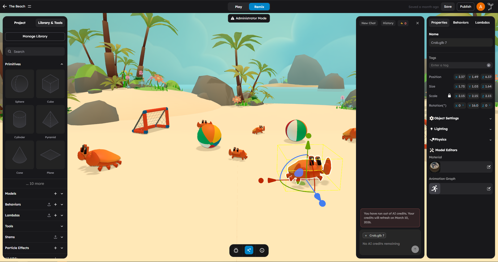

# AI Copilot

StemStudio includes a built-in AI Copilot that helps creators build and modify games from inside the editor. You can describe what you want in plain language, and Copilot helps create scene content, edit gameplay logic, and suggest assets without forcing you to start from scratch.

## What This Page Is For

Use this page when you want to know:

- How to open AI Copilot
- What kinds of game-creation tasks it handles well
- How to write prompts that lead to better results
- What to review after Copilot makes changes

## What AI Copilot Helps With

AI Copilot is best used as a creator tool for:

- Building a first pass of a level, room, or gameplay area
- Modifying an existing scene without hunting through every panel manually
- Writing or revising custom behavior code
- Configuring built-in behaviors for common gameplay patterns
- Finding assets that match a game idea or theme
- Explaining why a system is not behaving the way you expect

It works best when you treat it like a fast collaborator. Let it handle setup and iteration, then use the editor to fine-tune the result.

## How To Open Copilot

1. Open the StemStudio editor.
2. In the action bar, click **AI Copilot**.
3. Type your request in the chat input and submit it.

If you already have relevant objects selected, Copilot can use that context to focus the request on the part of the scene you are working on.

## Chat Commands And Modes

Copilot also accepts a few short commands in the chat input:

- `/mode default` switches to the AI-focused editor layout. The scene remains visible, but direct click selection and transform controls are locked so changes happen through Copilot or script commands.
- `/mode advanced` switches back to the full editor layout with the outliner, action bar, scene tools, and right panel available.
- `? add box` runs a Stem script command from chat without opening the script terminal. Replace `add box` with any supported Stem script command.

## A Good Creator Workflow

The most reliable way to use Copilot is:

1. Select the object or area you want to work on, if your request is local.
2. Ask for one meaningful change or one clear build step.
3. Review the result in the scene and in the inspector.
4. Ask for the next adjustment.
5. Press **Play** and test before moving on.

This works better than asking for a full game in one prompt.

## What You Can Ask For

### Scene Building

Use Copilot to block out gameplay spaces, decorate scenes, or add repeated content.

Examples:

- "Create a simple platformer start area with a floor, three staggered platforms, and a finish marker."
- "Add a campsite with a fire, logs, and a ring of rocks near the player spawn."
- "Scatter 20 low-poly pine trees around the outer edge of the level."

### Editing Existing Scenes

Copilot is especially useful after you already have a scene started.

Examples:

- "Turn this room into a sci-fi control room with screens and blue lighting."
- "Replace these four crates with explosive barrels."
- "Add cover objects along the left side of the arena."

If the request is about a specific set of objects, select them first and mention that in your prompt.

### Behavior Code

You can ask Copilot to create new behaviors, modify existing ones, or explain a script you already have.

Examples:

- "Write a behavior that rotates this platform slowly back and forth."
- "Add a pickup behavior that increments a shared score counter."
- "Fix this behavior so the door only opens once."
- "Explain what this behavior is doing and point out any mistakes."

For code requests, Copilot is most useful when you also describe the gameplay goal, not just the code change.

### Built-In Gameplay Setup

Before writing custom code, ask Copilot to use existing systems where possible.

Examples:

- "Set up a door that opens when the player enters a trigger."
- "Make this object collectible and play a sound when picked up."
- "Add an enemy patrol route between these two points."

### Asset Search

Copilot can help you find models, images, and other content that match the game you are building.

Examples:

- "Find a stylized treasure chest."
- "Search for a low-poly oak tree."
- "I need a vehicle model that fits a desert racing game."

## Prompting Tips

### Be Concrete

Good:

`Create a 20x20 floor, add four walls 3 units tall, and place a door opening on the front side.`

Less useful:

`Make a room.`

### Describe The Player Experience

Good:

`I want the player to collect three keys before the exit door opens.`

That gives Copilot a gameplay outcome to design around, not just isolated objects.

### Use Short Iterations

For bigger tasks, split the request:

1. `Build the level layout.`
2. `Now add the player path and hazards.`
3. `Now add collectibles and the finish condition.`

### Mention What Already Exists

Good:

`The player controller already exists. Add checkpoints and a respawn flow for this section of the level.`

### Ask For Revision, Not Replacement

When the first result is close but not right, keep iterating:

- `Make the platforms wider.`
- `Use fewer props and leave more open space.`
- `Keep the same behavior, but make the door close again after 3 seconds.`

## Working With Selected Objects

Copilot works better when the request has clear context. A useful pattern is:

1. Select the object or group you want to change.
2. Open Copilot.
3. Keep the request tied to that selection.

Examples:

- "Add interaction logic to these selected objects."
- "Make the selected lights flicker like emergency lights."
- "Attach a looping ambient sound to the selected waterfall."

## What To Review After Copilot Makes Changes

Always check the result in the editor before moving on:

- Look at the hierarchy to see what was created or changed.
- Check behavior attributes in the right panel.
- Inspect transforms, physics, and visibility on important objects.
- Open generated behavior code and read it once before trusting it.
- Run the scene in **Play** mode to confirm the gameplay actually works.

Copilot can move quickly, but the creator still owns the final result.

## When Copilot Is Most Useful

Copilot is strongest for:

- First-pass setup
- Repetitive scene work
- Wiring common gameplay patterns
- Turning vague ideas into a starting implementation
- Iterating on behavior code

The regular editor is still better for:

- Precise object placement
- Material and color fine-tuning
- Careful inspector edits
- Play-testing and feel tuning

## Limitations

- Copilot may need a few rounds to get a scene or mechanic where you want it.
- Large requests are less reliable than staged requests.
- Generated code should always be tested in **Play** mode.
- Asset suggestions still need creator review for style, scale, and fit.
- You must be signed in to use AI features.
- Copilot usage depends on available AI credits.

## Practical Examples

Here are prompts that work well for creators:

- `Create a simple obstacle course for a rolling ball game.`
- `Add five coin pickups along the main path and keep them evenly spaced.`
- `Write a behavior for this object that floats up and down and spins slowly.`
- `Use built-in behaviors to make this door open when the player gets close.`
- `Find a better tree model for a stylized fantasy forest.`
- `Review this behavior and fix the collision logic without changing the rest of the system.`

## Next Steps

- Try Copilot on a small task first, such as `Create a simple platformer start area.`
- Read [AI NPCs](02-ai-npcs.md) to build interactive characters.
- Read [AI Model Generation](03-ai-model-generation.md) to create 3D models from text.
- Read [AI Image Generation](04-ai-image-generation.md) to generate images and textures.
