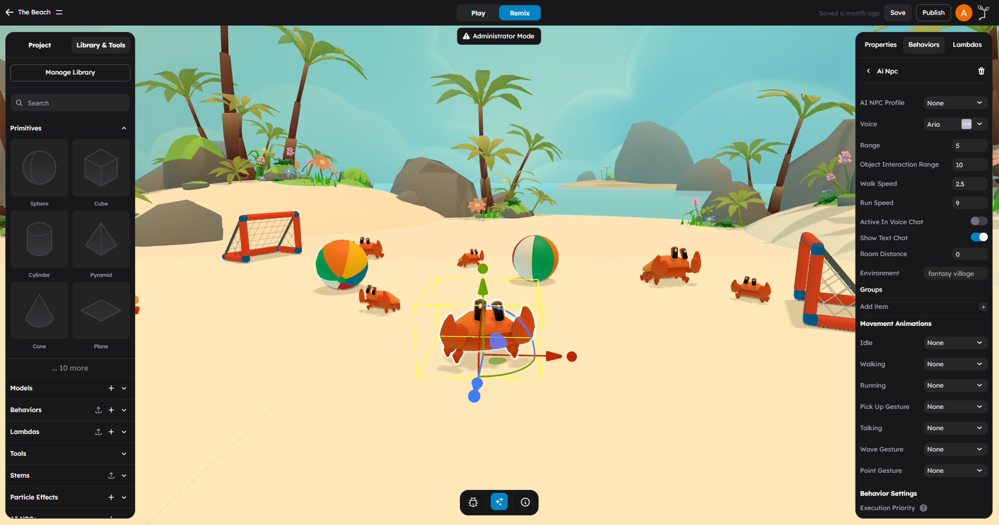
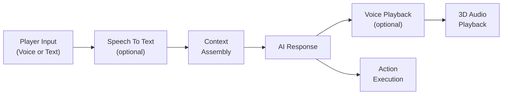

# AI NPCs

AI NPCs are non-player characters that use large language models to hold real conversations with players. They can speak with unique voices, walk around the scene, pick up objects, gesture, and react to game events -- all driven by AI.

## What This Page Is For

Use this page when you need to answer questions like:

- How do I add an AI NPC to my scene?
- How do I configure its personality and voice?
- How does the conversation system work?
- What animations and actions can NPCs perform?

## Setting Up An AI NPC

### Step 1: Add A Character Model

1. In the left panel, open **Models** or **AI NPCs**.
2. Add a character model to the scene. Any humanoid GLB/GLTF model with animations will work.
3. Position it where you want the NPC to stand.

### Step 2: Attach The AiNpcBehavior

1. Select the character model in the viewport.
2. In the right panel, switch to the **Behaviors** tab.
3. Click **Add Behavior** and search for **Ai Npc**.
4. Attach the **Ai Npc** behavior.

When the behavior is attached, it automatically configures default physics settings on the object (dynamic body with 70kg mass, box shape, rotation locked on X and Z axes). This gives the NPC a physical presence in the world.

### Step 3: Configure The NPC Profile

The **AI NPC Profile** attribute links the NPC to a personality profile that defines who the character is. Profiles are created as resources in your project and include:

| Field | Purpose |
|-------|---------|
| **name** | The NPC's display name |
| **bio** | Background story and context |
| **lore** | World knowledge the NPC has |
| **adjectives** | Personality traits (e.g., "friendly", "mysterious", "sarcastic") |
| **interests** | Topics the NPC is knowledgeable about |
| **response_style** | How the NPC communicates (e.g., "formal", "casual", "poetic") |

The profile is used as AI context so the NPC stays in character throughout conversations.

## Voice Configuration

### Choosing A Voice

The **Voice** attribute sets which built-in voice persona the NPC uses for spoken responses. There are 20 built-in voice options:

| Voice | Voice | Voice | Voice |
|-------|-------|-------|-------|
| Aria | Roger | Sarah | Laura |
| Charlie | George | Callum | River |
| Liam | Charlotte | Alice | Matilda |
| Will | Jessica | Eric | Chris |
| Brian | Daniel | Lily | Bill |

The default voice is **Aria**.

### Voice Chat Mode

| Attribute | Default | Description |
|-----------|---------|-------------|
| **Active In Voice Chat** | `false` | When enabled, the NPC listens for voice input and responds with spoken audio |
| **Show Text Chat** | `true` | Displays a text chat bubble above the NPC |

When voice chat is enabled, players can speak to the NPC using their microphone. The NPC's spoken response plays as audio with volume based on distance -- louder when the player is closer, quieter when farther away.

## Interaction Range

| Attribute | Default | Description |
|-----------|---------|-------------|
| **Range** | `5` | How close the player must be (in units) to start a conversation |
| **Object Interaction Range** | `10` | Maximum distance at which the NPC can detect and interact with scene objects |

The NPC tracks the player's distance in real-time. When the player enters the interaction range, the conversation UI appears. Audio volume scales with distance -- at the edge of range the volume is near zero, and at close range it approaches full volume.

## Movement

| Attribute | Default | Description |
|-----------|---------|-------------|
| **Walk Speed** | `2.5` | Movement speed when walking (units per second) |
| **Run Speed** | `9` | Movement speed when running (units per second) |
| **Roam Distance** | (empty) | Maximum distance the NPC can wander from its origin. Leave empty to disable roaming |

### Idle Behavior

When not in conversation or performing an action, the NPC cycles between two states:

1. **Standing** -- Plays the idle animation for 3-8 seconds (randomized)
2. **Wandering** -- Walks in a random direction at half walk speed for 5-13 seconds (randomized)

If the NPC wanders too far from its original position, it automatically turns and walks back.

During conversations, the NPC stops wandering and faces the player. After the conversation ends, it resumes its idle behavior.

## World Context

| Attribute | Default | Description |
|-----------|---------|-------------|
| **Environment** | `"fantasy village"` | Text description of the NPC's world setting |
| **Groups** | `"villagers"` | Social groups or factions the NPC belongs to |

These values are provided as context for more immersive conversations. The NPC also tracks nearby objects within its interaction range so it can reference things in the environment.

## Animations

The NPC supports seven animation slots. Each slot maps to an animation clip on the character model. If the model has animations, the editor will auto-suggest matching clips based on name.

| Slot | Searches For | Used When |
|------|-------------|-----------|
| **Idle** | "idle" | Standing still, not engaged |
| **Walking** | "walk" | Moving at walk speed |
| **Running** | "run" | Moving at run speed |
| **Pick Up Gesture** | "pick", "pickup", "grab" | Picking up an object |
| **Talking** | "talk", "speaking" | Speaking during a conversation |
| **Wave Gesture** | "wave", "greeting" | Waving or greeting a player |
| **Point Gesture** | "point" | Pointing at something in the scene |

Set each slot to **None** if the model does not have a matching animation.

## Conversation Flow

The conversation flow combines player input, scene context, generated responses, and optional NPC actions:

### Step By Step

1. **Player speaks or types** -- The player either speaks into their microphone (if voice chat is enabled) or types a text message.

2. **Voice transcription** -- If the player spoke, the audio is transcribed into text.

3. **Context assembly** -- The system assembles a context package for the language model that includes:
   - The NPC's profile (name, bio, lore, adjectives, interests, response style)
   - The current environment description
   - The NPC's social groups
   - Nearby objects and their positions
   - Recent game events (score changes, enemies spawned, items collected, etc.)
   - The NPC's current position and the player's position
   - Conversation history

4. **AI processing** -- The context and player message are used to generate both a text response and optional action commands.

5. **Voice output** -- If voice output is enabled, the text response is turned into spoken audio using the NPC's configured voice.

6. **Audio playback** -- The audio plays from the NPC's position in 3D space. Volume is based on the player's distance from the NPC. The talking animation plays while audio is active.

7. **Action execution** -- If the LLM selected actions (like walking to an object or waving), those actions are queued and executed in order.

### NPC Actions

During conversations, the AI can decide to perform physical actions in the world. The available actions are:

| Action | What It Does |
|--------|-------------|
| **rotate_to_face_object** | Turn to face a specific object |
| **go_to_object** | Walk to a specific object in the scene |
| **go_to_position** | Walk to specific XYZ coordinates |
| **pick_up_object** | Pick up a nearby object (creates a physics joint) |
| **put_down_object** | Release a held object |
| **wave_gesture** | Perform a wave animation |
| **point_at** | Point at a specific object |

Actions are queued and processed in order. The NPC must walk to an object before it can pick it up.

### Game Event Awareness

The NPC listens for game events and includes recent events in its context. This means the NPC can reference things that just happened in the game:

- Score changes
- Player health and lives changes
- Enemy spawns and deaths
- Collectibles picked up
- Triggers, teleports, and jump pads activated
- Character movement and jumps

Up to the 20 most recent events are tracked and shared with the AI.

## Things To Know

### Authentication

Players must be signed in to interact with AI NPCs.

### Conversation Storage

Conversation history stays with the current play session and room. Starting a new room begins with a fresh conversation history.

### Performance

- AI NPCs are heavier than simple ambient NPCs because they combine movement, scene awareness, and conversation systems
- Keep interaction ranges reasonable if you plan to use many AI NPCs in the same scene
- Test scenes with multiple active NPCs in Play mode before publishing
- Audio volume adjusts with distance so nearby conversations feel more natural

### Multiple NPCs

A scene can have multiple AI NPCs. When multiple NPCs are in range, the system tracks which one is closest to the player and prioritizes that NPC for voice interaction. Each NPC maintains its own conversation history and action queue.

## Minimal Setup Checklist

1. Add a character model with animations to the scene
2. Attach the **Ai Npc** behavior
3. Select an **AI NPC Profile** (create one first if needed)
4. Choose a **Voice**
5. Map at least the **Idle** and **Walking** animation slots
6. Set the interaction **Range**
7. Press **Play** and walk up to the NPC to test

## Next Steps

- Read [AI Model Generation](03-ai-model-generation.md) to generate character models for your NPCs.
- Read [Behaviors vs Lambdas](../scripting/01-behaviors-vs-lambdas.md) to understand how the AiNpcBehavior fits into the behavior system.
- Read [Communication Patterns](../scripting/04-communication-patterns.md) to learn how to react to NPC events in your own behaviors.
