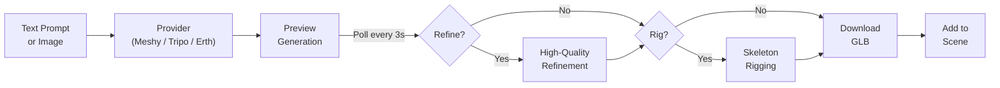

# AI 3D Model Generation

StemStudio lets you generate 3D models directly in the editor using text descriptions or reference images. Instead of searching asset libraries or learning 3D modeling software, you describe what you want and AI generates a downloadable GLB model.

## What This Page Is For

Use this page when you need to answer questions like:

- How do I generate a 3D model from a text description?
- What providers are available and how do they differ?
- How does the generation pipeline work?
- Can I get rigged and animated models?
- What makes a good prompt for 3D generation?

## Providers

StemStudio supports three generation providers, each with different strengths:

| Provider | Input Types | Key Strength |
|----------|------------|--------------|
| **Meshy** | Text-to-3D | High-quality refinement pipeline with optional rigging |
| **Tripo** | Text-to-3D, Image-to-3D | Automatic rigging with biped/quadruped detection and animation retargeting |
| **Erth** | Text-to-3D | Primitive-based composition using basic shapes |

The default provider can be configured at the project level. You can also specify which provider to use per request.

## Text-To-3D Generation

### How It Works

The generation pipeline follows these steps:

```
1. PROMPT
   You describe the model you want

2. GENERATE
   The provider creates an initial model (preview quality)

3. POLL
   The editor polls for progress every 3 seconds

4. REFINE (optional, Meshy only)
   The preview is refined to higher quality

5. RIG (optional)
   A skeleton is added for animation

6. DOWNLOAD
   The final GLB model is downloaded and added to the scene
```



### Using The Generator

1. Open the model generation tool in the left panel or through the AI tools.
2. Type a text description of the model you want.
3. Optionally add a negative prompt to exclude unwanted features.
4. Choose the provider and quality settings.
5. Click **Generate** and wait for the result.

### Generation Parameters

| Parameter | Description | Default |
|-----------|-------------|---------|
| **prompt** | Text description of the model | (required) |
| **negative_prompt** | Features to exclude from the result | `""` |
| **target_polycount** | Target polygon count | `3000` |
| **generator** | Which provider to use | Project default |
| **refine** | Whether to run a refinement pass (Meshy) | `false` |
| **autoRig** | Whether to automatically rig the model | `false` |

## Image-To-3D Generation

Tripo supports generating 3D models from reference images. This is useful when you have concept art or a photo of something you want to recreate in 3D.

1. Upload a reference image.
2. Optionally add a text prompt to guide the generation.
3. The provider analyzes the image and generates a 3D model.

Image-to-3D generation follows the same polling workflow as text-to-3D.

## Provider Details

### Meshy

Meshy specializes in text-to-3D generation with a multi-stage pipeline:

1. **Preview generation** -- Creates an initial low-poly model
2. **Refinement** -- Improves geometry, textures, and detail
3. **Rigging** -- Adds a skeleton for animation (if the model is humanoid)

The refinement and rigging stages are optional. You can choose any combination:

| Options | Pipeline Stages | Progress Split |
|---------|----------------|----------------|
| No refine, no rig | Preview only | 0-100% |
| Refine only | Preview, then refine | 0-50%, 50-100% |
| Rig only | Preview, then rig | 0-50%, 50-100% |
| Refine and rig | Preview, refine, then rig | 0-33%, 33-66%, 66-100% |

If rigging fails (for example, the model is not humanoid), the system proceeds with the unrigged model rather than failing entirely.

The default model type is `lowpoly` with a target of 3000 polygons.

### Tripo

Tripo supports both text-to-3D and image-to-3D generation, and has a robust rigging pipeline:

1. **Generation** -- Creates the 3D model from text or image input
2. **Pre-rig check** -- Analyzes the model's topology (biped or quadruped) and whether it is riggable
3. **Rigging** -- Applies a Mixamo-compatible skeleton
4. **Animation retargeting** -- Applies a default animation based on topology

**Topology detection:**

| Topology | Detection | Default Animation |
|----------|-----------|-------------------|
| **Biped** | Humanoid body shape | Walk animation |
| **Quadruped** | Four-legged body shape | Cat walk animation |

Biped models get access to a full set of preset animations:

- idle, walk, climb, jump, run, slash, shoot, hurt, fall, turn

Quadruped models get:

- cat run, cat walk

The animation retargeting uses Mixamo-compatible skeletons, so the generated animations work with StemStudio's animation system.

### Erth

The Erth provider takes a different approach -- it generates compositions of basic primitive shapes (box, sphere, cylinder, cone, plane) rather than a single mesh. Each primitive has its own position, rotation, scale, color, and material properties.

This is useful for quick prototyping and structural objects where you want something more stylized or geometric.

## Quality And Polygon Control

### Target Polycount

The `target_polycount` parameter controls the polygon budget for generated models:

| Polycount | Best For |
|-----------|----------|
| **1000-3000** | Mobile-friendly, low-poly style |
| **3000-10000** | Standard game-ready models |
| **10000+** | High-detail models (use sparingly) |

The default is 3000 polygons, which produces clean low-poly models that render efficiently.

### Texture Quality

Tripo offers a `texture_quality` option:

- **standard** -- Good quality, faster generation
- Higher quality options may be available depending on the provider version

## Timeouts And Polling

| Stage | Poll Interval | Max Timeout |
|-------|--------------|-------------|
| Standard generation | 3 seconds | 5 minutes |
| Rigging | 30 seconds | 10 minutes |

Generation tasks that exceed the timeout will fail with an error. If this happens, try again -- generation times can vary based on server load.

## Tips For Good Prompts

### Be Specific About Style

Good: "A low-poly medieval wooden treasure chest with iron bands and a gold lock"

Less useful: "A chest"

### Include Material Details

Good: "A stone castle tower with moss-covered walls and a wooden door"

Less useful: "A tower"

### Use The Negative Prompt

The negative prompt tells the generator what to avoid:

- "blurry, low quality, distorted" -- General quality exclusions
- "realistic, photorealistic" -- When you want a stylized look
- "complex, high detail" -- When you want something simple

### Describe The View

Models are generated from a specific perspective. Describing the important features helps:

Good: "A fantasy sword with a curved blade, leather-wrapped handle, and a gem in the pommel"

### Keep Polygon Budget In Mind

If you are targeting mobile or low-end devices, mention it in the prompt or set a low target polycount. Models with fewer polygons render faster and use less memory.

## Common Workflows

### Quick Prototyping

1. Generate a model with the Erth provider (primitive-based, fast)
2. Test the gameplay with the prototype shape
3. Later replace with a refined model from Meshy or Tripo

### Character Generation With Animation

1. Generate a humanoid character with Tripo (text or image input)
2. Enable auto-rigging during generation
3. The model arrives with a Mixamo-compatible skeleton
4. Assign animations in the behavior configuration
5. Attach the Character Controller or AI NPC behavior

### Asset Library Building

1. Generate several variations of a model by tweaking the prompt
2. Save the best results to your project assets
3. Reuse them across multiple scenes

## Things To Know

- Model generation requires sign-in and is subject to usage limits.
- Generation is asynchronous. You can continue working in the editor while a model generates.
- GLB is the output format for all providers. GLB files include geometry, textures, and (if rigged) skeleton data.
- Generated models are added to your scene as standard 3D objects with full physics and behavior support.
- Rigging is not guaranteed to succeed. Non-humanoid or abstract shapes may not be riggable.

## Next Steps

- Read [AI Image Generation](04-ai-image-generation.md) to create textures and skyboxes for your models.
- Read [AI NPCs](02-ai-npcs.md) to use generated characters as intelligent NPCs.
- Read [Editor Tour](../getting-started/02-editor-tour.md) for where to find the generation tools in the editor.
