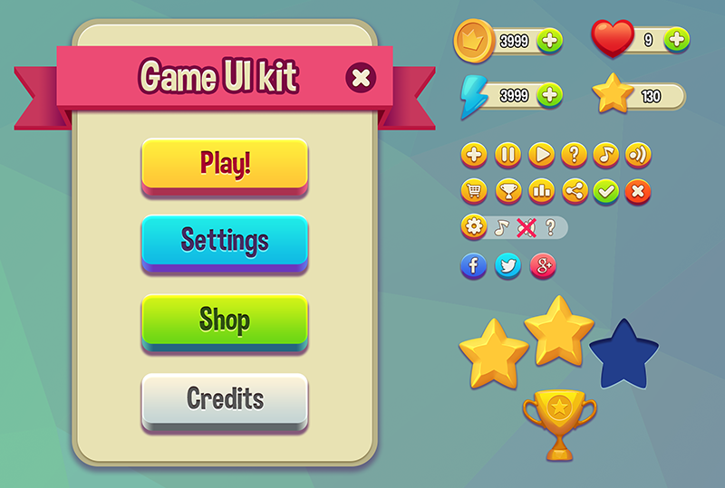

# UIKit and Pointer Events

UIKit is a Three.js-based UI library that renders user interfaces as 3D meshes in your scene. It provides flexbox layout, text rendering, images, inputs, and interactive pointer events -- all from behavior scripts.

## What This Page Is For

Use this page when you need to:

- Build in-world UI panels, health bars, menus, or HUDs from behavior code
- Understand the available UIKit components and their properties
- Set up pointer events for hover, click, and drag interactions
- Manage UIKit lifecycle and cleanup

## Globals Available in Scripts

UIKit is exposed to behavior and lambda scripts as two globals:

| Global | Purpose |
|--------|---------|
| `UIKit` | Core UI components (Container, Text, Image, Input, Fullscreen, Content, Svg, Video) |
| `UIKitPointerEvents` | Pointer event system for hover, click, and drag interactions |

These are injected automatically -- no imports needed in your script.

---

## Quick Start

```javascript
let ui = null;
let scoreText = null;
let score = 0;

function init(game) {
    UIKitPointerEvents.initialize(game);
}

function onStart() {
    ui = new UIKit.Container({
        width: 200,
        height: 80,
        backgroundColor: 0x222222,
        backgroundOpacity: 0.8,
        borderRadius: 8,
        padding: 16,
        flexDirection: "column",
        alignItems: "center",
        justifyContent: "center"
    });

    scoreText = new UIKit.Text({
        text: "Score: 0",
        fontSize: 24,
        color: 0xffffff
    });
    ui.add(scoreText);

    // Attach to this behavior's target object
    this.target.add(ui);

    // Register as a root to enable pointer events
    UIKitPointerEvents.registerRoot(ui);
}

function update(deltaTime) {
    UIKitPointerEvents.update(deltaTime);
}

function dispose() {
    if (ui) {
        UIKitPointerEvents.unregisterRoot(ui);
        ui.dispose();
        ui = null;
    }
    UIKitPointerEvents.deinitialize();
}
```

---

## Components

### Container

The main layout building block. Supports flexbox positioning, backgrounds, borders, scrolling, and interaction states.

```javascript
const panel = new UIKit.Container({
    // Size
    width: 300,
    height: 200,

    // Background
    backgroundColor: 0x333333,
    backgroundOpacity: 0.9,

    // Border
    borderRadius: 12,
    borderWidth: 2,
    borderColor: 0x666666,

    // Padding (all sides or individual)
    padding: 16,
    paddingTop: 20,
    paddingBottom: 20,
    paddingLeft: 16,
    paddingRight: 16,

    // Flexbox layout
    flexDirection: "column",    // "row" | "column" | "row-reverse" | "column-reverse"
    justifyContent: "center",   // "flex-start" | "flex-end" | "center" | "space-between" | "space-around"
    alignItems: "center",       // "flex-start" | "flex-end" | "center" | "stretch"
    gap: 8,                     // Space between children

    // Scrolling
    overflow: "scroll",         // "visible" | "hidden" | "scroll"

    // Interaction
    pointerEvents: "auto",      // "auto" | "none"

    // Hover and active states
    hover: {
        backgroundColor: 0x444444
    },
    active: {
        backgroundColor: 0x555555
    },

    // Event handlers
    onClick: () => console.log("Clicked!"),
    onPointerEnter: () => console.log("Hover start"),
    onPointerLeave: () => console.log("Hover end")
});
```

### Text

Renders text in 3D space.

```javascript
const label = new UIKit.Text({
    text: "Hello World",
    fontSize: 32,
    fontWeight: "bold",         // "normal" | "bold" | 100-900
    color: 0xffffff,
    opacity: 1,

    // Alignment
    textAlign: "center",        // "left" | "center" | "right"
    verticalAlign: "center",    // "top" | "center" | "bottom"

    // Spacing
    letterSpacing: 0,
    lineHeight: 1.2,

    // Overflow
    maxLines: 2                 // Limit lines, adds ellipsis
});
```

### Image

Displays images from URLs.

```javascript
const icon = new UIKit.Image({
    src: "https://example.com/icon.png",
    width: 64,
    height: 64,
    objectFit: "cover",         // "fill" | "contain" | "cover"
    borderRadius: 8,
    opacity: 1
});
```

### Input

Text input field for user text entry.

```javascript
const nameInput = new UIKit.Input({
    value: "",
    placeholder: "Enter name...",
    fontSize: 18,
    color: 0xffffff,
    backgroundColor: 0x222222,
    borderRadius: 4,
    padding: 8,

    onValueChange: (newValue) => {
        console.log("Input changed:", newValue);
    }
});
```

### Fullscreen

Camera-facing UI that fills the viewport. Useful for HUDs and overlays.

```javascript
// Requires renderer reference from game
const hud = new UIKit.Fullscreen(game.renderer, {
    distanceToCamera: 0.5
});

const healthBar = new UIKit.Container({
    width: 200,
    height: 20,
    backgroundColor: 0xff0000
});
hud.add(healthBar);

game.scene.add(hud);
UIKitPointerEvents.registerRoot(hud);
```

### Other Components

| Component | Description |
|-----------|-------------|
| `Content` | Scrollable content area for long content within a Container |
| `Svg` | SVG graphics rendering |
| `Video` | Video playback on a 3D surface |

---

## Updating Properties

Use `setProperties()` to change component properties after creation. Batch updates for efficiency.

```javascript
// Update a single property
text.setProperties({ text: "New Text" });

// Update multiple properties at once (more efficient)
container.setProperties({
    backgroundColor: 0xff0000,
    width: 300,
    opacity: 0.5
});
```

---

## UIKitPointerEvents API

The pointer events system enables hover, click, and drag interactions on UIKit components. It uses reference counting so multiple behaviors can safely share the system.

### Lifecycle

The required call order in every behavior that uses UIKit:

```javascript
// 1. In init() -- increment reference count
UIKitPointerEvents.initialize(game);

// 2. After creating UI -- register root components
UIKitPointerEvents.registerRoot(myContainer);

// 3. In update() -- process events each frame
UIKitPointerEvents.update(deltaTime);

// 4. Before disposing UI -- unregister roots
UIKitPointerEvents.unregisterRoot(myContainer);

// 5. In dispose() -- decrement reference count
UIKitPointerEvents.deinitialize();
```

### Reference Counting

Multiple behaviors can safely use UIKitPointerEvents simultaneously:

```
Behavior A init()     -> refCount: 1
Behavior B init()     -> refCount: 2
Behavior A dispose()  -> refCount: 1 (system stays active)
Behavior B dispose()  -> refCount: 0 (full cleanup)
```

The system:
- **Starts** when the first root is registered
- **Stops** when the last root is unregistered
- **Fully cleans up** when refCount reaches 0 AND no roots exist

### Methods

| Method | Returns | Description |
|--------|---------|-------------|
| `initialize(game)` | `void` | Store game reference, increment ref count. Call in `init()`. |
| `deinitialize()` | `void` | Decrement ref count. Full cleanup when count reaches 0. Call in `dispose()`. |
| `registerRoot(component)` | `void` | Register a UIKit component as a root. Starts pointer events on first root. |
| `unregisterRoot(component)` | `void` | Unregister a root. Stops pointer events when last root is removed. |
| `update(deltaTime)` | `void` | Process pointer events and update all roots. Call every frame in `update()`. |
| `forceDispose()` | `void` | Force immediate cleanup, bypassing ref counting. Use sparingly. |
| `isActive()` | `boolean` | True if pointer events are running and roots exist. |
| `isInitialized()` | `boolean` | True if a game reference exists. |
| `getRootCount()` | `number` | Number of currently registered roots. |
| `getInitRefCount()` | `number` | Current ref count (useful for debugging). |

---

## Layout Examples

### Horizontal Button Row

```javascript
const buttonRow = new UIKit.Container({
    flexDirection: "row",
    gap: 8,
    padding: 8
});

["Play", "Settings", "Quit"].forEach(label => {
    const btn = new UIKit.Container({
        width: 100,
        height: 40,
        backgroundColor: 0x4444aa,
        borderRadius: 4,
        justifyContent: "center",
        alignItems: "center",
        hover: { backgroundColor: 0x5555bb },
        onClick: () => console.log(`${label} clicked`)
    });

    const text = new UIKit.Text({
        text: label,
        fontSize: 16,
        color: 0xffffff
    });
    btn.add(text);
    buttonRow.add(btn);
});
```

### Health Bar with Fill

```javascript
function createHealthBar(width, height, health, maxHealth) {
    const container = new UIKit.Container({
        width,
        height,
        backgroundColor: 0x333333,
        borderRadius: 4,
        overflow: "hidden"
    });

    const fill = new UIKit.Container({
        width: (health / maxHealth) * width,
        height: "100%",
        backgroundColor: health > 30 ? 0x44aa44 : 0xaa4444
    });

    container.add(fill);
    return { container, fill };
}

// Create health bar
const { container: healthBar, fill: healthFill } = createHealthBar(200, 20, 75, 100);

// Update health later
function setHealth(current, max) {
    healthFill.setProperties({
        width: (current / max) * 200,
        backgroundColor: current > 30 ? 0x44aa44 : 0xaa4444
    });
}
```

### Vertical Stats Panel

```javascript
const statsPanel = new UIKit.Container({
    width: 150,
    flexDirection: "column",
    backgroundColor: 0x000000,
    backgroundOpacity: 0.7,
    borderRadius: 8,
    padding: 12,
    gap: 8
});

const stats = [
    { label: "Health", value: "100/100", color: 0xff4444 },
    { label: "Mana", value: "50/50", color: 0x4444ff },
    { label: "Gold", value: "250", color: 0xffcc00 }
];

stats.forEach(stat => {
    const row = new UIKit.Container({
        flexDirection: "row",
        justifyContent: "space-between",
        width: "100%"
    });

    row.add(new UIKit.Text({ text: stat.label, fontSize: 14, color: 0xaaaaaa }));
    row.add(new UIKit.Text({ text: stat.value, fontSize: 14, color: stat.color }));

    statsPanel.add(row);
});
```

---

## Full Example: Level Map HUD

This example builds a complete level-selection screen inspired by mobile game UI patterns -- a top navigation bar, scrollable level nodes along a path, badge indicators, and a bottom tab bar.



The behavior below creates this kind of screen as a fullscreen UIKit overlay. Paste it into a new behavior and attach it to any object in your scene.

### behavior.json

```json
{
    "name": "Level Map HUD",
    "description": "Displays a level-selection map with a top bar, level nodes, and bottom tabs.",
    "attributes": {
        "theme": {
            "name": "Theme",
            "type": "enum",
            "default": "forest",
            "options": ["forest", "desert"],
            "description": "Color theme for the level map."
        }
    }
}
```

### script.js

```javascript
let hud = null;
let levelNodes = [];

// Color palettes per theme
const THEMES = {
    forest: {
        bg: 0x7ec850,
        bgSecondary: 0x5ba83a,
        path: 0xd4c896,
        nodeDefault: 0x4fc3f7,
        nodeLocked: 0xbdbdbd,
        nodeAccent: 0xce93d8,
        nodeWarm: 0xffb74d,
        badge: 0xba68c8,
        tabBar: 0xffffff,
        tabIcon: 0x42a5f5,
        title: 0xffffff,
        label: 0xffffff
    },
    desert: {
        bg: 0xe8c96a,
        bgSecondary: 0xd4a843,
        path: 0xf5e6c0,
        nodeDefault: 0x4fc3f7,
        nodeLocked: 0xbdbdbd,
        nodeAccent: 0xce93d8,
        nodeWarm: 0xef5350,
        badge: 0xba68c8,
        tabBar: 0xffffff,
        tabIcon: 0x42a5f5,
        title: 0xffffff,
        label: 0xffffff
    }
};

const LEVELS = [
    { name: "Bakery",    icon: "🧁", unlocked: true,  badge: 0 },
    { name: "Kitchen",   icon: "🍳", unlocked: true,  badge: 0 },
    { name: "Nature",    icon: "🌿", unlocked: true,  badge: 0 },
    { name: "Weather",   icon: "☀️", unlocked: true,  badge: 2 },
    { name: "Clothes",   icon: "👕", unlocked: true,  badge: 0 },
    { name: "Family",    icon: "🏠", unlocked: false, badge: 3 }
];

/**
 * @this {Behavior}
 */
function init(game) {
    UIKitPointerEvents.initialize(game);
    this._game = game;
}

/**
 * @this {Behavior}
 */
function onStart() {
    const theme = THEMES[this.attributes.theme] || THEMES.forest;

    // --- Fullscreen root ---
    hud = new UIKit.Fullscreen(this._game.renderer, {
        distanceToCamera: 0.5
    });

    // Main vertical layout
    const root = new UIKit.Container({
        width: 360,
        height: 640,
        flexDirection: "column",
        backgroundColor: theme.bg,
        borderRadius: 24,
        overflow: "hidden"
    });

    // ============================
    // TOP BAR
    // ============================
    const topBar = new UIKit.Container({
        width: "100%",
        height: 48,
        flexDirection: "row",
        alignItems: "center",
        justifyContent: "space-between",
        paddingLeft: 16,
        paddingRight: 16,
        backgroundColor: theme.bgSecondary,
        backgroundOpacity: 0.4
    });

    topBar.add(new UIKit.Text({
        text: "≡",
        fontSize: 22,
        color: theme.title
    }));

    topBar.add(new UIKit.Text({
        text: "COURSE B2",
        fontSize: 16,
        fontWeight: "bold",
        color: theme.title
    }));

    topBar.add(new UIKit.Text({
        text: "⌄",
        fontSize: 22,
        color: theme.title
    }));

    root.add(topBar);

    // ============================
    // LEVEL MAP (scrollable area)
    // ============================
    const mapArea = new UIKit.Container({
        width: "100%",
        flexGrow: 1,
        flexDirection: "column",
        alignItems: "center",
        padding: 20,
        gap: 12,
        overflow: "scroll"
    });

    // Build level nodes in a zigzag pattern
    LEVELS.forEach((level, i) => {
        const isLeft = i % 2 === 0;

        // Row container for zigzag placement
        const row = new UIKit.Container({
            width: "100%",
            flexDirection: "row",
            justifyContent: isLeft ? "flex-start" : "flex-end",
            paddingLeft: isLeft ? 20 : 0,
            paddingRight: isLeft ? 0 : 20
        });

        // Node wrapper (icon circle + label)
        const nodeWrapper = new UIKit.Container({
            flexDirection: "column",
            alignItems: "center",
            gap: 4
        });

        // Pick node color
        let nodeColor = theme.nodeDefault;
        if (!level.unlocked) nodeColor = theme.nodeLocked;
        else if (level.badge > 0 && i % 3 === 0) nodeColor = theme.nodeAccent;
        else if (i % 3 === 2) nodeColor = theme.nodeWarm;

        // Circle icon
        const circle = new UIKit.Container({
            width: 56,
            height: 56,
            borderRadius: 28,
            backgroundColor: level.unlocked ? nodeColor : theme.nodeLocked,
            backgroundOpacity: level.unlocked ? 1.0 : 0.5,
            justifyContent: "center",
            alignItems: "center",
            borderWidth: 3,
            borderColor: 0xffffff,
            hover: level.unlocked ? { backgroundColor: 0xffffff } : {},
            onClick: level.unlocked
                ? () => console.log(`Selected level: ${level.name}`)
                : undefined
        });

        circle.add(new UIKit.Text({
            text: level.icon,
            fontSize: 24
        }));

        nodeWrapper.add(circle);

        // Badge (notification dot)
        if (level.badge > 0) {
            const badge = new UIKit.Container({
                width: 20,
                height: 20,
                borderRadius: 10,
                backgroundColor: theme.badge,
                justifyContent: "center",
                alignItems: "center",
                marginTop: -16,
                marginLeft: 36
            });
            badge.add(new UIKit.Text({
                text: String(level.badge),
                fontSize: 11,
                fontWeight: "bold",
                color: 0xffffff
            }));
            nodeWrapper.add(badge);
        }

        // Level name label
        nodeWrapper.add(new UIKit.Text({
            text: level.name,
            fontSize: 13,
            fontWeight: "bold",
            color: theme.label,
            opacity: level.unlocked ? 1.0 : 0.5
        }));

        row.add(nodeWrapper);
        mapArea.add(row);

        levelNodes.push({ level, circle, nodeWrapper });
    });

    root.add(mapArea);

    // ============================
    // BOTTOM TAB BAR
    // ============================
    const tabBar = new UIKit.Container({
        width: "100%",
        height: 56,
        flexDirection: "row",
        justifyContent: "space-around",
        alignItems: "center",
        backgroundColor: theme.tabBar,
        borderColor: 0xe0e0e0,
        borderWidth: 1
    });

    const tabs = [
        { icon: "🎓", label: "Learn" },
        { icon: "📖", label: "Read" },
        { icon: "👥", label: "Social" },
        { icon: "🔤", label: "A-Z" }
    ];

    tabs.forEach((tab, idx) => {
        const tabBtn = new UIKit.Container({
            flexDirection: "column",
            alignItems: "center",
            gap: 2,
            padding: 4,
            hover: { backgroundOpacity: 0.1, backgroundColor: theme.tabIcon },
            onClick: () => console.log(`Tab: ${tab.label}`)
        });

        tabBtn.add(new UIKit.Text({
            text: tab.icon,
            fontSize: 20
        }));

        tabBtn.add(new UIKit.Text({
            text: tab.label,
            fontSize: 10,
            color: idx === 0 ? theme.tabIcon : 0x999999
        }));

        tabBar.add(tabBtn);
    });

    root.add(tabBar);

    // ============================
    // Assemble
    // ============================
    hud.add(root);
    this._game.scene.add(hud);
    UIKitPointerEvents.registerRoot(hud);
}

/**
 * @this {Behavior}
 */
function update(deltaTime) {
    UIKitPointerEvents.update(deltaTime);
}

/**
 * @this {Behavior}
 */
function dispose() {
    if (hud) {
        UIKitPointerEvents.unregisterRoot(hud);
        hud.dispose();
        hud = null;
    }
    levelNodes = [];
    UIKitPointerEvents.deinitialize();
}
```

### What This Example Covers

| Technique | Where It Is Used |
|-----------|-----------------|
| `UIKit.Fullscreen` | Camera-facing overlay for the entire HUD |
| Flexbox row layout | Top bar (hamburger, title, dropdown) and bottom tab bar |
| Flexbox column layout | Vertical stacking of level nodes |
| Zigzag positioning | Alternating `justifyContent: "flex-start"` / `"flex-end"` per row |
| Rounded circles | `borderRadius` set to half of width/height for perfect circles |
| Badge indicators | Small absolute circles overlaid on level nodes |
| Hover states | `hover` property on level circles and tab buttons |
| Click handlers | `onClick` on unlocked levels and tabs |
| Scrolling | `overflow: "scroll"` on the map area |
| Theme switching | `theme` attribute in behavior.json toggles color palette |
| Locked states | Reduced opacity and no click handler for locked nodes |
| Proper cleanup | `dispose()` unregisters roots, disposes HUD, deinitializes pointer events |

---

## Best Practices

### Performance

- **Minimize root components.** Each root requires separate update calls.
- **Use `pointerEvents: "none"`** on non-interactive elements to skip hit testing.
- **Batch property updates.** Use `setProperties()` with multiple properties at once.
- **Dispose properly.** Always call `dispose()` on components when done.

### Memory Management

Always clean up in `dispose()` in this order:

```javascript
function dispose() {
    if (ui) {
        // 1. Unregister from pointer events
        UIKitPointerEvents.unregisterRoot(ui);

        // 2. Remove from parent
        if (ui.parent) {
            ui.parent.remove(ui);
        }

        // 3. Dispose the component (cleans up Three.js resources)
        ui.dispose();

        // 4. Clear reference
        ui = null;
    }

    // 5. Deinitialize pointer events
    UIKitPointerEvents.deinitialize();
}
```

---

## Troubleshooting

### UI Not Visible

1. Check the component is added to the scene: `parent.add(uiComponent)`
2. Verify scale -- UIKit uses world units, may need adjustment
3. Check `visible` property and opacity values
4. Ensure component is in front of camera

### Interactions Not Working

1. Verify `UIKitPointerEvents.initialize(game)` was called
2. Check `UIKitPointerEvents.registerRoot(component)` was called
3. Ensure `UIKitPointerEvents.update(deltaTime)` is called each frame
4. Check `pointerEvents` property is not set to `"none"`

### Multiple Behaviors Conflicting

1. Each behavior should call `initialize()` and `deinitialize()`
2. Each behavior should register/unregister only its own roots
3. Use `UIKitPointerEvents.getRootCount()` to debug

---

## Next Steps

- See [Writing Behaviors](../scripting/02-writing-behaviors.md) for behavior lifecycle basics.
- Read the [Erth Interface](01-erth-interface.md) for the full runtime API.
- See [HUD and UI](../gameplay/05-hud-and-ui.md) for the built-in HUD system (different from UIKit).
