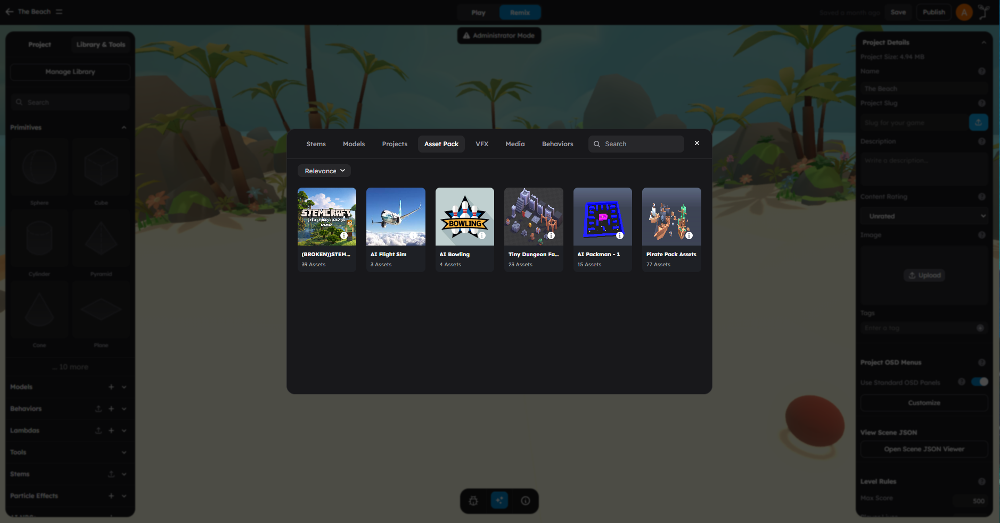

# Asset Library

The asset library is where all your project's content lives -- models, images, sounds, videos, stems, behaviors, lambdas, and particle effects. It is the main entry point in the left panel for finding existing assets and adding new ones to your scene.

Browse, search, and manage all project assets from the Library and Tools panel.

## Opening The Asset Library

The asset library lives in the **left panel** of the editor. To access it:

1. Look at the left panel tabs.
2. Select the **Assets** tab (sometimes labeled **Library & Tools**).
3. You will see a grid of asset category icons.

The categories are listed as clickable rows or icons. Clicking one opens that category and shows all assets of that type in your project.

## Asset Categories

The asset library organizes content into the following categories:

| Category | What It Contains | Typical Use |
|----------|-----------------|-------------|
| **Primitives** | Basic 3D shapes (Sphere, Cube, Cylinder, etc.) | Starting geometry for building scenes |
| **Models** | Imported 3D models (GLB, GLTF, FBX, OBJ, etc.) | Characters, props, architecture, vehicles |
| **Stems** | Reusable prefab objects with embedded behaviors | Pre-built gameplay objects you can drop in |
| **Images** | Textures, skyboxes, and image files | Surface materials, backgrounds, UI elements |
| **Sounds** | Audio files and sound effects | Background music, SFX, ambient audio |
| **Videos** | Video files for in-game use | Cutscenes, tutorials, in-world screens |
| **Behaviors** | Object-level gameplay scripts | Movement, triggers, scoring, AI |
| **Lambdas** | Batched processing systems | High-performance per-frame updates |
| **Particle Effects** | Visual effects and particles | Fire, smoke, sparkles, explosions |
| **AI NPCs** | AI-powered non-player characters | Interactive characters with dialogue |

Each category shows a list or grid of assets that belong to your current scene or project.

## Searching And Filtering Assets

Every asset category includes a **search bar** at the top. Use it to quickly find assets by name.

### How Search Works

- Type any part of the asset name into the search bar.
- Results filter in real time as you type.
- Search is case-insensitive -- typing "tree" will match "Tree", "TREE", and "PineTree".
- Clear the search bar to show all assets in the category again.

### Tips For Finding Assets Quickly

- **Use short keywords.** Searching "rock" is faster than "grey rock formation".
- **Check the right category.** If you are looking for a texture, check **Images** instead of **Models**.
- **Use the scene hierarchy.** If an asset is already in the scene, you can also find it through the Project tab or by clicking it in the viewport.

## Browsing Asset Categories

### Primitives

Primitives are the basic building blocks for any scene. They are not uploaded -- they are built into the editor and always available. Click any primitive to add it to the scene.

For the full list of primitives, see [Primitives Reference](03-primitives-reference.md).

### Models

The Models tab shows all 3D models that have been uploaded to or associated with your current scene. Each model appears as a card with a thumbnail preview and name.

- **Click** a model to add an instance to your scene.
- **Delete** a model to remove it and all its instances from the project.
- **Upload** new models using the upload button at the top.

For details on uploading models, see [Importing Assets](02-importing-assets.md).

### Stems

Stems are reusable prefab objects that can include geometry, materials, behaviors, and lambdas bundled together. The Stems tab shows stems associated with your scene.

For details on creating and using stems, see [Stems and Prefabs](04-stems-prefabs.md).

### Images

The Images tab shows all image files in your project -- textures, skybox images, and general-purpose images. Images can be applied as materials/textures on objects or used in UI elements.

### Sounds

The Sounds tab lists audio files uploaded to your scene. You can preview sounds directly from the tab and attach them to objects through behaviors.

### Videos

The Videos tab shows video files in your project. Videos can be played on surfaces within the 3D scene.

### Behaviors And Lambdas

These tabs show the scripts associated with your project. You can create new behaviors and lambdas, import existing ones, or browse what is already attached to objects.

For the scripting workflow, see [Behaviors vs Lambdas](../scripting/01-behaviors-vs-lambdas.md).

### Particle Effects

The Particle Effects tab shows visual effect assets. These include fire, smoke, water, and custom particle systems.

## Importing Assets From The Community Library

StemStudio includes a community library where creators can share assets. To import a community asset:

1. Open the relevant asset category (Models, Behaviors, Lambdas, or Stems).
2. Look for a **community** or **library** section within the tab.
3. Browse or search community-shared assets.
4. Click an asset to import it into your project.

Imported community assets are copied into your project. Changes you make will not affect the original shared version.

> **Tip:** If you find a useful behavior or stem in the community library, you can import it and modify it to fit your specific needs.

## Managing Your Asset Collection

### Renaming Assets

Most assets can be renamed after upload. Select the asset and update its name through the properties or details view.

### Deleting Assets

To delete an asset:

1. Find it in the relevant category tab.
2. Use the delete action (typically a trash icon or right-click menu).
3. Confirm the deletion.

> **Warning:** Deleting a model or asset will remove **all instances** of it from your scene. This cannot be undone.

### Organizing Assets

Keep your asset collection manageable by:

- **Naming assets descriptively.** Use names like "WoodenCrate" or "FootstepSound" instead of "model1" or "sound_final_v2".
- **Deleting unused assets.** If you uploaded a model but are no longer using it, remove it to keep your project clean.
- **Using stems for complex objects.** Instead of managing many separate objects, bundle related objects and behaviors into a stem.

## What To Avoid

- Do not upload assets without descriptive names -- it makes them hard to find later.
- Do not keep unused assets in your project -- they increase project size without benefit.
- Do not confuse the Primitives tab with the Models tab -- primitives are built-in shapes, while models are imported 3D files.

## Next Steps

- Learn how to upload your own assets in [Importing Assets](02-importing-assets.md).
- See the full list of built-in shapes in [Primitives Reference](03-primitives-reference.md).
- Learn about reusable prefabs in [Stems and Prefabs](04-stems-prefabs.md).
- Understand materials and textures in [Materials and Textures](05-materials-and-textures.md).
