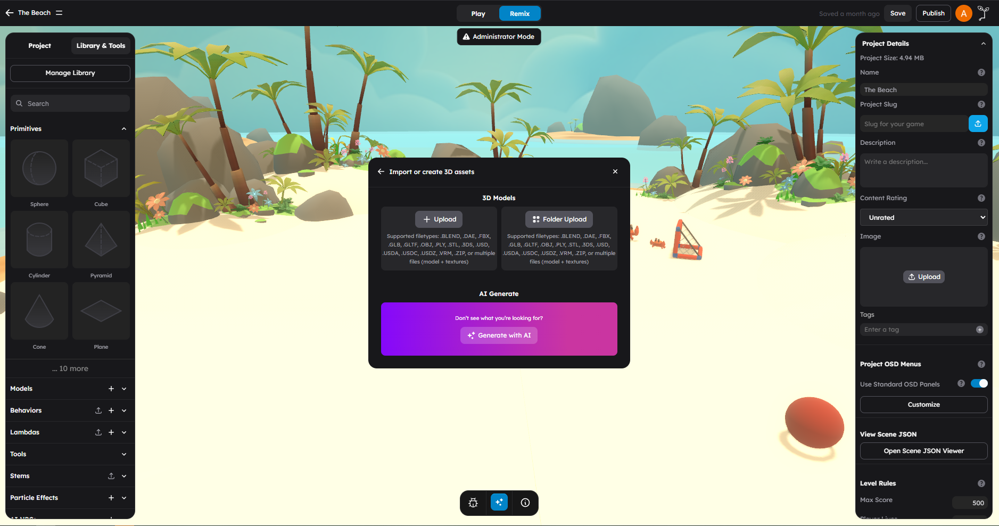

# Importing Assets

StemStudio lets you bring your own content into the editor -- 3D models, images, sounds, and videos. This page covers the upload workflow for each asset type, supported formats, and what to expect during import.



Upload 3D models, images, sounds, and videos into your StemStudio project.

## Uploading 3D Models

3D models are the most common imported asset. StemStudio supports a wide range of model formats.

### Supported 3D Model Formats

| Format | Extension | Notes |
|--------|-----------|-------|
| glTF Binary | `.glb` | Recommended. Self-contained with embedded textures |
| glTF | `.gltf` | JSON-based. Requires separate texture files |
| FBX | `.fbx` | Common exchange format from Blender, Maya, 3ds Max |
| OBJ | `.obj` | Widely supported. No animation data |
| Collada | `.dae` | XML-based format |
| PLY | `.ply` | Point cloud and mesh data |
| STL | `.stl` | Common for 3D printing. No color/texture data |
| 3DS | `.3ds` | Legacy 3ds Max format |
| Blender | `.blend` | Native Blender files |
| USD | `.usd` | Universal Scene Description |
| USDA | `.usda` | USD in ASCII format |
| USDC | `.usdc` | USD in binary (Crate) format |
| USDZ | `.usdz` | USD zipped package (common on iOS) |
| VRM | `.vrm` | Humanoid avatar format |

> **Recommendation:** When possible, export your models as **GLB**. It is a single file that bundles geometry, materials, textures, and animations together. This avoids missing texture issues and simplifies the upload.

### Model Upload Workflow

1. In the left panel, open the **Models** tab.
2. Click the **Upload** button (or the **+** icon).
3. The upload view opens.


4. Select your model file. You can also:
   - Select a **.zip** file containing a model with its textures.
   - Select image files alongside the model for texture mapping.
   - Drag and drop files into the upload area.
5. The model preview loads, showing a 3D preview of your model.


6. Review the preview. You can rotate the model to inspect it from different angles.
7. Click **Upload** or **Confirm** to save the model to your project.
8. The model appears in your **Models** tab and can now be added to any scene.

### Uploading Models With Textures

If your model uses external texture files (common with `.gltf`, `.obj`, and `.fbx`):

- **ZIP method:** Package the model file and all its texture images into a single `.zip` file. Upload the ZIP and StemStudio will resolve the textures automatically.
- **Multi-file method:** Select both the model file and its texture images in the file picker. StemStudio uses intelligent texture mapping to match textures to the correct material channels (diffuse, normal, roughness, metallic, etc.).

StemStudio's texture mapping system supports these texture image formats:

| Format | Extensions |
|--------|-----------|
| JPEG | `.jpg`, `.jpeg` |
| PNG | `.png` |
| WebP | `.webp` |
| BMP | `.bmp` |
| TGA | `.tga` |
| TIFF | `.tiff` |
| GIF | `.gif` |

The system automatically detects PBR texture types (diffuse, normal, roughness, metallic, ambient occlusion, emissive, displacement, alpha) based on file naming conventions.

### Model Upload Tips

- **Check your model scale.** Some tools export models at very different scales. You can adjust the scale in the Properties panel after import.
- **Check for animations.** If your model includes animations, they will be preserved in GLB/GLTF and FBX formats.
- **Optimize before upload.** Reduce polygon count for game-ready assets. High-poly models affect performance.
- **Name your files clearly.** The file name becomes the asset name in the library.

## Model Upload Settings

When uploading a 3D model, the upload dialog includes a settings panel that controls how the model is processed before saving.

### Processing Options

| Setting | Default | Description |
|---------|---------|-------------|
| **Compress Model** | on | Applies mesh compression (Draco) to reduce file size |
| **Compress Textures** | on | Converts textures to compressed formats (KTX2/Basis) for faster loading |
| **Limit Texture Size** | on | Caps texture dimensions to a maximum size |
| **Max Texture Size** | 2048 | Maximum texture resolution when Limit Texture Size is enabled |
| **Voxelize** | off | Converts the model to a voxel (blocky) representation |
| **Remove Hidden Faces** | off | Strips geometry faces that are not visible from the outside |
| **Simplify** | off | Reduces polygon count while preserving overall shape |

### LOD Generation

Level of Detail (LOD) generation creates multiple versions of the model at decreasing quality levels. The engine switches between LOD levels based on the object's distance from the camera to improve performance.

| LOD Level | Vertex Retention | Texture Scale | Use Case |
|-----------|-----------------|---------------|----------|
| **LOD 0** | 100% (original) | 100% | Close-up viewing |
| **LOD 1** | 80% | 75% | Medium distance |
| **LOD 2** | 50% | 50% | Far distance |
| **LOD 3** | 30% | 25% | Very far distance |

### Humanoid Model

Enable the **Humanoid Model** toggle when uploading character models. This signals StemStudio to apply humanoid-specific processing such as bone mapping for animation retargeting.

## Uploading Images

Images are used as textures on 3D objects, skybox backgrounds, or general-purpose visual assets.

### How To Upload Images

1. In the left panel, open the **Images** tab.
2. Click the **Upload** or **+** button.
3. Select one or more image files.
4. The images are uploaded to your project and appear in the Images tab.


### Supported Image Formats

| Format | Extensions | Best For |
|--------|-----------|----------|
| JPEG | `.jpg`, `.jpeg` | Photos, textures with no transparency |
| PNG | `.png` | Textures with transparency, UI elements |
| WebP | `.webp` | Optimized web images |
| BMP | `.bmp` | Uncompressed images |
| GIF | `.gif` | Simple animations (used as static) |

### Image Use Cases

- **Textures:** Apply images to 3D objects as base color, normal maps, or other PBR channels. See [Materials and Textures](05-materials-and-textures.md).
- **Skyboxes:** Use panoramic images or cubemap images as the scene background.
- **UI and HUD elements:** Display images in gameplay overlays.

> **Tip:** For textures, use power-of-two resolutions (512x512, 1024x1024, 2048x2048) for best GPU performance.

## Uploading Sounds

Sound files add audio to your games -- background music, sound effects, ambient noise, and dialogue.

### How To Upload Sounds

1. In the left panel, open the **Sounds** tab.
2. Click the **Upload** or **+** button.
3. Select your audio file.
4. The sound is uploaded and appears in the Sounds tab.


### Supported Audio Formats

| Format | Extension | Notes |
|--------|-----------|-------|
| MP3 | `.mp3` | Most common. Good compression. Widely supported |
| WAV | `.wav` | Uncompressed. Higher quality, larger files |
| OGG | `.ogg` | Open format. Good compression and quality |

### Sound Tips

- **Keep file sizes reasonable.** Long, high-bitrate audio files increase load times.
- **Use MP3 for background music.** It offers good compression for longer tracks.
- **Use short WAV or OGG for sound effects.** Quick sounds benefit from the lower latency of uncompressed or lightly compressed formats.
- **Preview before using.** You can play sounds directly from the Sounds tab to confirm you uploaded the right file.

## Uploading Videos

Videos can be played on surfaces within the 3D scene, used for cutscenes, or displayed on in-game screens.

### How To Upload Videos

1. In the left panel, open the **Videos** tab.
2. Click the **Upload** or **+** button.
3. Select your video file.
4. The video is uploaded and appears in the Videos tab.


### Supported Video Formats

| Format | Extension | Notes |
|--------|-----------|-------|
| MP4 | `.mp4` | Recommended. Widely supported with H.264 codec |
| WebM | `.webm` | Good web support. Open format |

### Video Tips

- **Keep videos short and compressed.** Large video files significantly increase project load times.
- **Use MP4 with H.264 encoding** for maximum browser compatibility.
- **Consider resolution.** In-game video screens are often viewed from a distance, so full HD (1080p) is usually sufficient.

## File Size Considerations

While StemStudio does not enforce a single hard file size limit for all asset types, keep these guidelines in mind:

- **3D Models:** Aim for under 50 MB per model. Complex models with many textures should be optimized before upload.
- **Images:** Keep textures under 4096x4096 pixels. Most game textures work well at 1024x1024 or 2048x2048.
- **Sounds:** Keep individual sound files under 10 MB. Use compressed formats (MP3, OGG) for longer audio.
- **Videos:** Keep videos as small as practical. Compress before uploading.

Large assets increase scene load times for all players. Optimize assets before uploading whenever possible.

## The Import Workflow Step By Step

Here is the general import workflow that applies to all asset types:

```
1. OPEN THE CATEGORY TAB
   Navigate to the correct tab in the left panel (Models, Images, Sounds, Videos)

2. START THE UPLOAD
   Click the Upload or + button to open the file picker

3. SELECT FILES
   Choose your file(s) from your computer
   - For models: optionally include texture images or use a ZIP
   - For images: select one or more image files
   - For sounds/videos: select the media file

4. PREVIEW (models only)
   Review the 3D preview of your model
   Rotate and inspect to confirm it looks correct

5. CONFIRM UPLOAD
   Click Upload or Confirm to save the asset to your project

6. USE THE ASSET
   The asset appears in the corresponding tab
   Click it to add it to your scene or apply it to objects
```

## What To Avoid

- Do not upload unoptimized assets with millions of polygons or 8K textures -- they will hurt performance.
- Do not upload model files without their textures -- the model will appear grey or untextured.
- Do not rename texture files after exporting from your 3D tool -- the model expects specific file names for texture references.
- Do not upload copyrighted content you do not have rights to use.

## Next Steps

- Browse built-in shapes that require no upload in [Primitives Reference](03-primitives-reference.md).
- Learn how to apply textures to imported models in [Materials and Textures](05-materials-and-textures.md).
- Create reusable prefabs from your imported assets in [Stems and Prefabs](04-stems-prefabs.md).
