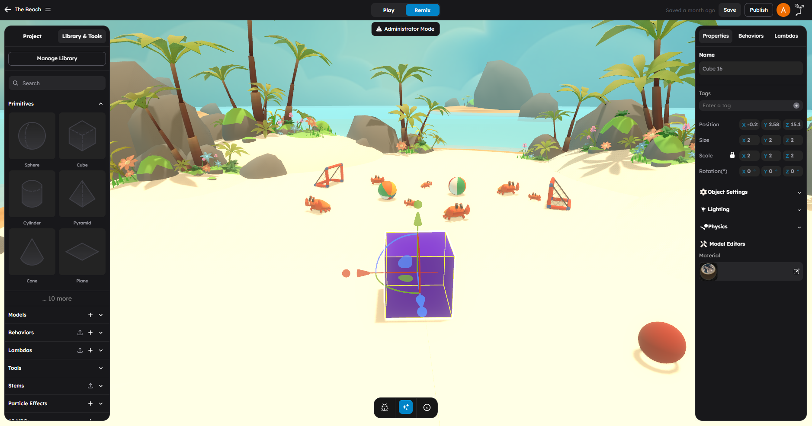

# Primitives Reference

Primitives are built-in 3D shapes that you can add to your scene with a single click. They require no upload or import -- they are always available in the **Primitives** section of the left panel.

Primitives are the fastest way to start building. Use them for level geometry, placeholder objects, prototyping, and as the foundation for more complex creations.

## What This Page Is For

Use this page when you need to answer questions like:

- What primitive shapes are available?
- Which primitive should I use for a specific purpose?
- What are the advanced primitives and when do I need them?
- How do I add a primitive to my scene?

## How To Add A Primitive

1. Open the **Primitives** section in the left panel.
2. Click any primitive icon.
3. The shape is added to the scene near the camera.
4. Select it in the viewport and configure it in the right panel.

Every primitive is created with:

- A random color (MeshStandardMaterial)
- Default physics properties
- An auto-generated unique name (e.g., "Cube", "Cube 2", "Cube 3")
- Shadow casting and receiving enabled

## Basic Primitives

These are the core shapes you will use most often.

| Primitive | Description | Typical Use Cases |
|-----------|-------------|-------------------|
| **Sphere** | A smooth ball shape with 32 segments | Balls, planets, projectiles, rounded objects, collision volumes |
| **Cube** | A six-sided box (internally a BoxGeometry) | Walls, floors, platforms, crates, building blocks, most level geometry |
| **Cylinder** | A tube with flat top and bottom caps | Pillars, pipes, barrels, tree trunks, cylindrical architecture |
| **Pyramid** | A four-sided triangular shape (tetrahedron) | Spikes, rooftops, decorative tips, markers |
| **Cone** | A tapered shape with a circular base and point | Trees (stylized), funnels, traffic cones, directional indicators |
| **Plane** | A flat rectangular surface (rotated to lie horizontal) | Floors, ground surfaces, water planes, walls, screens |
| **Torus** | A donut shape (ring with circular cross-section) | Rings, portals, decorative loops, collectible rings |
| **Torus Knot** | A knotted loop -- a torus tied in a trefoil knot | Decorative objects, abstract art, visual interest pieces |
| **Capsule** | A cylinder with hemispherical caps on each end | Character collision shapes, pills, rounded cylinders |

### Sphere

A sphere with configurable radius. Created with 32 width and 32 height segments for a smooth appearance. Good general-purpose round shape.

- **Default size:** Radius 0.5 (diameter 1 unit)
- **Physics preset:** Plastic

### Cube

Despite the name "Cube" in the editor, this is a box that can be scaled non-uniformly along any axis. It is the most versatile primitive.

- **Default size:** 1 x 1 x 1 units
- **Physics preset:** Plastic

> **Tip:** Scale a Cube to `(20, 0.5, 20)` to make a floor, or to `(0.5, 3, 10)` to make a wall.

### Cylinder

A circular cylinder with configurable radius and height. Created with 32 radial segments for smooth sides.

- **Default size:** Radius 0.5, height 1 unit
- **Physics preset:** Plastic

### Pyramid

A tetrahedron -- a four-faced triangular solid. In the editor, it is labeled "Pyramid" and shows a pyramid icon.

- **Default size:** Radius 1 unit
- **Physics preset:** Plastic

### Cone

A cone with a circular base tapering to a point. Created with 32 radial segments.

- **Default size:** Radius 1, height 2 units
- **Physics preset:** Plastic

### Plane

A flat rectangular surface, rotated so it lies horizontally (facing up). Created with double-sided material so it is visible from both sides.

- **Default size:** 10 x 10 units
- **Default scale:** Y-scale set to 0.1
- **Physics preset:** Ground

> **Tip:** Planes are ideal for floors and ground surfaces. Their Ground physics preset makes them a solid, non-bouncy surface by default.

### Torus

A donut shape with configurable major radius and tube radius.

- **Default size:** Major radius 0.5, tube radius 0.25
- **Physics preset:** Plastic

### Torus Knot

A mathematical knot shape -- a torus that has been tied into a trefoil knot. Visually striking but not commonly used for gameplay geometry.

- **Default size:** Radius 0.5, tube radius ~0.17
- **Physics preset:** Plastic

### Capsule

A cylinder with hemispherical caps. This is the standard shape for character physics colliders in many game engines.

- **Default size:** Radius 0.25, height 0.5
- **Physics preset:** Plastic

## Polyhedral Primitives

These are regular geometric solids with equal faces. They are useful for dice, gems, decorative objects, and mathematical demonstrations.

| Primitive | Faces | Description | Typical Use Cases |
|-----------|-------|-------------|-------------------|
| **Icosahedron** | 20 | Twenty equilateral triangles | Low-poly spheres, gems, dice (d20) |
| **Octahedron** | 8 | Eight equilateral triangles | Diamonds, crystals, dice (d8) |
| **Dodecahedron** | 12 | Twelve regular pentagons | Decorative shapes, dice (d12) |

### Icosahedron

A 20-faced polyhedron. With detail level 0 (the default), it produces a faceted ball shape. At higher detail levels, it approximates a sphere.

- **Default size:** Radius 0.5
- **Physics preset:** Plastic

### Octahedron

An 8-faced polyhedron that looks like two square-based pyramids joined at their bases. Classic diamond shape.

- **Default size:** Radius 0.5
- **Physics preset:** Plastic

### Dodecahedron

A 12-faced polyhedron with pentagonal faces. Less common but visually interesting.

- **Default size:** Radius 0.5
- **Physics preset:** Plastic

## Flat Primitives

| Primitive | Description | Typical Use Cases |
|-----------|-------------|-------------------|
| **Ring** | A flat annular shape (disc with a hole) | Target indicators, UI rings, decorative halos |

### Ring

A flat ring (annulus) with configurable inner and outer radius. Created with double-sided material.

- **Default size:** Inner radius 0.25, outer radius 0.5
- **Physics preset:** Plastic

## Advanced Primitives

These primitives offer more complex geometry creation for specialized needs.

| Primitive | Description | Typical Use Cases |
|-----------|-------------|-------------------|
| **Custom Shape** | A 2D shape from SVG path data | Logos, custom 2D outlines, flat decorative shapes |
| **Custom Tube** | A 3D tube along a bezier curve path | Pipes, wires, roller coaster tracks, organic curves |
| **Text** | 3D extruded text with font and bevel options | Signs, labels, titles, in-world text |

### Custom Shape

Creates a 2D mesh from SVG path data. You provide an SVG path string (like `M 0,0 L 10,10 L 0,20 Z`) and StemStudio generates a flat mesh from it. You can also paste full SVG documents.

- **Input:** SVG path data or full SVG document
- **Default shape:** A star
- **Material:** Double-sided
- **Use when:** You need custom 2D outlines, logos, or flat decorative shapes

The shape can be updated after creation by editing the SVG path in the object's properties.

### Custom Tube

Creates a 3D tube that follows a curve path defined by control points. Supports multiple curve types and can also extrude 2D shapes into 3D.

**Curve types available:**

| Curve Type | Description | Minimum Points |
|------------|-------------|----------------|
| **Line** | Straight line between first and last points | 2 |
| **QuadraticBezier** | Smooth curve with one control point | 3 |
| **CubicBezier** | Smooth curve with two control points | 4 |
| **CatmullRom** | Smooth spline passing through all points | 2+ |
| **Ellipse** | Elliptical curve | 2+ |

**Parameters:**

- **Curve points:** Array of 3D positions defining the path
- **Tubular segments:** Smoothness along the length (default: 64)
- **Radius:** Tube thickness (default: 0.2)
- **Radial segments:** Smoothness around the tube circumference (default: 8)
- **Closed:** Whether the tube forms a closed loop
- **Extrude depth:** When greater than 0, extrudes the 2D shape defined by the points instead of creating a tube

> **Tip:** Use CatmullRom curves when you want the tube to pass smoothly through all your control points. Use CubicBezier when you want precise control over the curve's tangent directions.

### Text

Creates 3D extruded text. You type the text content and configure its visual appearance.

**Text properties:**

| Property | Description | Default |
|----------|-------------|---------|
| **Text content** | The text string to display | "Text" |
| **Font size** | Size of the text | 1 |
| **Font name** | The typeface to use | Helvetiker |
| **Weight** | Font weight (regular, bold) | Regular |
| **Extrusion** | Depth of the 3D extrusion | 0.2 |
| **Bevel** | Bevel size on edges | 0 |
| **Bevel sides** | Number of bevel segments | 1 |
| **Horizontal align** | Left, center, right, or justify | Center |
| **Vertical align** | Top, middle, or bottom | Middle |
| **Case** | Normal, uppercase, or lowercase | Normal |
| **Line height** | Spacing between lines | 1.2 |
| **Spacing** | Character spacing | 0 |

## Legacy And Additional Geometry Types

The following geometry types are not shown in the main primitives grid but may appear in stems or older scenes:

| Type | Description |
|------|-------------|
| **Circle** | A flat circular disc |
| **Lathe** | A shape created by rotating a profile curve around an axis |
| **Teapot** | The classic Utah teapot test model |
| **Sprite** | A 2D image that always faces the camera (billboard) |
| **Group** | An empty container for organizing child objects |

## Particle And Environmental Effects

In addition to geometry primitives, the editor offers built-in environmental effects that can be added from the Primitives or Particle Effects section:

| Effect | Description |
|--------|-------------|
| **Fire** | A particle-based fire effect with configurable size and intensity |
| **Smoke** | A particle-based smoke effect with configurable density and color |
| **Water** | A procedural wave-based water surface |

These use WebGPU-compatible TSL (Three.js Shading Language) particle systems for rendering.

## Choosing The Right Primitive

Use this decision guide when you are not sure which primitive to start with:

| If you need... | Use |
|----------------|-----|
| A flat surface (floor, wall, platform) | **Plane** or **Cube** |
| A round object (ball, planet, balloon) | **Sphere** |
| A column, pillar, or pipe | **Cylinder** |
| A character collider shape | **Capsule** |
| A pointed shape (spike, cone, tree) | **Cone** or **Pyramid** |
| A ring or portal shape | **Torus** or **Ring** |
| A crystal or gem shape | **Octahedron** or **Icosahedron** |
| Custom flat outlines or logos | **Custom Shape** |
| Curved pipes, wires, or tracks | **Custom Tube** |
| In-world text labels or signs | **Text** |
| A decorative or abstract shape | **Torus Knot** or **Dodecahedron** |

## What To Avoid

- Do not use high-polygon primitives where low-polygon ones would suffice -- every extra triangle costs performance.
- Do not forget that Planes are one-sided by default in many engines, but StemStudio creates them double-sided. If you only need visibility from one direction, you can disable double-sided rendering in the material settings.
- Do not rely on the default random color -- change it in the material/rendering section for visual clarity.

## Next Steps

- Learn how to change primitive appearance in [Materials and Textures](05-materials-and-textures.md).
- Import complex 3D models in [Importing Assets](02-importing-assets.md).
- Bundle primitives with behaviors into reusable objects in [Stems and Prefabs](04-stems-prefabs.md).
