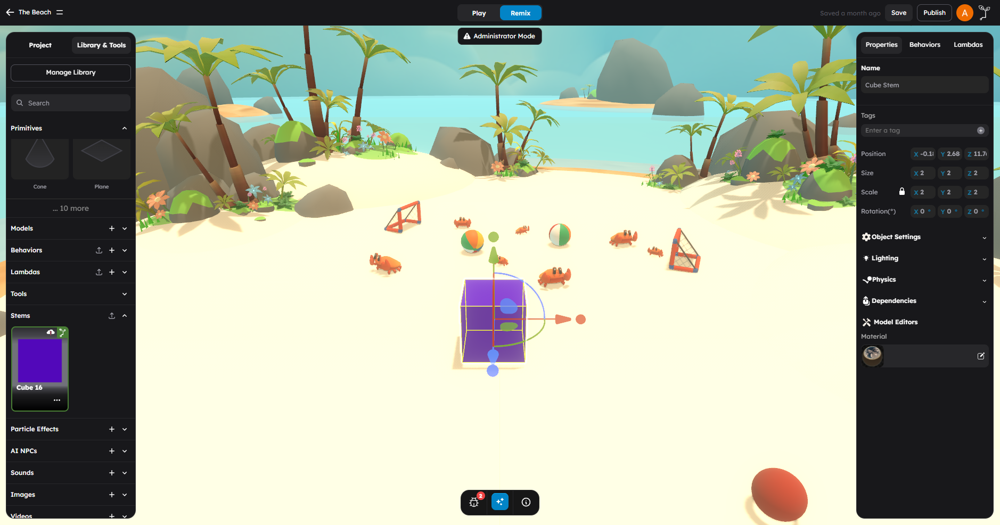

# Stems and Prefabs

A **stem** is a reusable prefab object in StemStudio. It bundles together geometry, materials, transforms, behaviors, lambdas, and asset references into a single reusable package. Think of it as a template you can stamp into any scene.

## What This Page Is For

Use this page when you need to answer questions like:

- What is a stem and how is it different from a regular object?
- How do I create a stem from objects in my scene?
- How do I use an existing stem in my scene?
- How do I publish a stem for others to use?
- When should I use a stem instead of individual objects?

## What A Stem Is

A stem is a saved snapshot of one or more objects along with everything attached to them:

- **Geometry and materials** -- The 3D shape, colors, and textures
- **Transform** -- Position, rotation, and scale relationships
- **Behaviors** -- Any gameplay scripts attached to the objects
- **Lambdas** -- Any batch processing systems associated with the objects
- **Asset references** -- Links to models, images, sounds, and other assets used by the objects

When you add a stem to a scene, StemStudio reconstructs all of these pieces, giving you a fully functional copy of the original object setup.

### The Mental Model

Think of stems like this:

- A **single object** is one ingredient.
- A **stem** is a complete recipe -- all the ingredients, preparation steps, and cooking instructions bundled together.

You build the recipe once, then use it as many times as you need.

## When To Use Stems

### Use A Stem When

- You have a complex object with multiple parts and behaviors that you want to reuse across scenes.
- You are building a library of game-ready objects (enemies, collectibles, obstacles, UI elements).
- You want to share a functional game object with other creators.
- You find yourself rebuilding the same object setup repeatedly.

### Use Individual Objects When

- The object is simple and unique to one scene (a single wall, a one-off decoration).
- You are still experimenting with the object's design and do not want to commit to a reusable template.
- The object has no behaviors or complex configuration.

### Examples Of Good Stems

| Stem | Contents |
|------|----------|
| Collectible Coin | Gold cylinder + spin behavior + score-on-collect behavior + sparkle particle effect |
| Enemy Spawner | Invisible marker + spawner behavior + enemy prefab reference + spawn timing config |
| Interactive Door | Door model + open/close behavior + trigger zone + sound effect |
| Player Spawn Point | Marker object + spawn point behavior + camera setup |
| Checkpoint | Flag model + checkpoint behavior + activation particle effect |

## Creating A Stem

To create a stem from objects in your scene:

1. **Set up your object** in the scene with all the geometry, materials, behaviors, and configuration you want.
2. **Select the object** (or parent object if it has children) in the viewport.
3. **Save as stem** using the stem creation action. This is typically available through:
   - A right-click context menu option
   - An action button in the right panel
   - The stem management interface

4. **Name your stem** descriptively. Good names describe what the stem does, not just what it looks like:
   - Good: "BouncyPlatform", "CoinCollectible", "EnemyPatrolPoint"
   - Avoid: "Object1", "test_stem", "asdf"

5. **Confirm creation.** The stem is saved and appears in your **Stems** tab in the left panel.

### What Gets Saved In A Stem

When you create a stem, StemStudio captures:

- The serialized 3D object data (geometry, materials, transforms, hierarchy)
- All behavior configurations attached to the objects
- All lambda registrations
- An asset resolution context that maps logical asset IDs to actual asset files
- Embedded copies of associated behaviors and lambdas

This means stems are self-contained. They carry their own behavior code and asset references, so they can be imported into other projects without missing dependencies.

### Stem Thumbnails

StemStudio generates a thumbnail image for each stem automatically. This thumbnail appears in the Stems tab to help you visually identify your stems.

## Using A Stem In Your Scene

To add a stem to your scene:

1. Open the **Stems** tab in the left panel.
2. Browse or search for the stem you want.
3. Click the stem card to add it to the scene.

The stem's objects, behaviors, and configuration are reconstructed in your scene. You can then:

- **Move, rotate, and scale** the stem instance as a unit.
- **Modify properties** of the individual objects within it.
- **Add more behaviors** or change configuration as needed.

> **Important:** Stem instances are independent copies. Modifying one instance does not affect other instances or the original stem definition. If you want to update all instances, you need to update the stem and re-add it.

## Publishing Stems To The Community

You can share your stems with other StemStudio creators by publishing them to the community library.

### How To Publish

1. Create and test your stem in your own scene.
2. Make sure it works correctly -- add it to a fresh scene and test it there.
3. Use the **publish** action on the stem to make it available to the community.

### Publishing Guidelines

- **Test thoroughly.** Published stems should work out of the box. Other creators expect functional prefabs.
- **Name clearly.** Use descriptive names that tell creators what the stem does.
- **Keep it self-contained.** Stems should include all the behaviors and assets they need. Avoid dependencies on scene-specific objects that will not exist in other projects.

### Publishing Requirements

- The stem must be saved and valid.
- All behaviors and lambdas embedded in the stem must be in a publishable state.
- Unpublished behaviors referenced by a stem will cause an error during the publishing process. Make sure any custom behaviors are published before publishing the stem.

## Exporting And Importing Stems

Stems can also be exported as files and imported into other projects outside the community library.

### Exporting A Stem

The export process creates a YAML-based file with the `.yaml` extension containing:

- Metadata (tool name, export version, export date)
- The stem name
- Serialized object data
- Asset resolution context (mappings between logical IDs and asset IDs)
- Embedded behaviors (configuration and source code)
- Embedded lambdas (configuration and source code)

### Importing A Stem File

To import a stem from a file:

1. Use the stem import action in the editor.
2. Select the exported `.yaml` file.
3. StemStudio validates the file format and version.
4. The stem is added to your project's Stems tab.

During import, StemStudio:

- Validates the file is a genuine StemStudio export
- Extracts the embedded behaviors and lambdas
- Resolves asset references
- Makes the stem available in your project

## Stem Versioning And Dependencies

### Versioning

Stems use a simple versioning model:

- Each stem has an **asset ID** and a **revision ID**.
- When you update a stem, a new revision is created.
- The latest release can be fetched when listing scene assets.

### Dependencies

Stems carry their dependencies with them:

- **Behaviors** are embedded directly in the stem export, including both configuration and source code.
- **Lambdas** are embedded similarly.
- **Asset references** (models, images, sounds) are tracked through the asset resolution context, which maps logical IDs to actual asset storage IDs.

This design means stems are portable across projects. However, if a stem references large assets (models, textures), those assets need to be available in the target project or server.

### Dependency Resolution On Import

When importing a stem, the system resolves dependencies in this order:

1. Check if referenced assets exist in the target project.
2. If assets are from the same server, attempt to link to existing copies.
3. If assets are from a different server (cross-server import), the `sourceServer` field in the export tracks the origin.

## How Stems Relate To Other Asset Types

| Feature | Stem | Model | Behavior | Lambda |
|---------|------|-------|----------|--------|
| Contains geometry | Yes | Yes | No | No |
| Contains behavior code | Yes (embedded) | No | Yes | No |
| Contains lambda code | Yes (embedded) | No | No | Yes |
| Reusable across scenes | Yes | Yes | Yes | Yes |
| Self-contained with dependencies | Yes | Partially (textures) | Yes | Yes |
| Best for | Complete gameplay objects | Visual assets | Logic scripts | Batch processing |

## Common Patterns

### The "Game Kit" Pattern

Create a set of related stems that work together:

1. Create stems for each gameplay element (player, enemies, collectibles, obstacles).
2. Each stem is self-contained with its own behaviors.
3. Drop all the stems into a new scene to quickly prototype a game.

### The "Variant" Pattern

Create base stems and modify instances:

1. Create a base stem (e.g., "BasicEnemy").
2. Add it to a scene multiple times.
3. Modify each instance's behavior attributes (speed, health, patrol path).
4. Optionally save modified versions as new stems ("FastEnemy", "TankEnemy").

### The "Building Block" Pattern

Create small, simple stems that combine:

1. Create stems for individual pieces (wall segment, floor tile, ramp).
2. Assemble them in scenes to build larger structures.
3. Each piece carries its own physics and material configuration.

## What To Avoid

- Do not create stems for objects that are truly one-off -- it adds unnecessary overhead.
- Do not publish stems that depend on unpublished behaviors -- the publish process will flag an error.
- Do not assume modifying a stem instance updates other instances -- each instance is an independent copy.
- Do not forget to test stems in a clean scene before publishing -- dependencies that exist in your development scene may be missing elsewhere.

## Next Steps

- Browse the asset library for existing stems in [Asset Library](01-asset-library.md).
- Learn how to style stem objects in [Materials and Textures](05-materials-and-textures.md).
- Add gameplay logic to stems with [Behaviors vs Lambdas](../scripting/01-behaviors-vs-lambdas.md).
