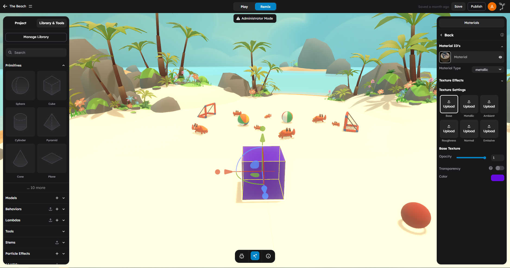

# Materials and Textures

Materials control how objects look -- their color, shininess, roughness, transparency, and surface detail. Textures are images applied to materials to add visual complexity like wood grain, metal scratches, or brick patterns.

## What This Page Is For

Use this page when you need to answer questions like:

- What material types does StemStudio support?
- How do I change an object's color, metalness, or roughness?
- How do I apply a texture image to an object?
- What is PBR and how do the texture channels work?
- How do I create common material effects like glass, metal, or wood?

## Material Types In StemStudio

StemStudio supports three material workflow types. Each type determines which texture channels are available and how the material properties are calculated.

| Material Type | Description | Best For |
|---------------|-------------|----------|
| **Metallic** | Standard metallic/roughness PBR workflow | Most general-purpose materials |
| **Specular** | Specular/glossiness PBR workflow | Materials where you want direct control over specular color |
| **PBR** | Combined AO/Metallic/Roughness in a single ORM texture | Optimized materials from professional 3D tools |

### Choosing A Material Type

- **Start with Metallic.** It is the most common workflow and matches what most 3D tools and asset stores produce.
- **Use Specular** when you need fine control over the specular highlight color (useful for materials like fabric, skin, or certain plastics).
- **Use PBR (ORM)** when your texture pack comes with a combined AO/Metallic/Roughness map. This is common with professionally authored texture sets.

You can switch between material types using the material type dropdown in the material editor.

## Material Properties

Every material in StemStudio exposes the following base properties. These can be set as flat values or driven by texture maps.

### Color

The base color (also called albedo or diffuse color) of the surface. This is the fundamental color of the object before any lighting effects.

- **Property:** Color picker
- **Default:** White (#ffffff) for imported models, random color for primitives
- **Use:** Sets the overall surface color

### Metalness

Controls how metallic the surface appears. Metallic surfaces reflect the environment and tint reflections with the base color. Non-metallic (dielectric) surfaces have white specular reflections.

- **Range:** 0.0 (non-metal) to 1.0 (fully metallic)
- **Default:** 0.0
- **Examples:** 0.0 for wood, plastic, fabric. 1.0 for gold, steel, chrome.

### Roughness

Controls how rough or smooth the surface is. Smooth surfaces produce sharp reflections. Rough surfaces scatter light and produce blurry, diffuse reflections.

- **Range:** 0.0 (mirror smooth) to 1.0 (completely rough)
- **Default:** 1.0
- **Examples:** 0.0 for mirrors, polished chrome. 0.3 for glossy paint. 0.7 for concrete. 1.0 for chalk.

### Opacity

Controls how transparent the object is. At full opacity, the object is completely solid. At lower values, objects behind it become visible.

- **Range:** 0.0 (invisible) to 1.0 (fully opaque)
- **Default:** 1.0
- **Related:** The "Use Base Alpha" toggle uses the alpha channel of the base texture for transparency patterns (useful for foliage, fences, etc.)

### Emissive Color And Intensity

Makes the surface appear to glow with its own light. Emissive surfaces contribute color regardless of scene lighting.

- **Emissive color:** The color of the glow
- **Emissive intensity:** How strong the glow is (default: 1.0)
- **Use:** Screens, neon signs, lava, glowing crystals, UI elements

> **Note:** Emissive materials do not cast light onto other objects. They only make the surface itself appear bright. For actual light emission, use a Light object.

### Specular Color And Intensity

Available in the **Specular** material type. Controls the color and strength of specular highlights directly.

- **Specular color:** The color of the highlight
- **Specular intensity:** How prominent the highlight is (default: 1.0)

### Ambient Occlusion (AO)

Controls the intensity of ambient occlusion -- the subtle darkening in crevices and corners where ambient light cannot reach.

- **Range:** 0.0 (no AO effect) to 1.0 (full AO effect)
- **Default:** 1.0

### Normal Scale

Controls the strength of the normal map effect. Higher values make surface bumps and details more pronounced.

- **Range:** 0.0 (flat) to any positive value
- **Default:** 1.0

## Texture Maps

Textures are images that drive material properties across the surface. Instead of a single flat color, textures let you paint detail onto objects.

### Available Texture Channels

The available texture channels depend on the material type:

#### Metallic Workflow

| Channel | Purpose | Example |
|---------|---------|---------|
| **Base** | Surface color/albedo | A wood grain photo |
| **Metallic** | Per-pixel metalness | White = metal, black = non-metal |
| **Roughness** | Per-pixel roughness | White = rough, black = smooth |
| **Ambient** | Ambient occlusion | Darkens crevices and corners |
| **Normal** | Surface bump detail | Adds depth without extra geometry |
| **Emissive** | Glow regions | Lit panels on a spaceship hull |

#### Specular Workflow

| Channel | Purpose | Example |
|---------|---------|---------|
| **Base** | Surface color/albedo | A brick wall photo |
| **Specular** | Per-pixel specular color | Controls highlight color |
| **Roughness** | Per-pixel roughness | White = rough, black = smooth |
| **Ambient** | Ambient occlusion | Darkens crevices and corners |
| **Normal** | Surface bump detail | Adds depth without extra geometry |
| **Emissive** | Glow regions | Glowing runes on stone |

#### PBR (ORM) Workflow

| Channel | Purpose | Example |
|---------|---------|---------|
| **Base** | Surface color/albedo | Any surface color texture |
| **ORM** | Combined AO (R), Metallic (G), Roughness (B) | Single texture packing three channels |
| **Normal** | Surface bump detail | Adds depth without extra geometry |
| **Emissive** | Glow regions | Glowing elements |

## Applying Textures To Objects

### Step-By-Step Texture Application

1. **Select the object** in the viewport.
2. Open the **Material & Rendering** section in the right panel.
3. Choose your **Material Type** (Metallic, Specular, or PBR).
4. Find the texture channel you want to fill (Base, Normal, Roughness, etc.).
5. Click the texture slot to upload or select an image.
6. The texture is applied immediately and you can see the result in the viewport.

### Texture Settings

After applying textures, you can adjust additional settings:

| Setting | Description | Default |
|---------|-------------|---------|
| **Double Sided** | Render both front and back faces of the mesh | Off |
| **Tile Amount (X)** | How many times the texture repeats horizontally | 1 |
| **Tile Amount (Y)** | How many times the texture repeats vertically | 1 |
| **Panning Speed (X)** | Horizontal texture scroll speed (for animated effects) | 0 |
| **Panning Speed (Y)** | Vertical texture scroll speed (for animated effects) | 0 |

> **Tip:** Increase Tile Amount to make a texture repeat across a large surface. For example, a 1x1 meter brick texture on a 10x10 meter wall should use Tile Amount (X) = 10 and Tile Amount (Y) = 10.

## The Material Editor

StemStudio includes a dedicated **Material Editor** for fine-tuning materials on imported models with multiple material slots.

### Opening The Material Editor

The Material Editor is available when you select an imported model that has multiple materials. It provides:

- A 3D preview of the model showing material changes in real time
- Per-material settings for each material slot on the model
- The ability to apply and preview texture changes before committing

### Working With Multi-Material Models

Imported 3D models often have multiple materials (e.g., a character model with separate materials for skin, clothing, and accessories). The Material Editor lets you select and configure each material independently.

## Common Material Patterns

Here are recipes for common material effects using the material properties.

### Glass

| Property | Value |
|----------|-------|
| Color | Light blue or white |
| Metalness | 0.0 |
| Roughness | 0.0 |
| Opacity | 0.2 - 0.4 |

Transparent and smooth. Low opacity makes the surface see-through. Zero roughness gives sharp reflections.

### Polished Metal (Chrome)

| Property | Value |
|----------|-------|
| Color | White or light grey |
| Metalness | 1.0 |
| Roughness | 0.0 - 0.1 |
| Opacity | 1.0 |

Fully metallic and very smooth. Produces mirror-like reflections.

### Brushed Metal (Steel)

| Property | Value |
|----------|-------|
| Color | Grey (#888888) |
| Metalness | 1.0 |
| Roughness | 0.3 - 0.5 |
| Opacity | 1.0 |

Metallic but with some surface roughness, giving blurred reflections like brushed steel.

### Gold

| Property | Value |
|----------|-------|
| Color | Gold (#FFD700) |
| Metalness | 1.0 |
| Roughness | 0.2 - 0.4 |
| Opacity | 1.0 |

Metallic with the base color tinting the reflections. Slightly rougher than chrome for a natural gold look.

### Wood

| Property | Value |
|----------|-------|
| Color | Brown (or use a wood base texture) |
| Metalness | 0.0 |
| Roughness | 0.6 - 0.8 |
| Opacity | 1.0 |
| Normal map | Wood grain normal texture (optional) |

Non-metallic and fairly rough. A base texture with wood grain and a normal map for surface detail produces the most realistic result.

### Plastic

| Property | Value |
|----------|-------|
| Color | Any color |
| Metalness | 0.0 |
| Roughness | 0.3 - 0.5 |
| Opacity | 1.0 |

Non-metallic with moderate smoothness. Produces subtle white specular highlights.

### Concrete / Stone

| Property | Value |
|----------|-------|
| Color | Grey (or use a concrete base texture) |
| Metalness | 0.0 |
| Roughness | 0.8 - 1.0 |
| Opacity | 1.0 |
| Normal map | Concrete surface normal texture (optional) |

Very rough and non-metallic. Almost no visible reflections.

### Glowing / Neon

| Property | Value |
|----------|-------|
| Color | Any color |
| Emissive color | Same as base color (or brighter) |
| Emissive intensity | 2.0 - 5.0 |
| Metalness | 0.0 |
| Roughness | 0.5 |

The emissive channel makes the surface appear to glow. Increase emissive intensity for a stronger effect. This pairs well with bloom post-processing if available.

### Matte / Chalk

| Property | Value |
|----------|-------|
| Color | Any color |
| Metalness | 0.0 |
| Roughness | 1.0 |
| Opacity | 1.0 |

Completely rough and non-metallic. No visible reflections at all. Good for stylized or flat-shaded art styles.

## Texture Mapping Basics

### UV Mapping

UV mapping determines how a 2D texture image wraps around a 3D surface. Each vertex on the mesh has UV coordinates that map to a position on the texture image.

- **Primitives** come with built-in UV mapping that works well for most use cases.
- **Imported models** should have UV mapping set up in your 3D modeling tool (Blender, Maya, etc.) before export.
- If UV mapping looks wrong (stretched or misaligned textures), the issue is usually in the model's UV unwrap, not in StemStudio.

### Tiling

Tiling repeats the texture across the surface. Use the **Tile Amount** settings to control how many times the texture repeats:

- **Tile Amount = 1:** The texture stretches once across the entire surface.
- **Tile Amount = 4:** The texture repeats 4 times in that direction.
- **Different X and Y values:** Produce non-uniform tiling (useful for rectangular surfaces with square textures).

### Texture Resolution

Choose texture resolution based on how close players will get to the surface:

| Use Case | Recommended Resolution |
|----------|----------------------|
| Background objects, distant scenery | 256x256 or 512x512 |
| Standard game objects | 512x512 or 1024x1024 |
| Close-up surfaces, important props | 1024x1024 or 2048x2048 |
| Maximum detail (hero objects) | 2048x2048 or 4096x4096 |

> **Tip:** Use power-of-two resolutions (256, 512, 1024, 2048, 4096) for optimal GPU performance. Non-power-of-two textures may be automatically resized, which can reduce quality.

### PBR Texture Naming Conventions

If you are uploading textures alongside a model, StemStudio's auto-detection system recognizes common PBR naming patterns:

- **Diffuse/Base:** `*_diffuse.*`, `*_albedo.*`, `*_color.*`, `*_basecolor.*`
- **Normal:** `*_normal.*`, `*_norm.*`, `*_nrm.*`
- **Roughness:** `*_roughness.*`, `*_rough.*`
- **Metallic:** `*_metallic.*`, `*_metal.*`, `*_metalness.*`
- **AO:** `*_ao.*`, `*_ambient.*`, `*_occlusion.*`
- **Emissive:** `*_emissive.*`, `*_emission.*`
- **Displacement:** `*_displacement.*`, `*_height.*`

## What To Avoid

- Do not set Metalness to a value between 0 and 1 for realistic materials -- real surfaces are either metallic (1.0) or non-metallic (0.0). In-between values can look physically incorrect. (Exception: blending for artistic effect is fine in stylized games.)
- Do not use oversized textures on objects players will never see up close -- it wastes GPU memory.
- Do not forget to check the "Double Sided" setting for thin surfaces like leaves, fences, or flags that need to be visible from both sides.
- Do not apply panning speed unless you intentionally want an animated texture effect (like flowing water or scrolling text).

## Next Steps

- Upload texture images in [Importing Assets](02-importing-assets.md).
- Apply materials to primitives from [Primitives Reference](03-primitives-reference.md).
- Bundle styled objects into reusable stems in [Stems and Prefabs](04-stems-prefabs.md).
- Add visual effects beyond materials with particle effects and lighting in the [Editor Tour](../getting-started/02-editor-tour.md).
