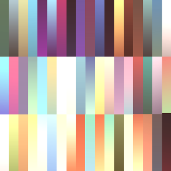

# Art Specs & Recommendations

**Project Target:** WebGL / WebGPU (Browser) | **Core Engine:** Three.js

---

## General Introduction & Performance Targets

In a browser environment, **Draw Calls are the primary bottleneck**, often outweighing raw polygon counts. The CPU overhead of communicating with the GPU via JavaScript is significant. Optimization strategies should prioritize **reducing object counts** over reducing triangle counts.

### Platform Targets

**Low-End (Mobile / Tablet)**

- **Draw Call Budget:** **25 - 100** per frame.
- **Strategy:** Aggressive atlasing and frustum culling are mandatory.

**High-End (Desktop)**

- **Draw Call Budget:** **200 - 500** per frame.
- **Strategy:** Keeping draw calls low frees up CPU time for game logic and physics.

### What "Active" Means

The budgets above apply to **Active** (rendered) objects per frame, assuming frustum culling is working correctly.

- If an object is behind the camera, it does not count toward the Draw Call budget.
- If an object is visible, it costs 1 Draw Call per Material.

> These numbers are strict safety guidelines to guarantee performance. It's up to you to balance the visual budget against these constraints to achieve your design vision.

---

## Geometry & Polygon Budgets

*Goal: Minimize download size and GPU vertex processing time.*

### Core Principles

- **Use Primitives First:** The built-in [primitive shapes](03-primitives-reference.md) are the **most performant assets** available. Use them as a first choice.
- **Strategic Topology:** Be frugal with polygons. Add density only where it impacts the silhouette or where **deformation** occurs (joints/face). Flat surfaces should have minimal geometry.
- **Mobile-First:** If targeting both Desktop and Mobile, design for the **Mobile constraint first**. It's easier to upscale a mobile game to desktop than to optimize a heavy desktop game for a phone.
- **Context is King:** A character can be a simple cube or a complex humanoid. Your specific gameplay needs (e.g., a crowd of 100 simple units vs. 1 hero unit) will dictate where you spend your polygon budget.

### Triangle Counts

| Asset Type | Desktop Target (Tris) | Mobile Target (Tris) | Notes |
| :--- | :--- | :--- | :--- |
| **Hero Character** | 15,000 - 30,000 | 5,000 - 8,000 | May require more detail due to proximity to camera. |
| **NPC / Enemy** | 5,000 - 10,000 | 1,500 - 3,000 | More performant NPCs allow more to be rendered simultaneously. |
| **Environment & Terrain** | 25,000 - 50,000 | 12,000 - 16,000 | Break into modular pieces for frustum culling — avoid giant single meshes. |
| **Hero Props** | 3,000 - 5,000 | 1,000 - 1,500 | Prominent features for navigation, storytelling, or points of interest. |
| **Medium Props** | 600 - 2,000 | 200 - 400 | Trees, simple structures, etc. |
| **Small Props** | 100 - 500 | 50 - 200 | Bushes, plants, rocks. Bake small details (bolts, screws) into textures/normals. |
| **Total Scene Budget** | ~500k - 1M active | ~100k - 200k active | "Active" = visible in camera considering frustum culling. |

### Optimization Tips

- **Streamline:** Remove anything unnecessary. Every bit counts.
- **Instancing:** Built in to StemStudio — performance improves automatically when duplicate assets are used.
- **LODs:** Level of detail is built in. Assets viewed at a distance are reduced in complexity. Recommended for all assets that will be seen from a distance (most assets).

---

## Textures & Materials

*Goal: Prevent VRAM saturation and browser crashes.*

### Core Principles

- **Start Low:** Always start with the **lowest acceptable resolution** and only scale up if visually poor in-engine. A 1024px texture uses 4x the memory of a 512px texture.
- **Textures Are Always Loaded:** Unlike geometry, textures in Three.js are **not culled**. If an object exists in the scene — even behind the player — its texture occupies VRAM.
- **Format Matters:** A JPG is small on disk but explodes into uncompressed bitmap data in VRAM. Use KTX2/Basis formats to keep memory low.

For detailed material configuration, see [Materials and Textures](05-materials-and-textures.md).

### Texture Resolution Guide

| Asset Type | Desktop Target | Mobile Target | Format | Notes |
| :--- | :--- | :--- | :--- | :--- |
| **Hero Character** | 1024x1024 (1-2x) | 512x512 (1-2x) | PNG KTX2 | Use atlasing to reduce draw calls. |
| **NPCs / Enemies** | 512x512 (1-5x) | 256x256 | PNG KTX2 | Share texture/atlases across multiple NPCs. |
| **Crowd / Mobs** | 256x256 | 128x128 | PNG KTX2 | Use a shared atlas for the entire crowd. |
| **Environment Tile Hero** | 1024x1024 | 512x512 | PNG KTX2 | Limit 1 per scene. |
| **Environment Tiles** | 512x512 | 256x256 | PNG KTX2 | Low noise, repeating textures for tiling. |
| **Props Large** | 256x256 | 128x128 | PNG KTX2 | Atlas multiple props into one 1024-512 sheet. |
| **Props Small** | 128x128 | 64x64 | PNG KTX2 | Atlas multiple props into one 512-256 sheet. |
| **Skybox (HDRI)** | 1024x512 (High: 2048x1024) | 512x256 (High: 1024x512) | HDR / EXR | Start lower; only upscale if visibly pixelated. |
| **Total Scene Budget** | < 512 MB | < 128 MB | | Exceeding this will crash the browser tab. |

### Material Configuration

| Feature | Recommendation | Why? |
| :--- | :--- | :--- |
| **Material Type** | MeshStandardMaterial | Best balance of performance and PBR realism. |
| **Dimensions** | Power of Two (POT) | Required for mipmapping. Example: 512, 1024, 2048. |
| **ORM Packing** | R=Occlusion G=Roughness B=Metalness | Saves 2 texture lookups per pixel. |
| **Alpha Mode** | Opaque or Mask | Avoid Blend (transparency) unless absolutely necessary. |

> **Tip:** Consider using a color swatch sheet for all assets in your experience. This is one of the most performant approaches — and it helps your visual style feel cohesive.

### Mipmapping

Mipmaps are pre-calculated, lower-resolution versions of a texture used when objects are far away. They eliminate shimmering/moire patterns and improve GPU performance.

**Texture dimensions must be a power of two (POT):**
- **Valid:** 32, 64, 128, 256, 512, 1024, 2048
- **Invalid:** 500, 1000, 1920, 1080

If you provide an invalid size, Three.js will force-resize it at runtime (expensive) or disable mipmaps (ugly).

---

## Pivot Point Placement

*Goal: Ensure predictable rotation, scaling, and scene placement.*

| Asset Type | Pivot Location (Origin 0,0,0) | Reasoning |
| :--- | :--- | :--- |
| **Characters / NPCs** | Bottom Center (Between feet) | Characters stick to the ground when scaled or spawned. |
| **Environment Props** | Bottom Center (Floor contact) | Trees, rocks, furniture sit on terrain without manual adjustment. |
| **Modular Walls / Floors** | Corner or Edge (Snap vertex) | Required for grid snapping. Usually Bottom-Left or Center-Edge. |
| **Flying Objects / Drones** | Center of Mass | Smooth rotation/banking on all axes. |
| **Held Items (Weapons)** | Grip Point (Handle) | Origin at the hand grip, not the center of the object. |

**Rules:**
- All assets must be exported with **Transform Applied**. Coordinates (0,0,0) in Blender/Maya must match the pivot location above.
- **Do not** offset the pivot in the engine — fix it in the source file.

---

## Rigging & Animation

*Goal: Reduce CPU overhead on the main JavaScript thread.*

### Skeleton Constraints

- **Max Bones:** ~60 per mesh. Exceeding this forces Three.js to use slower "Texture Based Skinning" on some mobile GPUs. This count includes all helper bones, IK targets, and twist bones.
- **Vertex Weights:** Max **4 bone influences** per vertex (WebGL limit).

### Animation Optimization

- **Frame Rate:** Export at **24 FPS** or **30 FPS**. Do not export at 60 FPS — Three.js interpolates automatically. 60 FPS doubles file size for zero visual gain.
- **Channel Cleaning (Mandatory):**
  - Delete Scale keys if the character doesn't change size.
  - Delete Location keys on bones that only rotate (knees, elbows).
  - This often reduces animation file size by 40-50%.
- **Blending Budget:** Limit to **3-4** simultaneously blended animations per character.
- **Crowds (50+ units):** Use **Vertex Animation Textures (VATs)** to move calculation to the GPU and bypass the CPU skeleton system.

---

## Scene Lighting & Shadows

*Goal: Balance visual fidelity with shader performance.*

### Light Types & Costs

| Light Type | Cost | Limit | Notes |
| :--- | :--- | :--- | :--- |
| **Ambient / Hemisphere** | Low | 1 per scene | Base lighting filler. No shadows. |
| **Directional (Sun)** | Medium | 1 per scene | Primary shadow caster. Use cascading shadow maps. |
| **Spotlight** | High | Max 2-3 active | Good for flashlights/streetlamps. |
| **Point** | Very High | Use sparingly | Shadows require **6 render passes** (CubeMap). Best used for unshadowed glowing effects. |

### Shadow Strategy

- **Static Objects:** Don't cast real-time shadows from buildings or terrain. Use **baked lightmaps** (AO + shadow baked into a texture in Blender).
- **Dynamic Objects:**
  - **Desktop:** Cast shadows from 1 Directional Light only.
  - **Mobile:** Use "Blob Shadows" (dark circle plane under the character).
- **Environment Map:** Use an **HDRI** for realistic reflections and ambient light without multiple real lights.

---

## Visual Effects (VFX)

*Goal: Mitigate fill-rate issues and overdraw.*

- **Particle Counts:**
  - CPU Sprites: < 500
  - GPU Instances: 10,000+
- **Texture Sheets:** Use 4x4 or 8x8 "Flipbook" textures on single planes instead of hundreds of individual particles.
- **Transparency:** Use **AlphaTest** (Cutout) over Transparency (Blending) whenever possible. Blended alpha creates overdraw and hurts performance.

See also: [Particles and VFX](../gameplay/03-particles-vfx.md)

---

## File Delivery

*Goal: Maintain editable sources while providing optimized runtime files.*

### Source / Archival Format: .FBX

- **Purpose:** The "Master" file with all raw data, rig controls, and metadata.
- **Requirements:**
  - Embed Media (textures included).
  - Up-axis: Y-Up.
  - Scale: Metric (Meters).
- **Use Case:** Re-importing into Blender/Maya for edits.

### Production / Runtime Format: .GLB (Binary glTF)

- **Purpose:** The "Game Ready" file, stripped of non-essentials.
- **Requirements:**
  - **Compressed:** Run through gltf-pipeline (Draco compression).
  - **Baked:** Animations baked to bones; IK/Control rigs removed.
  - **Textures:** Resized to Mobile Targets (e.g., 512px) and converted to KTX2/WebP.
- **Use Case:** Loaded directly by the StemStudio engine.

See also: [Importing Assets](02-importing-assets.md)
