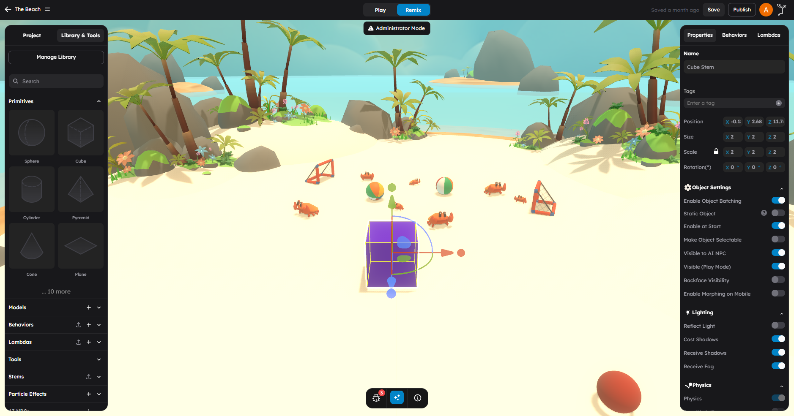

# Right Panel — Object Properties

The right panel is where you turn a selected scene object into a game object.

When you select something in the scene, the right panel changes to match that selection. In most cases, you will work across three tabs:

- **Properties**
- **Behaviors**
- **Lambdas**

If the scene itself is selected (click the background), you also get:

- **Settings**

Configure object properties, attach gameplay behaviors, register with lambda systems, and edit project-wide settings.

---

## Properties Tab

Use **Properties** when you want to edit the selected object itself.

This tab is the right choice for:

- Transform and movement setup
- Rendering and visibility
- Text and model-specific settings
- Physics and collision settings
- Object metadata and in-game presentation

For many objects, the Properties tab is where you do the majority of the work before adding any logic.

### Sections In Properties

The exact sections change based on object type, but here are the common ones:

#### Transformation

| Field | Type | Description |
|-------|------|-------------|
| **Position** | Vector3 (x, y, z) | World position of the object in scene units |
| **Rotation** | Vector3 (x, y, z) | Rotation in degrees around each axis |
| **Scale** | Vector3 (x, y, z) | Size multiplier on each axis (1 = original size) |

> **Tip:** You can also move objects using the viewport gizmos. The Properties panel shows exact values for precision work.

#### Rendering

| Field | Description |
|-------|-------------|
| **Cast Shadow** | Whether this object casts shadows onto other surfaces |
| **Receive Shadow** | Whether this object shows shadows cast by other objects |
| **Render Order** | Draw order priority (higher values render on top) |
| **Visible** | Whether the object is visible in the editor |
| **Frustum Culled** | Whether the renderer can skip this object when off-screen |

#### In-Game Settings

| Field | Description |
|-------|-------------|
| **Name** | Display name of the object |
| **Description** | Text shown when the object is inspected in-game |
| **Interactable** | Whether the player can interact with this object |
| **Clickable** | Whether click/tap events fire on this object |
| **Hover Cursor** | Cursor style when hovering over the object in-game |
| **Blocks Camera** | Whether the third-person camera collides with this object. When enabled, the camera cannot pass through. Disable for decorative objects, skyboxes, or particle effects that the camera should clip through. Default: On |

#### Physics

| Field | Description |
|-------|-------------|
| **Body Type** | `Static` (immovable), `Dynamic` (physics-driven), `Kinematic` (script-driven) |
| **Mass** | Weight of the object in kilograms (dynamic bodies only) |
| **Friction** | Surface friction coefficient (0 = frictionless, 1 = high grip) |
| **Restitution** | Bounciness (0 = no bounce, 1 = full bounce) |
| **Collision Shape** | Physics shape: `Box`, `Sphere`, `Cylinder`, `Capsule`, `Mesh`, `ConvexHull` |
| **Is Trigger** | If enabled, detects overlaps without physical collision |
| **Lock Rotation** | Prevents physics from rotating the object |

> **Note:** Physics fields only appear when physics is enabled on the object. Enable physics by setting a Body Type other than `None`.

#### Visibility

| Field | Description |
|-------|-------------|
| **Visible In Game** | Whether the object is visible during play mode |
| **Visible In Editor** | Whether the object is visible during editing |
| **Layer** | Rendering layer assignment |

#### Lighting (Light Objects Only)

For light objects (Point Light, Spot Light, Directional Light, Area Light), additional fields appear:

| Field | Description |
|-------|-------------|
| **Color** | Light color |
| **Intensity** | Brightness multiplier |
| **Distance** | Maximum range of the light (point/spot) |
| **Decay** | How quickly the light fades with distance |
| **Angle** | Cone angle in degrees (spot light only) |
| **Penumbra** | Soft edge width (spot light only) |
| **Cast Shadow** | Whether this light casts shadows |
| **Shadow Map Size** | Shadow quality resolution |

#### Model (Imported Models)

| Field | Description |
|-------|-------------|
| **Animation** | Select and play animations embedded in the model |
| **Materials** | Override or edit materials on the model |

#### Text (Text Objects)

| Field | Description |
|-------|-------------|
| **Content** | The text string to display |
| **Font Size** | Text size |
| **Color** | Text color |
| **Alignment** | Left, center, or right alignment |

### Use Properties For These Tasks

- Move, rotate, or scale an object
- Decide whether it should be visible in-game
- Tune collisions and rigid body behavior
- Configure model- or text-specific options
- Adjust how the object appears and behaves as a scene item

---

## Behaviors Tab

Use **Behaviors** when you want to attach object-level gameplay logic.

A behavior is the most natural place to say:

- "When this object starts, do something"
- "When the player enters this trigger, do something"
- "Every frame, update this object"
- "Listen for gameplay events and react"

The Behaviors tab lets you add, select, copy, paste, and configure the behaviors attached to the current object.

### What You See In The Behaviors Tab

- A list of all behaviors attached to the selected object
- For each behavior, its **attributes** (configurable parameters)
- An optional **Custom Name** field at the top of each behavior's configuration -- use this to label behavior instances for easier identification (for example, naming three Enemy behaviors as "Boss", "Patrol Guard", and "Turret")
- An **Add Behavior** button to attach new behaviors
- Copy/paste controls for duplicating behavior configurations

### Behavior Attributes

Each behavior can expose attributes that you edit directly in this panel. These attributes control behavior without writing code. Common attribute types include:

- **Number** — Speed, distance, health values
- **String** — Names, labels, messages
- **Boolean** — On/off toggles
- **Color** — Color pickers
- **Vector3** — 3D positions or directions
- **Object Reference** — Links to other scene objects

### Use Behaviors For These Tasks

- Attach logic to one object
- Edit behavior attributes
- Manage multiple behaviors on the same object
- Configure object-specific gameplay state

For more on writing behaviors, see [Writing Behaviors](../scripting/02-writing-behaviors.md).

---

## Lambdas Tab

Use **Lambdas** when you want the selected object to participate in a shared batched system.

Unlike behaviors, lambdas are not just "logic on this object." A lambda instance can process many objects together. The Lambdas tab lets you attach lambda components to the selected object and edit the component data for that lambda.

This is a good fit when many objects need the same kind of repeated update, such as:

- Position, velocity, or rotation processing
- Repeated visual or audio actions
- Lightweight ECS-style systems
- Batched gameplay data updates

### What You See In The Lambdas Tab

- A list of lambda components attached to the object
- For each component, the **component data** fields
- An **Add Lambda** button to register with a new lambda system

### Use Lambdas For These Tasks

- Add the selected object to a shared system
- Edit component data per object
- Enable or disable a lambda component on the object
- Attach the object to an existing lambda instance

For more on writing lambdas, see [Writing Lambdas](../scripting/03-writing-lambdas.md).

---

## Settings Tab

**Settings** appears when you are working at the scene level instead of the object level. Click the scene background (deselect all objects) to see this tab.

This tab is for project and game-wide configuration, not per-object editing.

### Settings Sections

| Section | What It Controls |
|---------|-----------------|
| **Game Details** | Name, description, thumbnail, tags |
| **Game Mode** | Game type and win/loss conditions |
| **Multiplayer** | Enable multiplayer, room settings, max players |
| **Player Profile** | Player appearance and identity options |
| **Physics Defaults** | Gravity, default physics material, simulation quality |
| **Snapping** | Grid snapping, rotation snapping, units |
| **Units** | Measurement units and angle units |
| **Integrations** | Platform connections, authentication settings |

If you are trying to configure one selected mesh, light, or trigger, you probably want **Properties** or **Behaviors** instead.

For the full settings reference, see [Project Settings](04-project-settings.md).

---

## How To Choose The Correct Tab

Use this rule of thumb:

| I want to... | Use this tab |
|--------------|-------------|
| Change how the object looks or moves | **Properties** |
| Add gameplay logic to the object | **Behaviors** |
| Register the object with a shared system | **Lambdas** |
| Change how the whole game works | **Settings** |

## Examples

### Example: Make A Crate Solid

Open **Properties**, then work in the Physics section. Set Body Type to `Static` or `Dynamic` and choose a collision shape. You do not need a behavior just to make an object collide properly.

### Example: Make A Trigger Open A Door

Open **Behaviors**. This is object logic and event handling, so behaviors are the right tool. Attach a trigger behavior and configure it to emit a door-open event.

### Example: Add Many Moving Objects That Share The Same Update Pattern

Open **Lambdas** for each participating object and attach the relevant lambda component. Then let a behavior or system trigger the lambda at runtime.

### Example: Turn On Multiplayer For The Game

Click the scene background to deselect all objects, then open **Settings**. This is not an object-level property — it is a game-wide setting.

## Common Mistakes

- Putting gameplay logic in Properties when it belongs in Behaviors
- Using a behavior for large batched data processing that should be handled by a lambda
- Looking for scene-level settings while an object is selected (click the background first)
- Treating the Lambdas tab as a replacement for behaviors instead of a complement to them

## A Practical Order Of Operations

For most gameplay objects, the cleanest order is:

1. Set up the object in **Properties**
2. Attach object logic in **Behaviors**
3. Add lambda participation in **Lambdas** only if needed

That order keeps the object understandable and avoids overbuilding too early.

## Next Steps

- Read [Behaviors vs Lambdas](../scripting/01-behaviors-vs-lambdas.md) before building custom scripting systems.
- Read [Project Settings](04-project-settings.md) for full scene configuration reference.
- Read [Writing Behaviors](../scripting/02-writing-behaviors.md) to start writing your first behavior.
