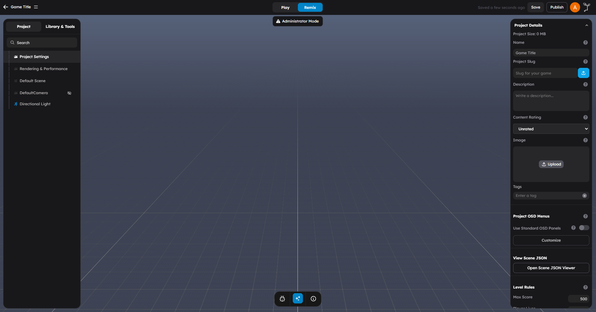
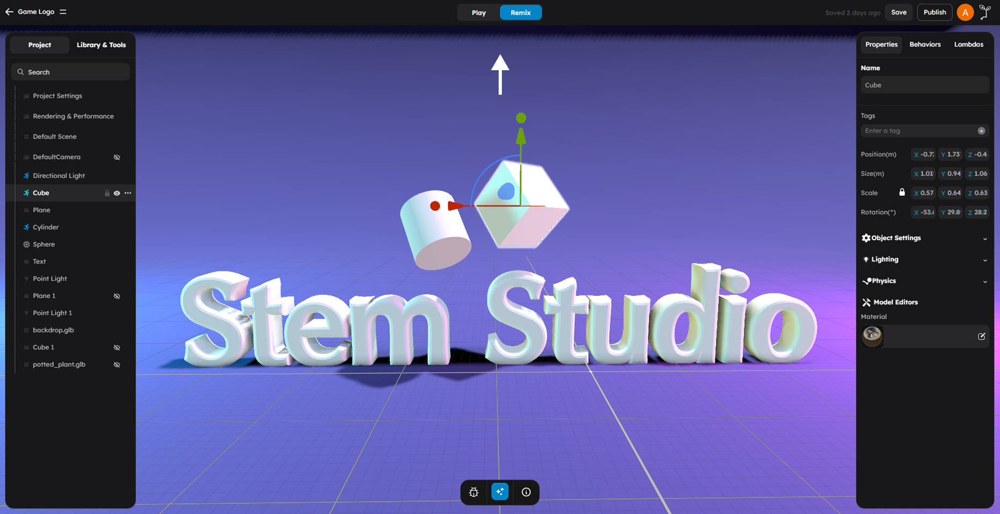

# Toolbar and Viewport

The top controls and viewport are the two areas you interact with most while building a scene. The top controls combine transform/playback tools with quick-access buttons for camera presets, snap settings, debug tools, AI, and the unified code editor. The viewport is the 3D canvas where your scene lives and where you select, move, and visually edit objects.

Transform objects, control playback, navigate the viewport, and use the current quick-access action bar.

---

## Transform Tools

The transform tools let you move, rotate, and scale objects directly in the 3D viewport using a visual gizmo. The toolbar shows three transform mode buttons.

### Move (W)

Press **W** or click the Move button in the toolbar to activate the Move tool.

When active, the selected object displays a **translation gizmo** with three colored arrows:

- **Red arrow** -- Move along the X axis
- **Green arrow** -- Move along the Y axis
- **Blue arrow** -- Move along the Z axis

**How to use it:**

1. Select an object in the viewport.
2. Press **W** to activate Move mode.
3. Click and drag any arrow to move the object along that axis.
4. Release the mouse button to confirm the position.

#### Plane Handles

Between the axis arrows, you will see small **plane handles** (colored squares at the intersections of two axes). Dragging a plane handle moves the object along two axes simultaneously while keeping the third axis locked.

- **Red-Green plane** -- Move along X and Y
- **Red-Blue plane** -- Move along X and Z
- **Green-Blue plane** -- Move along Y and Z

> **Tip:** Plane handles are useful when you want to slide an object along a surface (like moving a crate across a floor) without accidentally lifting it up or pushing it through the ground.

### Rotate (E)

Press **E** or click the Rotate button to activate the Rotate tool.

When active, the selected object displays a **rotation gizmo** with three colored rings:

- **Red ring** -- Rotate around the X axis
- **Green ring** -- Rotate around the Y axis
- **Blue ring** -- Rotate around the Z axis

**How to use it:**

1. Select an object.
2. Press **E** to activate Rotate mode.
3. Click and drag any ring to rotate the object around that axis.
4. A degree readout appears while dragging to show the current rotation amount.

> **Tip:** If you need precise rotation values, use the Properties panel in the right panel. The gizmo is best for visual adjustments.

### Scale (R)

Press **R** or click the Scale button to activate the Scale tool.

When active, the selected object displays a **scale gizmo** with three colored handles and a center cube:

- **Red handle** -- Scale along the X axis
- **Green handle** -- Scale along the Y axis
- **Blue handle** -- Scale along the Z axis
- **Center cube** -- Scale uniformly along all axes

**How to use it:**

1. Select an object.
2. Press **R** to activate Scale mode.
3. Drag an axis handle to stretch or compress along that axis.
4. Drag the center cube to scale the object uniformly.

> **Tip:** Uniform scaling (using the center cube) is usually what you want for models and characters. Per-axis scaling is more useful for primitives like boxes and planes.

### Switching Between Transform Modes

You can switch between transform modes at any time:

| Key | Tool | Gizmo |
|-----|------|-------|
| **W** | Move | Axis arrows + plane handles |
| **E** | Rotate | Axis rings |
| **R** | Scale | Axis handles + center cube |

The currently active mode is highlighted in the toolbar. Only one transform mode can be active at a time.

### Canceling A Transform

Press **Escape** while dragging a gizmo handle to cancel the current transform operation and return the object to its position before the drag started.

---

## Camera View Presets

The toolbar includes a **Camera View** button (camera icon) that lets you quickly snap the editor camera to standard orientations.

Click the camera icon to open the view presets panel:

| Preset | What It Does |
|--------|-------------|
| **Default (Perspective)** | The standard 3D perspective view for general scene building |
| **Top Down** | Looks straight down from above, useful for laying out floor plans and positioning objects on a grid |
| **Side View** | A side-on view for aligning objects vertically or checking heights |

The currently active preset is highlighted. When you manually orbit the camera, it switches to **Custom** to indicate you are no longer in a preset view.

> **Tip:** Use Top Down view when placing objects on terrain or building room layouts. Switch back to Default for general 3D editing.

---

## Grid Snap Quick Access

When grid snapping is enabled in [Project Settings](04-project-settings.md), a **Grid Snap** button (grid icon) appears in the toolbar. This lets you quickly change the snap resolution without opening Project Settings.

Click the grid icon to choose from preset snap increments:

| Snap Size | Best For |
|-----------|----------|
| **1** | Fine placement, small props |
| **2** | General object placement |
| **4** | Medium-scale building |
| **8** | Room-scale layout |
| **16** | Large structure alignment |
| **32, 64, 128** | Terrain-scale or chunk-aligned placement |

When you change the snap size, the viewport grid lines update to match the new resolution, giving you a visual reference for alignment.

> **Note:** The Grid Snap button only appears when grid snapping is enabled. To enable it, go to [Project Settings > Snapping](04-project-settings.md) and turn on **Enable Grid Snapping**.

---

## Action Bar Quick Tools

The current action bar also includes a set of quick-access buttons beyond transform and playback.

| Tool | What it does |
|------|--------------|
| **Debug Console** | Opens the in-editor debug/log panel |
| **AI Copilot** | Opens the AI copilot flow |
| **Code Editor** | Opens the unified code editor for behaviors, lambdas, imports, and text files |
| **Keyboard Shortcuts** | Opens shortcut help |
| **Help** | Opens the docs site |
| **Collaboration Status** | Shows whether collaborative editing is connected, connecting, or disconnected |

These buttons are especially useful once you move past scene layout and start iterating on gameplay logic and debugging.

---

## Play / Stop

The Play and Stop buttons control **play mode**, which lets you test your game directly inside the editor.

### Play

Click the **Play** button to enter play mode. When play mode starts:

- All behaviors begin executing their `onStart()` and `update()` lifecycle hooks
- Physics simulation begins (objects with dynamic bodies start responding to gravity and collisions)
- Input controls activate (WASD movement, mouse interactions, etc.)
- The viewport switches to a player perspective
- The scene state is temporarily frozen so changes during play are not saved

### Stop

Click the **Stop** button to exit play mode and return to the editor. When you stop:

- All behavior execution halts
- Physics simulation stops
- The scene reverts to its state before you pressed Play
- You are back in editing mode

> **Important:** Changes you make during play mode are **not saved**. Play mode is purely for testing. If you move objects, trigger behaviors, or interact with the scene while playing, everything resets when you stop.

### Common Play Mode Workflow

1. Make changes in the editor (add objects, configure behaviors, adjust properties).
2. Press **Play** to test.
3. Observe how the game feels.
4. Press **Stop** to return to the editor.
5. Make adjustments based on what you observed.
6. Repeat.

This build-test-iterate loop is the core workflow for game development in StemStudio.

---

## Undo / Redo

Undo and Redo are keyboard-only shortcuts — there are no visible toolbar buttons for them.

| Action | Shortcut (Windows/Linux) | Shortcut (Mac) |
|--------|--------------------------|----------------|
| **Undo** | Ctrl+Z | Cmd+Z |
| **Redo** | Ctrl+Shift+Z | Cmd+Shift+Z |

Undo and Redo track most editing operations including:

- Moving, rotating, and scaling objects
- Adding and removing objects
- Changing object properties
- Attaching and detaching behaviors

> **Tip:** If you accidentally delete an object, press Ctrl+Z (Cmd+Z on Mac) immediately to bring it back.

---

## Save

Save your scene to persist all changes.

| Action | Shortcut (Windows/Linux) | Shortcut (Mac) |
|--------|--------------------------|----------------|
| **Save** | Ctrl+S | Cmd+S |

You can also save by clicking the Save button in the toolbar.

> **Important:** StemStudio does not auto-save. Get in the habit of saving frequently, especially before entering play mode or making large changes. If you close the browser tab without saving, unsaved changes are lost.

---

## Viewport Navigation

The viewport is the large 3D canvas in the center of the editor. You navigate around the scene using mouse and keyboard controls.

### Mouse Navigation

| Action | Mouse Control | What It Does |
|--------|--------------|--------------|
| **Orbit** | Right-click + drag | Rotate the camera around the scene center |
| **Pan** | Middle-click + drag | Slide the camera laterally without rotating |
| **Zoom** | Scroll wheel | Move the camera closer to or farther from the scene |
| **Select** | Left-click | Select the object under the cursor |

### Trackpad Navigation

If you are using a trackpad (common on laptops), these alternatives work:

| Action | Trackpad Control |
|--------|-----------------|
| **Orbit** | Two-finger drag |
| **Pan** | Shift + two-finger drag |
| **Zoom** | Pinch gesture |
| **Select** | Click (single finger tap) |

### Orbit

Orbiting rotates the camera around a central point, letting you view your scene from different angles. Right-click and drag to orbit.

- Drag left/right to orbit horizontally
- Drag up/down to orbit vertically
- The orbit center is usually the last point you focused on or the scene center

### Pan

Panning slides the entire view left, right, up, or down without changing the camera angle. Middle-click (scroll wheel click) and drag to pan.

### Zoom

Scrolling the mouse wheel zooms the camera in and out. Scroll up to zoom in, scroll down to zoom out.

> **Tip:** If you zoom in too far and lose your bearings, select an object and press **F** to focus on it and reset the camera distance.

### Select

Left-click an object in the viewport to select it. The selected object is highlighted and its transform gizmo appears. Clicking the empty background deselects all objects.

---

## Focus / Frame Selected (F)

Press **F** to focus the camera on the currently selected object. This centers the object in the viewport and adjusts the zoom level so the object fills the view.

Focus is useful when:

- You have zoomed out far and want to quickly return to a specific object
- You have panned away from the area you were working on
- You selected an object from the scene hierarchy in the left panel and want to see it in the viewport
- You cannot find an object visually

> **Tip:** Select an object from the Project tab in the left panel and press **F** to immediately navigate to it in the viewport. This is often faster than manually orbiting and panning to find it.

---

## Viewport Interaction Summary

| Key / Input | Action |
|-------------|--------|
| **W** | Activate Move tool |
| **E** | Activate Rotate tool |
| **R** | Activate Scale tool |
| **F** | Focus/frame selected object |
| **Escape** | Cancel transform or deselect |
| **Delete** / **Backspace** | Delete selected object |
| **Camera icon** | Open camera view presets (Default, Top Down, Side View) |
| **Grid icon** | Change snap resolution (visible when grid snapping is enabled) |
| **Left-click** | Select object |
| **Right-click + drag** | Orbit camera |
| **Middle-click + drag** | Pan camera |
| **Scroll wheel** | Zoom camera |

---

## Practical Tips

- **Use keyboard shortcuts for transform modes.** Pressing W, E, and R to switch between Move, Rotate, and Scale is much faster than clicking the toolbar buttons.
- **Orbit frequently.** Always check your work from multiple angles. Objects that look correctly placed from one view may be floating or intersecting from another.
- **Use Focus (F) to avoid getting lost.** If you pan or zoom too far and lose sight of your scene, select any object and press F to snap back.
- **Save before testing.** Press Ctrl+S (Cmd+S) before pressing Play so your latest changes are preserved.
- **Check both editor and play perspectives.** The camera position in the editor is not the same as what the player sees during play. Test frequently.

## Common Mistakes

- **Forgetting that play mode does not save changes.** Any object positions or settings changed during play revert when you stop. Make all permanent changes in editor mode.
- **Dragging the wrong gizmo axis.** If an object moves in an unexpected direction, check which axis handle you are dragging. The color coding (red = X, green = Y, blue = Z) is consistent across all transform tools.
- **Scaling when you meant to move.** If an object suddenly changes size, you may be in Scale mode (R) instead of Move mode (W). Check the toolbar to see which mode is active.
- **Not saving frequently enough.** There is no auto-save. A browser crash or accidental tab close will lose all unsaved work.
- **Panning instead of orbiting (or vice versa).** Right-click drag orbits, middle-click drag pans. Mixing these up is common when learning the controls.

## Next Steps

- Read [Right Panel](02-right-panel.md) to learn how to configure object properties after positioning them.
- Read [Project Settings](04-project-settings.md) for scene-level configuration like physics and snapping.
- Read [Keyboard Shortcuts](05-keyboard-shortcuts.md) for the complete shortcut reference.
