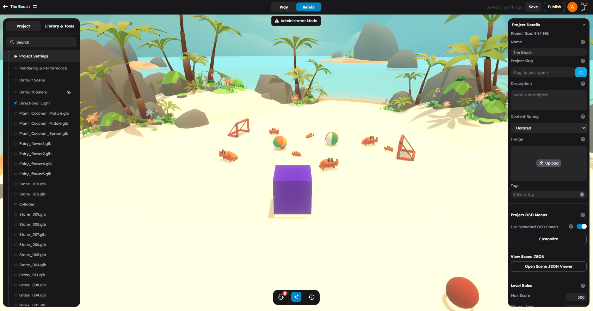
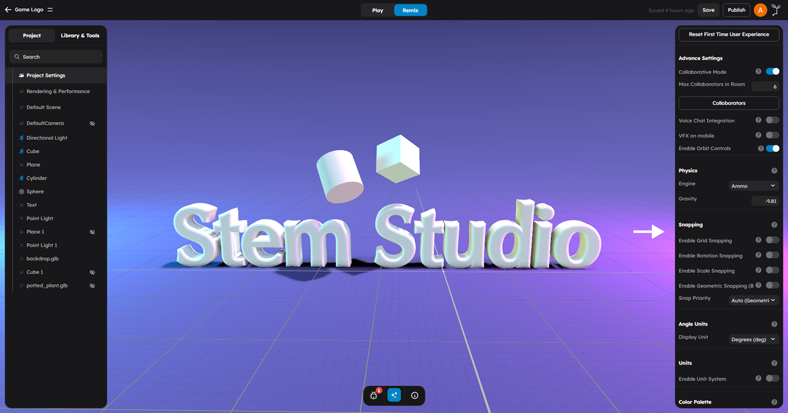

# Project Settings

Project settings control how your entire game works -- from its name and description to physics simulation, snapping behavior, multiplayer rules, and platform integrations.

To open project settings:

1. Click the scene background to deselect all objects.
2. In the right panel, the **Settings** tab becomes available.
3. Click **Settings** to view and edit project-level configuration.

Configure project metadata, physics, lighting, snapping, multiplayer, and platform integrations.

---

## Project Details

The Project Details section contains the metadata that identifies your game.

| Field | Description |
|-------|-------------|
| **Project Size** | Read-only display of the current scene file size in MB. A warning appears if the scene is unusually large. |
| **Name** | The public title of your game, shown to players and in listings. |
| **Project Slug** | A subdomain identifier for your game (e.g., `coolgame.erth.ai`). Only lowercase letters, numbers, and hyphens are allowed. Admin access may be required. |
| **Description** | A short summary used in discovery surfaces and share cards. |
| **Content Rating** | Age-appropriateness guidance. Options: Unrated, Everyone, Everyone 10+, Teen, Mature 17+, Adults Only. |
| **Image** | Primary thumbnail or banner image for your project. Upload an image to represent your game in listings. |
| **Tags** | Keywords that help players discover your game. Add multiple tags to improve searchability. |

### Slug Details

The slug creates a custom URL for your game (e.g., `your-slug.erth.ai`). Once saved, the slug is locked. You can delete it and create a new one, but each slug must be unique across all StemStudio games.

> **Tip:** Choose a slug that is short, memorable, and related to your game name. Avoid special characters -- only lowercase letters, numbers, and hyphens are valid.

---

## Project OSD Menus

The OSD (On-Screen Display) section controls the default in-game user interface panels that players see during gameplay.

| Field | Description |
|-------|-------------|
| **Use Standard OSD Panels** | When enabled, the default in-game HUD and menu panels are displayed during play. |
| **Customize** | Opens the UI customization panel where you can configure which OSD elements appear and how they look. Only available when the game is enabled and Standard OSD is active. |

---

## View Scene JSON

A debugging utility that opens a JSON viewer showing the raw scene data structure.

| Field | Description |
|-------|-------------|
| **Open Scene JSON Viewer** | Opens a read-only viewer displaying the current scene as serialized JSON. Useful for debugging and inspecting scene data. |

---

## Level Rules

Level Rules define the scoring, lives, and time objectives for your game's gameplay loop.

| Field | Description | Default |
|-------|-------------|---------|
| **Max Score** | Target score threshold for completing the level. When a player reaches this score, the level is considered complete. | 500 |
| **Player Lives** | How many failed attempts a player gets before game-over. | 3 |
| **Time Limit** | Duration of the gameplay session in seconds. Set to 0 for infinite (no time limit). | 200 |

> **Tip:** For exploration or sandbox-style games, set the time limit to 0 and increase player lives to a high number (or handle lives through your own behaviors).

---

## Debug Settings

Debug settings help you develop and test your game.

| Field | Description |
|-------|-------------|
| **Production Mode** | When enabled, removes debugger statements from behavior and lambda code. Keep this enabled for published games. Disable during development if you need `debugger` breakpoints. |
| **Open Scene JSON Viewer** | Opens the raw JSON representation of the scene for inspection. |
| **Reset First Time User Experience** | Clears the FTUE (First Time User Experience) flag so the Getting Started guide appears again on next page reload. Useful for testing onboarding flows. |

---

## Advanced Settings

The Advanced Settings section (labeled "Advance Settings" in the editor) controls collaboration and runtime behavior options.

| Field | Description |
|-------|-------------|
| **Collaborative Mode** | Enables real-time multi-creator editing. Multiple people can edit the same scene simultaneously. Requires a page refresh to take effect. |
| **Max Collaborators in Room** | Maximum number of creators that can edit the scene together at once. Range: 1--10. Only visible when Collaborative Mode is enabled. |
| **Collaborators** | Opens a modal to manage who has access to collaborate on this scene. Only available when Collaborative Mode is enabled. |
| **Voice Chat Integration** | Enables built-in voice communication for multiplayer experiences. Uses LiveKit for real-time audio. |
| **VFX on Mobile** | Allows particle and visual effects to render on mobile devices. Disable for better mobile performance on lower-end devices. |
| **Enable Orbit Controls** | Enables camera orbit controls during play when no player character is present. Useful for showcase scenes or interactive displays. |

> **Note:** Collaborative mode is for creators editing together, not for multiplayer gameplay. For player-facing multiplayer, use the Player Settings section instead.

---

## Physics

The Physics section sets the global simulation defaults for your scene.

| Field | Description | Default |
|-------|-------------|---------|
| **Engine** | Selects the runtime physics engine. **Ammo** (Bullet Physics) is the engine currently available in StemStudio. | Ammo |
| **Gravity** | Global gravity acceleration applied to all dynamic rigid bodies, in meters per second squared. Negative values pull downward. | -9.81 |

### Gravity Values

Common gravity settings:

| Value | Effect |
|-------|--------|
| **-9.81** | Earth-like gravity (default) |
| **-1.62** | Moon-like gravity |
| **0** | Zero gravity (space environments) |
| **-20** | Heavy gravity (faster falling, heavier feel) |

---

## Default Lights And Fog

StemStudio includes a scene-level **Default Lights and Fog** surface for environment-wide rendering controls. These settings affect the whole scene rather than a single object.

Use this area when you want to:

- brighten or darken the scene globally
- add sky-style fill light
- blend the horizon with fog
- change the scene background
- control the final contrast and brightness response
- enable or tune real-time shadows

---

## Ambient Lighting

The **Ambient Lighting** section adds a flat fill light across the whole scene.

| Field | Description | Default |
|-------|-------------|---------|
| **Color** | The ambient light color applied everywhere. | `#ffffff` |
| **Intensity** | Overall ambient brightness. `0` disables it. | `0` |

> **Tip:** Keep ambient intensity low. Too much ambient light removes contrast and makes the scene look flat.

---

## Hemisphere Lighting

The **Hemisphere Lighting** section blends one light color from above and another from below, which is useful for outdoor scenes.

| Field | Description | Default |
|-------|-------------|---------|
| **Sky Color** | Fill light color coming from above. | `#ffffff` |
| **Ground Color** | Fill light color coming from below. | `#888888` |
| **Intensity** | Overall hemisphere light strength. | `0` |

Hemisphere lighting is a good first pass for daylight scenes before you add more specific point, spot, or directional lights.

---

## Fog

The **Fog** section controls atmospheric depth and horizon blending.

| Field | Description | Default |
|-------|-------------|---------|
| **Type** | Fog mode. Options: **None**, **Linear**, **Exponential**, **Height**. | None |
| **Color** | Fog color blended into distant objects. | `#aaaaaa` |
| **Near** | Where linear fog begins. Only used in **Linear** mode. | `5` |
| **Far** | Where linear fog becomes fully opaque. Only used in **Linear** mode. | `150` |
| **Density** | Exponential fog thickness. Only used in **Exponential** mode. | `0.011` |
| **Min Height** | Lower bound of height fog. Only used in **Height** mode. | `50` |
| **Max Height** | Upper bound of height fog. Only used in **Height** mode. | `150` |
| **Falloff** | Height fog curve. Options: **Linear** or **Exp**. | Linear |
| **Visible in editor** | Shows or hides the fog effect while editing. | On |

### Choosing A Fog Type

| Type | Best For |
|------|----------|
| **Linear** | Predictable distance fade |
| **Exponential** | Dense atmosphere, mist, smoke |
| **Height** | Ground haze, valleys, layered outdoor scenes |

---

## Scene Background

The **Scene Background** section controls what appears behind the playable world.

| Field | Description | Default |
|-------|-------------|---------|
| **Type** | Background mode. Options: **Color**, **Texture**, **Cubemap**, **Gradient**. | Color |
| **Color** | Solid background color. | `#27272a` |
| **Texture** | A single image background. | Empty |
| **Cubemap** | Six images used as an environment background. | Empty |
| **Gradient** | A gradient-based background. | Default project gradient |
| **Gradient Mode** | Gradient style. Options: **2D** or **3D**. | 2D |
| **Rotation** | Rotates texture or cubemap backgrounds. | `0` |
| **Intensity** | Background brightness. | `1` |
| **Blurriness** | Blur amount for texture or cubemap backgrounds. | `0` |

> **Note:** Scene background settings are different from the `skybox` behavior. Use the scene background for a global backdrop. Use the `skybox` behavior when you want a mesh in the scene to act as the sky container.

---

## Tone Mapping

The **Tone Mapping** section controls how the final image is compressed and exposed.

| Field | Description | Default |
|-------|-------------|---------|
| **Type** | Tone mapping curve. Options: **None**, **Linear**, **Reinhard**, **Cineon**, **ACESFilmic**. | None |
| **Exposure** | Final scene brightness multiplier. | `1.0` |

For PBR scenes and realistic lighting workflows, `ACESFilmic` is usually the best starting point.

---

## Shadows

The **Shadows** section controls real-time shadow rendering for the scene.

| Field | Description | Default |
|-------|-------------|---------|
| **Enabled** | Turns real-time shadows on or off. | Off |
| **Map Type** | Shadow algorithm. Options: **Basic**, **PCF**, **PCF Soft**, **VSM**. | PCF |

> **Tip:** The default PCF shadow type provides a good balance of quality and performance. Shadows render with reduced pixelation and minimal gaps between objects and their shadows. Use PCF Soft if you prefer softer shadow edges at a higher GPU cost.

---

## Snapping

Snapping controls precision placement behavior when you move, rotate, or scale objects. All snapping is disabled by default.

### Grid Snapping

| Field | Description | Default |
|-------|-------------|---------|
| **Enable Grid Snapping** | Snaps object translation to fixed grid increments. | Off |
| **Grid Size** | Distance step used for move snapping, in scene units. Range: 0.01--100. | 1.0 |

When grid snapping is enabled, objects snap to the nearest grid point when you move them with the Move tool.

### Rotation Snapping

| Field | Description | Default |
|-------|-------------|---------|
| **Enable Rotation Snapping** | Snaps object rotation to fixed angle increments. | Off |
| **Snap Angle** | Angle increment for rotation snapping. Displayed in the currently selected angle unit (degrees or radians). | 0 |

Preset buttons are available for common angles: **15, 30, 45, and 90 degrees**.

> **Tip:** 15-degree snapping is a good default for general work. Use 90-degree snapping when building grid-aligned architecture.

### Scale Snapping

| Field | Description | Default |
|-------|-------------|---------|
| **Enable Scale Snapping** | Snaps scaling to fixed step increments. | Off |
| **Scale Increment** | Scale amount per snap step. Range: 0.01--10. | 0.1 |

### Geometric Snapping (Beta)

| Field | Description | Default |
|-------|-------------|---------|
| **Enable Geometric Snapping** | Snaps to nearby mesh geometry features. Beta feature. | Off |
| **Snap to Vertices** | Allows snapping to mesh corner points. | On |
| **Snap to Edges** | Allows snapping to mesh edge segments. | On |
| **Snap to Faces** | Allows snapping to polygon surfaces. | On |
| **Snap Distance** | Maximum distance from target geometry for a snap to trigger. Range: 0.1--10. | 0.5 |
| **Visual Feedback** | Shows snap indicators and highlights while positioning objects. | On |

### Snap Priority

| Option | Description |
|--------|-------------|
| **Auto (Geometric > Grid)** | Geometric snapping takes priority when available, falls back to grid snapping. |
| **Geometric Only** | Only geometric snapping is used. |
| **Grid Only** | Only grid snapping is used. |

---

## Angle Units

Controls how angles are displayed throughout the editor.

| Field | Description | Default |
|-------|-------------|---------|
| **Display Unit** | Sets the angle unit for rotation fields and gizmo overlays. Options: **Degrees (deg)** or **Radians (rad)**. | Degrees |

This is a display-only setting. Changing it does not alter the actual rotation values of objects -- it only changes how those values are shown in the editor UI.

---

## Units

Controls the measurement unit system displayed in editor controls.

| Field | Description | Default |
|-------|-------------|---------|
| **Enable Unit System** | When enabled, shows transform values using the selected display unit. | Off |
| **Display Unit** | Sets the measurement unit for numeric fields. Options: **Meters (m)**, **Centimeters (cm)**, **Millimeters (mm)**, **Inches (in)**, **Feet (ft)**. | Meters |

Like angle units, this is a visual display setting. The internal engine always works in meters. Enabling a different display unit converts values for presentation only.

> **Tip:** If you are building for a specific real-world scale (such as architectural visualization), enabling a familiar unit system can help you reason about distances more intuitively.

---

## Color Palette

Choose a named color palette whose swatches appear in every color picker throughout the editor. This gives you a consistent set of colors to work with across your entire project.

---

## Player Settings

The Player Settings section (labeled "Player Settings" in the editor) controls player identity, multiplayer, and avatar configuration.

| Field | Description |
|-------|-------------|
| **Multiplayer** | Enables networked multiplayer gameplay. When enabled, players join shared rooms and see each other in real time. |
| **Auto Join on Start** | When enabled, players automatically join a multiplayer room when the game starts. Only visible when Multiplayer is enabled. |
| **Max Clients per Room** | Maximum number of players allowed in a single multiplayer room. Minimum: 2. Only visible when Multiplayer is enabled. |
| **Use Player Avatar as Character** | Uses each player's profile avatar as their in-game character model when supported by the character system. |
| **Enable User Accounts** | Enables account-based player identity and progression. When enabled, players can create accounts, save progress, and maintain profiles. |
| **Allow Guest Players** | When enabled, allows players to enter without creating an account. Uses guest sign-in. Only visible when User Accounts are enabled. |

### Multiplayer Configuration

When you enable Multiplayer, several additional options become available:

1. **Auto Join on Start** -- Enable this for games where players should immediately be in a shared session. Disable it if your game has a lobby or menu screen before joining.
2. **Max Clients per Room** -- Controls room capacity. Lower values (2--4) are better for competitive games; higher values work for social experiences.

> **Note:** Multiplayer requires StemStudio's shared room service. In development mode, this runs locally. In production, it runs with your deployed game.

---

## Platform Integrations

Platform integrations are only visible when **Enable User Accounts** is turned on in Player Settings. These integrations connect your game with external platforms.

### Email/Password Auth

Enables traditional email and password account creation for players.

### Discord

Configures Discord integration for your game. When enabled, players can authenticate with their Discord account, and your game can interact with Discord APIs.

### Mobile Game Services

Configures integration with mobile gaming platforms (iOS Game Center, Google Play Games).

### Steam

Configures Steam platform integration for publishing on the Steam store.

### CrazyGames

Configures integration with the CrazyGames web gaming platform.

> **Tip:** You do not need to enable all integrations at once. Start with Email/Password or Discord for authentication, and add other platforms as needed when you are ready to publish.

---

## Settings Section Order (Quick Reference)

The settings panel presents sections in this order from top to bottom:

1. **Project Details** -- Name, description, tags, content rating, slug
2. **Project OSD Menus** -- In-game UI configuration
3. **View Scene JSON** -- Debug data viewer
4. **Level Rules** -- Score, lives, time limit
5. **Debug Settings** -- Production mode, FTUE reset
6. **Advanced Settings** -- Collaborative mode, voice chat, VFX, orbit controls
7. **Physics** -- Engine selection, gravity
8. **Ambient Lighting** -- Global fill light
9. **Hemisphere Lighting** -- Sky and ground fill colors
10. **Fog** -- Atmospheric depth and visibility falloff
11. **Scene Background** -- Color, texture, cubemap, or gradient backdrop
12. **Tone Mapping** -- Final image response and exposure
13. **Shadows** -- Scene shadow enablement and map quality
14. **Snapping** -- Grid, rotation, scale, geometric snapping
15. **Angle Units** -- Degrees or radians display
16. **Units** -- Measurement unit system
17. **Color Palette** -- Project-wide color swatches
18. **Player Settings** -- Multiplayer, avatar, user accounts
19. **Platform Integrations** -- Discord, Steam, CrazyGames, etc. (only when user accounts are enabled)

---

## Practical Tips

- **Set Project Details first.** Name and describe your game early so you can identify it easily in your dashboard.
- **Leave the physics engine on Ammo.** It is the only fully supported engine.
- **Set the scene background early.** It makes materials and lighting much easier to judge while building.
- **Match fog color to the background.** This makes the horizon blend cleanly instead of creating a visible seam.
- **Enable snapping for architectural scenes.** Grid snapping at 1.0 makes walls, floors, and platforms line up perfectly.
- **Use rotation snap presets.** The 15/30/45/90 degree preset buttons save time when building grid-aligned structures.
- **Set content rating before publishing.** An "Unrated" game may be filtered out of some discovery surfaces.
- **Test multiplayer settings with Play mode.** Enable multiplayer, save, and press Play to verify room joining works before publishing.

## Common Mistakes

- **Looking for project settings while an object is selected.** Click the scene background first to deselect all objects. The Settings tab only appears when no object is selected.
- **Confusing collaborative mode with multiplayer.** Collaborative mode is for multiple creators editing the scene together. Multiplayer is for players playing the game together.
- **Forgetting to save after changing settings.** Settings changes are applied in the editor immediately but are not persisted until you save the scene.
- **Changing physics settings mid-project without testing.** Adjusting gravity or collision settings can change physics feel. Always test thoroughly after changes.
- **Using too much ambient lighting.** High ambient intensity removes contrast and makes shadows and focal lighting less effective.
- **Turning on shadows everywhere without checking performance.** Real-time shadows can become one of the most expensive scene settings.
- **Setting the time limit but not handling what happens when it expires.** The time limit value is available to your behaviors, but you need to implement the game-over logic yourself (or use a built-in behavior that respects it).
- **Enabling all platform integrations unnecessarily.** Only enable the platforms you actually plan to deploy on. Each integration requires its own configuration and API keys.

## Collaborator Management

When Collaborative Mode is enabled in Advanced Settings, you can manage who has access to edit the scene.

### Adding A Collaborator

1. Enable **Collaborative Mode** in Advanced Settings.
2. Click **Collaborators** to open the collaborator panel.
3. Enter the collaborator's email address.
4. Click **Add** to grant them editing access.

### Removing A Collaborator

1. Open the **Collaborators** panel.
2. Find the collaborator in the list.
3. Click the remove button next to their name.

Collaborators see the project in their **Shared with Me** section on the dashboard. For more on shared projects, see [Dashboard and Project Flow](../getting-started/04-dashboard-and-projects.md).

## Next Steps

- Read [Keyboard Shortcuts](05-keyboard-shortcuts.md) for the complete shortcut reference.
- Read [Right Panel](02-right-panel.md) for object-level configuration.
- Read [Multiplayer Overview](../multiplayer/01-multiplayer-overview.md) for detailed multiplayer architecture.
