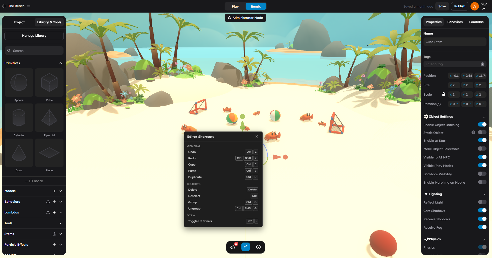

# Keyboard Shortcuts

This page is a complete reference of keyboard shortcuts available in the StemStudio editor. Learning even a few of these shortcuts will significantly speed up your workflow.

> **Mac users:** Wherever this page shows **Ctrl**, use **Cmd** instead. Wherever it shows **Alt**, use **Option**. The editor detects your platform and uses the correct modifier keys automatically.

---

## Transform Tools

These shortcuts control which transform gizmo is active in the viewport.

| Shortcut | Action | Description |
|----------|--------|-------------|
| **W** | Move | Activates the Move tool. Displays translation arrows for moving the selected object along X, Y, and Z axes. |
| **E** | Rotate | Activates the Rotate tool. Displays rotation rings for rotating the selected object around X, Y, and Z axes. |
| **R** | Scale | Activates the Scale tool. Displays scale handles for resizing the selected object along individual axes or uniformly. |

These shortcuts work whenever the viewport has focus and no text input is active.

---

## Viewport Navigation

These controls let you move the camera around the 3D scene.

### Mouse Controls

| Input | Action | Description |
|-------|--------|-------------|
| **Right-click + drag** | Orbit | Rotates the camera around the scene center point. Drag left/right to orbit horizontally, up/down to orbit vertically. |
| **Middle-click + drag** | Pan | Slides the camera view laterally without changing the viewing angle. |
| **Scroll wheel** | Zoom | Scrolls up to zoom in, down to zoom out. |
| **Left-click** | Select | Selects the object under the cursor. Clicking empty space deselects all objects. |

### Trackpad Controls

| Input | Action | Description |
|-------|--------|-------------|
| **Two-finger drag** | Orbit | Equivalent to right-click drag with a mouse. |
| **Shift + two-finger drag** | Pan | Equivalent to middle-click drag with a mouse. |
| **Pinch** | Zoom | Pinch in to zoom out, pinch out to zoom in. |
| **Click** | Select | Single-finger tap to select objects. |

### Viewport Keys

| Shortcut | Action | Description |
|----------|--------|-------------|
| **F** | Focus / Frame selected | Centers the camera on the currently selected object and adjusts zoom so the object fills the view. Useful for quickly navigating to objects. |
| **Escape** | Cancel / Deselect | Cancels the current transform drag operation, or deselects the current selection if no drag is active. |
| **Delete** / **Backspace** | Delete object | Deletes the currently selected object from the scene. |

---

## General Editor Shortcuts

These shortcuts are available throughout the editor when no text input field is focused.

| Shortcut (Windows/Linux) | Shortcut (Mac) | Action | Description |
|--------------------------|----------------|--------|-------------|
| **Ctrl+Z** | **Cmd+Z** | Undo | Reverts the last editing action. |
| **Ctrl+Shift+Z** | **Cmd+Shift+Z** | Redo | Re-applies the last undone action. |
| **Ctrl+C** | **Cmd+C** | Copy | Copies the selected object to the clipboard. |
| **Ctrl+V** | **Cmd+V** | Paste | Pastes the copied object into the scene. |
| **Ctrl+D** | **Cmd+D** | Duplicate | Creates a duplicate of the selected object at the same position. |
| **Ctrl+S** | **Cmd+S** | Save | Saves the current scene. |
| **Ctrl+G** | **Cmd+G** | Group | Groups the selected objects into a parent group. |
| **Ctrl+Shift+G** | **Cmd+Shift+G** | Ungroup | Ungroups the selected group, releasing its children. |
| **Ctrl+.** | **Cmd+.** | Toggle UI Panels | Hides or shows the editor side panels for a distraction-free viewport. |

---

## Code Editor Shortcuts

When you are working inside the behavior or lambda code editor, these shortcuts are available. The code editor uses IntelliJ-style keybindings.

### Editing

| Shortcut (Windows/Linux) | Shortcut (Mac) | Action | Description |
|--------------------------|----------------|--------|-------------|
| **Ctrl+S** | **Cmd+S** | Save | Saves the current script. |
| **Ctrl+D** | **Cmd+D** | Duplicate Line | Duplicates the current line or selection. |
| **Ctrl+Y** | **Cmd+Y** | Delete Line | Deletes the current line. |
| **Alt+Shift+Up** | **Option+Shift+Up** | Move Line Up | Moves the current line up by one position. |
| **Alt+Shift+Down** | **Option+Shift+Down** | Move Line Down | Moves the current line down by one position. |
| **Ctrl+/** | **Cmd+/** | Toggle Comment | Toggles a line comment on the current line or selection. |
| **Ctrl+Shift+/** | **Cmd+Shift+/** | Block Comment | Toggles a block comment around the selection. |
| **Ctrl+Shift+J** | **Cmd+Shift+J** | Join Lines | Joins the current line with the next line. |
| **Ctrl+Alt+L** | **Cmd+Option+L** | Reformat Code | Automatically formats the current file. |

### Selection

| Shortcut (Windows/Linux) | Shortcut (Mac) | Action | Description |
|--------------------------|----------------|--------|-------------|
| **Shift+Alt+Right** | **Shift+Option+Right** | Expand Selection | Expands the selection to the next logical boundary. |
| **Shift+Alt+Left** | **Shift+Option+Left** | Shrink Selection | Shrinks the selection to the previous logical boundary. |
| **Alt+J** | **Option+J** | Next Occurrence | Selects the next occurrence of the current selection. |
| **Ctrl+Shift+Alt+J** | **Cmd+Shift+Option+J** | All Occurrences | Selects all occurrences of the current selection. |

### Navigation

| Shortcut (Windows/Linux) | Shortcut (Mac) | Action | Description |
|--------------------------|----------------|--------|-------------|
| **Ctrl+F** | **Cmd+F** | Find | Opens the find/search dialog within the code editor. |
| **Ctrl+R** | **Cmd+R** | Replace | Opens the find and replace dialog. |
| **Ctrl+G** | **Cmd+G** | Go to Line | Opens the "go to line number" dialog. |

### Code Folding

| Shortcut (Windows/Linux) | Shortcut (Mac) | Action | Description |
|--------------------------|----------------|--------|-------------|
| **Ctrl+.** | **Cmd+.** | Toggle Fold | Toggles code folding on the current block. |
| **Ctrl+Shift+-** | **Cmd+Shift+-** | Fold All | Collapses all foldable code blocks. |
| **Ctrl+Shift+=** | **Cmd+Shift+=** | Unfold All | Expands all collapsed code blocks. |

---

## Quick Reference Card

Here are the shortcuts you will use most often, organized by frequency of use:

### Every Session

| Shortcut | Action |
|----------|--------|
| **W** / **E** / **R** | Switch transform tools |
| **F** | Focus on selected |
| **Ctrl+S** (Cmd+S) | Save |
| **Ctrl+Z** (Cmd+Z) | Undo |
| **Left-click** | Select |
| **Right-click + drag** | Orbit |
| **Scroll** | Zoom |

### Frequently

| Shortcut | Action |
|----------|--------|
| **Ctrl+D** (Cmd+D) | Duplicate object |
| **Delete** | Delete object |
| **Ctrl+Shift+Z** (Cmd+Shift+Z) | Redo |
| **Escape** | Deselect / Cancel |
| **Middle-click + drag** | Pan |

### When Coding

| Shortcut | Action |
|----------|--------|
| **Ctrl+F** (Cmd+F) | Find in code |
| **Ctrl+/** (Cmd+/) | Toggle comment |
| **Ctrl+Alt+L** (Cmd+Option+L) | Reformat code |
| **Ctrl+G** (Cmd+G) | Go to line |
| **Ctrl+D** (Cmd+D) | Duplicate line |

---

## Context-Sensitive Shortcuts

Some shortcuts behave differently depending on what is focused:

| Shortcut | In Viewport | In Code Editor |
|----------|-------------|---------------|
| **Ctrl+D** (Cmd+D) | Duplicates the selected scene object | Duplicates the current line |
| **Ctrl+G** (Cmd+G) | Groups selected objects | Opens "Go to Line" dialog |
| **Ctrl+.** (Cmd+.) | Toggles editor UI panels | Toggles code fold on current block |
| **Ctrl+S** (Cmd+S) | Saves the scene | Saves the current script |

The editor automatically routes shortcuts to the correct context based on which panel has focus.

---

## Viewing Shortcuts In The Editor

The code editor includes a built-in keyboard shortcuts panel. Click the keyboard icon in the code editor toolbar to open a floating reference panel that lists all available code editor shortcuts for your current platform.

---

## Practical Tips

- **Learn W, E, R, and F first.** These four shortcuts cover the most common viewport operations and will save you the most time.
- **Use Ctrl+S (Cmd+S) constantly.** There is no auto-save. Build the habit of saving after every meaningful change.
- **Use Ctrl+Z (Cmd+Z) fearlessly.** Undo is reliable and tracks most editor operations. If something goes wrong, undo immediately.
- **Use F to re-orient yourself.** If you get lost in the viewport, select any object from the Project tab in the left panel and press F to snap the camera to it.
- **Practice orbit and pan together.** Fluid camera control comes from combining right-click orbit and middle-click pan smoothly.

## Common Mistakes

- **Typing W, E, or R while a text input is focused.** Transform shortcuts only work when the viewport has focus. If you are typing in a text field, these keys type characters instead. Click the viewport first.
- **Using Ctrl+Y expecting Redo.** In StemStudio, Ctrl+Y (Cmd+Y) deletes a line in the code editor. Use **Ctrl+Shift+Z** (Cmd+Shift+Z) for redo.
- **Pressing Delete on Mac and nothing happening.** On Mac keyboards, use the **Backspace** key (labeled "delete" on most Mac keyboards) or **Fn+Delete** for the forward-delete behavior. Both work for deleting objects.
- **Forgetting that shortcuts are context-sensitive.** Ctrl+D duplicates an object in the viewport but duplicates a line in the code editor. Check which panel has focus before using a shared shortcut.

## Next Steps

- Read [Toolbar and Viewport](03-toolbar-and-viewport.md) for detailed explanations of each tool.
- Read [Left Panel](01-left-panel.md) for browsing and managing assets.
- Read [Right Panel](02-right-panel.md) for configuring selected objects.
