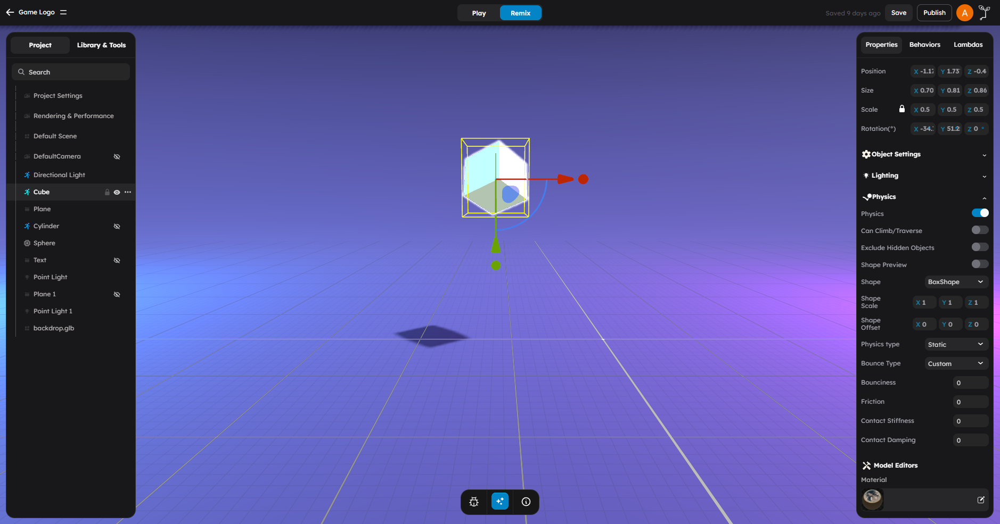
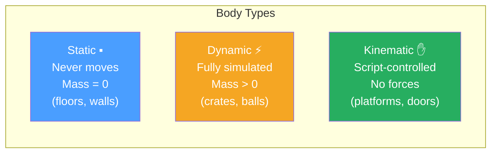
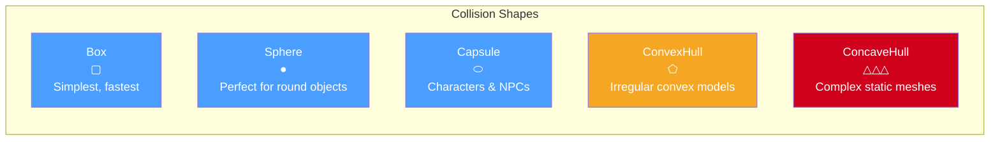
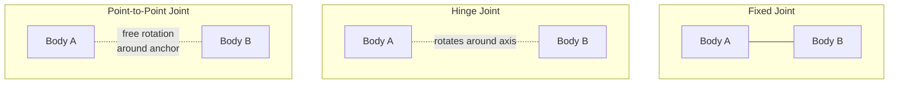

# Physics

StemStudio includes a full physics simulation that lets objects collide, bounce, fall, and respond to forces. You configure physics per object in the right panel, and the engine handles the rest at runtime.



## What This Page Is For

Use this page when you need to:

- Choose a physics engine for your project
- Understand body types and when to use each one
- Pick the right collision shape for an object
- Fine-tune surface behavior with materials and friction
- Create physical connections between objects with joints
- Set up a playable character with physics-based movement
- Debug physics issues with the debug drawer

## Physics Engine

StemStudio supports two physics engines that you can choose between per project:

- **Ammo.js** — port of Bullet Physics to WebAssembly. Battle-tested and full-featured. Default.
- **Rapier3D** — modern Rust-based physics ported to WebAssembly. Smaller, faster startup, and a cleaner determinism story.

Pick the engine from Project Settings. Most APIs are engine-agnostic, so behaviors written against one engine generally work against the other.


## Body Types

Every object with physics enabled has a **body type** that controls how the physics engine treats it.

### Static

Static bodies never move. The physics engine does not apply forces or velocity to them.

Use static for:

- Floors, walls, and platforms
- Buildings and terrain
- Any scenery that should not move

Static bodies have zero mass. Other objects collide with them, but they remain fixed in place.

### Dynamic

Dynamic bodies are fully simulated. The physics engine applies gravity, forces, and collision responses to them.

Use dynamic for:

- Objects that should fall, bounce, or roll
- Projectiles, crates, barrels, balls
- Anything the player can push or interact with physically

Dynamic bodies require a **mass** value greater than zero. Higher mass means more resistance to forces.

### Kinematic

Kinematic bodies are moved by script, not by the physics engine. They still collide with other objects, but forces do not affect them.

Use kinematic for:

- Moving platforms
- Elevators and doors driven by tween animations
- Any object where you want to control position directly but still have collisions



## Collision Shapes

The collision shape defines the invisible geometry the physics engine uses for collisions. It does not need to match the visual mesh exactly -- simpler shapes are faster to compute.

| Shape | Description | Best For |
|-------|-------------|----------|
| **Box** | Axis-aligned box | Crates, walls, floors, buildings |
| **Sphere** | Perfect sphere | Balls, projectiles, simple round objects |
| **Capsule** | Cylinder with hemispherical caps | Characters, NPCs, cylindrical objects |
| **ConvexHull** | Shrink-wrapped convex shape computed from geometry | Irregular but convex models |
| **ConcaveHull** | Triangle mesh computed from geometry | Complex static terrain, architectural models |



> Shapes listed left to right from cheapest to most expensive. Use the simplest shape that fits your object.

### Choosing A Shape

Start with the simplest shape that works:

1. Use **Box** or **Sphere** for primitives and simple objects.
2. Use **Capsule** for characters and standing figures.
3. Use **ConvexHull** when box or sphere does not fit the geometry well.
4. Use **ConcaveHull** only for static objects with complex geometry where accuracy matters.

> **Note:** ConcaveHull is significantly more expensive than the other shapes. Use it only on static bodies. The physics engine may not correctly simulate dynamic ConcaveHull bodies.

### Shape Dimensions

By default, StemStudio computes collision shape dimensions automatically from the object's geometry. You can override this with manual dimensions for Box, Sphere, and Capsule shapes:

- **Box**: width, height, length
- **Sphere**: radius
- **Capsule**: radius, height (cylindrical portion only, excluding caps)

ConvexHull and ConcaveHull shapes are always computed from the mesh geometry.

## Physics Materials

A physics material is a preset that configures surface properties in one step. Materials affect how objects feel when they interact.

StemStudio includes 14 built-in materials:

| Material | Restitution | Friction | Feel |
|----------|-------------|----------|------|
| **metal** | 0.4 | 0.35 | Hard, moderate bounce |
| **dirt** | 0.15 | 0.7 | Soft, high grip |
| **ground** | 0.2 | 0.55 | Neutral surface |
| **plastic** | 0.45 | 0.3 | Light, smooth |
| **snow** | 0.05 | 0.15 | Soft, low friction |
| **wood** | 0.35 | 0.45 | Moderate on both |
| **concrete** | 0.25 | 0.65 | Hard, high grip |
| **mud** | 0.0 | 0.8 | No bounce, very sticky |
| **ice** | 0.3 | 0.03 | Slippery, some bounce |
| **slime** | 0.4 | 0.15 | Bouncy, slippery |
| **water** | 0.02 | 0.05 | Almost no bounce or friction |
| **slipperyGround** | 0.25 | 0.08 | Low-friction floor |
| **rubber** | 0.85 | 0.9 | Very bouncy, very grippy |
| **sand** | 0.1 | 0.6 | Low bounce, moderate grip |

Selecting a material automatically sets restitution, friction, contact stiffness, and contact damping values. You can also set these manually with the **Custom** preset.


## Friction, Restitution, and Damping

If you need finer control than material presets provide, you can adjust surface properties individually.

### Friction

Friction controls how much objects resist sliding against each other.

- `0` = no friction (perfectly slippery)
- `1` = high friction (objects grip strongly)

StemStudio exposes three friction types:

| Property | Description |
|----------|-------------|
| **Friction** | Resistance to sliding contact |
| **Rolling Friction** | Resistance to rolling (spheres, wheels) |
| **Spinning Friction** | Resistance to spinning in place |

### Restitution

Restitution controls bounciness.

- `0` = no bounce (object absorbs all energy on impact)
- `1` = perfectly elastic (object bounces back to its original height)

### Damping

Damping reduces velocity over time, like air resistance.

| Property | Description |
|----------|-------------|
| **Linear Damping** | Reduces movement speed over time (default: 0) |
| **Angular Damping** | Reduces rotation speed over time (default: 0) |

Higher damping values make objects come to rest faster. This is useful for preventing objects from sliding or spinning indefinitely.

## Is Trigger (Ghost Mode)

When an object is set to **Ghost** collision behavior, it detects overlaps without producing a physical collision response. Objects pass through it instead of bouncing off.

Use triggers for:

- Pickup zones (detect when the player enters an area)
- Checkpoint regions
- Damage volumes
- Any detection that should not block movement

Triggers still fire collision callbacks, so behaviors can react to the overlap event.

## Joints

Joints connect two physics bodies together. StemStudio supports three joint types.

### Fixed Joint

A fixed joint locks two bodies together rigidly. They move as a single unit.

Use for:

- Attaching accessories to a vehicle
- Creating compound objects from multiple parts
- Connecting breakable pieces (remove the joint to break them apart)

### Hinge Joint

A hinge joint allows rotation around a single axis, like a door hinge or a wheel axle.

| Property | Description |
|----------|-------------|
| **Hinge Axis** | The axis of rotation (e.g., Y for a door, X for a wheel) |
| **Angular Limit** | Optional minimum and maximum rotation angles |
| **Motor** | Optional motor that drives the hinge at a target speed and torque |

Use for:

- Doors that swing open
- Wheels that spin
- Levers and cranks
- Any rotation constrained to one axis

### Point-to-Point Joint

A point-to-point joint connects two bodies at a single anchor point. Both bodies can rotate freely around that point.

Use for:

- Chain links
- Ragdoll connections
- Pendulums
- Rope segments



| Joint | Degrees of Freedom | Typical Use |
|-------|-------------------|-------------|
| **Fixed** | 0 (locked together) | Compound objects, breakable connections |
| **Hinge** | 1 (rotation on one axis) | Doors, wheels, levers |
| **Point-to-Point** | 3 (rotation on all axes) | Chain links, pendulums, ragdolls |

## Character Controller

The character controller is a specialized physics body designed for player-controlled characters. It handles walking, jumping, slopes, and steps without requiring manual physics tuning.

You configure the character controller through the **Character** behavior attributes:

| Property | Default | Description |
|----------|---------|-------------|
| **playerGravity** | World gravity | Custom gravity for this character. Overrides world gravity when set. |
| **jumpHeight** | 1 | Maximum jump height in world units |
| **stepHeight** | 0.1 | Maximum obstacle height the character can step over without jumping |
| **maxSlope** | 90 | Maximum walkable slope angle in degrees. Steeper slopes block movement. |

Additional character controller options include:

- **Push Objects** -- Apply impulse to dynamic objects the character walks into
- **Push Impulse** -- Force multiplier for pushing
- **Kick Objects** -- Left-click applies a strong impulse to nearby objects


> **Tip:** Lower the `maxSlope` to 45-60 degrees for realistic movement. The default of 90 lets the character walk up walls, which may not be desired.

## Physics Debug Drawer

The debug drawer renders collision shapes as wireframe outlines in the viewport. This is invaluable for diagnosing issues where the collision shape does not match what you expect.


Common issues the debug drawer helps identify:

- Collision shape is too large or too small for the visual mesh
- Shape offset is misaligned with the object
- Objects are using the wrong shape type
- Triggers are not positioned correctly

## Common Physics Patterns

### Falling Objects

1. Set the object's body type to **Dynamic**.
2. Set **mass** to a positive value.
3. Choose a collision shape that fits the geometry.
4. Press Play -- the object falls under gravity.

### Bouncing Ball

1. Add a Sphere primitive.
2. Set body type to **Dynamic**, shape to **Sphere**, mass to `1`.
3. Set material to **rubber** (restitution: 0.85).
4. Add a static floor beneath it.
5. Press Play -- the ball bounces.

### Swinging Door

1. Place two boxes: one for the door frame (Static), one for the door panel (Dynamic).
2. Add a **Hinge Joint** between them.
3. Set the hinge axis to Y (vertical).
4. Optionally set angular limits to restrict the swing range.
5. Press Play -- push the door and it swings on its hinge.

### Pickup Zone

1. Add a box or sphere to the scene.
2. Enable physics with body type **Static**.
3. Set collision behavior to **Ghost**.
4. Attach a behavior that listens for collision events.
5. When the player overlaps the ghost body, trigger the pickup logic.

### Moving Platform

1. Add a box with body type **Kinematic**.
2. Attach a **Tween Animation** behavior to move it along a path.
3. The platform moves on a path and other objects can ride on top of it.

## Rotation Lock

You can lock rotation on individual axes (X, Y, Z) to prevent a dynamic body from rotating in specific directions. This is useful for:

- Characters that should stay upright
- Objects that should only rotate around one axis
- NPCs that should not tip over

## Scripting Physics

From behavior code, you can interact with physics through the `gameObject.physics` interface on any physics-enabled object:

```ts
// Access the physics body through the gameObject wrapper
const physics = this.gameObject.physics;

// Apply a force or impulse
// Use the physics engine's APIs via the game manager
const physicsEngine = this.game.physics;
physicsEngine.applyImpulse(this.target.uuid, { x: 0, y: 10, z: 0 });

// Set velocity directly
physicsEngine.setLinearVelocity(this.target.uuid, { x: 5, y: 0, z: 0 });
```

> **Note:** The exact physics scripting API depends on the physics engine. See the [Erth Interface](../apis/01-erth-interface.md) and [GameObject API](../apis/05-gameobject-api.md) for the full reference.

## Next Steps

- Read [Animation](02-animation.md) to bring objects to life with animation clips and state machines.
- Read [Particles and VFX](03-particles-vfx.md) to add visual effects to physics interactions.
- Read [Audio](04-audio.md) to add sound feedback to collisions and interactions.
