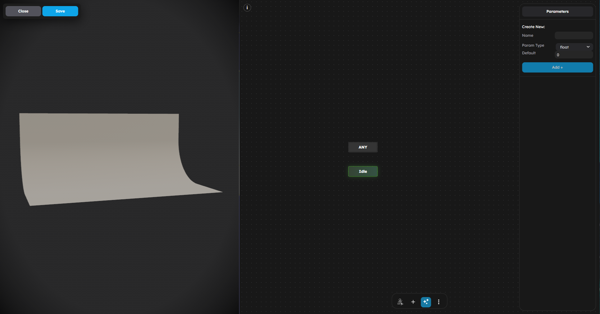

# Animation

StemStudio supports three animation workflows:

1. **Animation behavior** for playing a single clip from an imported model
2. **Animation Graph** for state machines and parameter-driven transitions
3. **Tween Animation** for scripted movement, rotation, and scale changes

If you need to control model clips from code, use the advanced `this.game` animation helpers. The current public behavior API does **not** expose a `this.erth.animation` namespace.



## What This Page Is For

Use this page when you need to:

- Play animations from imported 3D models
- Blend between idle, walk, run, and gesture clips
- Build animation state machines with automatic transitions
- Create tweened motion for doors, platforms, and props
- Trigger or reweight animations from behavior code

## Scripted Clip Playback

For advanced scripted playback, use GameManager:

- `this.game.playBlendedAnimations(object, blends, playOnce?)`
- `this.game.updateBlendedAnimationWeights(object, weights)`

These methods operate on the imported animation clips attached to a model object.

### Play a Single Clip

To play one clip, pass a single blend entry:

```ts
this.game.playBlendedAnimations(
    this.target,
    [
        {
            name: "Run",
            weight: 1,
            speed: 1,
            fadeDuration: 0.25,
        },
    ],
    false
);
```

### Blend Multiple Clips

Blend entries let you mix clips together on the same object:

```ts
this.game.playBlendedAnimations(
    this.target,
    [
        { name: "Walk", weight: 0.7, speed: 1, fadeDuration: 0.25 },
        { name: "Wave", weight: 0.3, speed: 1, fadeDuration: 0.25 },
    ],
    false
);
```

Each blend entry supports:

| Property | Type | Default | Description |
|----------|------|---------|-------------|
| `name` | string | required | Animation clip name from the model |
| `weight` | number | `1` | Blend weight for this clip |
| `speed` | number | `1` | Playback speed multiplier |
| `fadeDuration` | number | `0.5` | Crossfade duration in seconds |

### Reweight an Existing Blend

Once a blend is running, you can shift weights without restarting playback:

```ts
this.game.updateBlendedAnimationWeights(this.target, {
    Walk: 0.2,
    Run: 0.8,
});
```

This is useful for locomotion systems where you want smooth transitions between walk and run based on speed.

### What Is Not Exposed

Current creator-facing behavior scripts do not have a public `this.erth.animation` API for:

- `playAnimation()`
- `stopAnimation()`
- `setAnimationPaused()`

For those workflows, prefer:

- **Animation behavior** for one clip
- **Animation Graph** for state machines
- **GameManager blend helpers** for advanced scripted playback

## Animation Behavior

The **Animation** behavior is the fastest way to play model animations without writing code. Attach it to any object that has embedded clips.


### Attributes

| Attribute | Type | Default | Description |
|-----------|------|---------|-------------|
| **Start On Trigger** | boolean | false | When true, the clip starts only after an `activate` trigger event |
| **Animation** | enum | none | Selects which clip from the model to play |
| **Loop** | boolean | true | When true, the clip repeats continuously |
| **Speed** | number | 1 | Playback speed multiplier |

### How It Works

1. On scene start, the behavior plays the selected clip.
2. If **Loop** is disabled, the clip plays once and stops on the final pose.
3. If **Start On Trigger** is enabled, a Trigger behavior must emit `activate` to start playback and `deactivate` to stop it.

### Visibility

The Animation behavior only appears for objects that actually have embedded animation clips.

## Animation Graph System

The Animation Graph is a state machine for animation. Each state plays one or more clips, and transitions happen automatically when conditions are met.


### Core Concepts

#### States

Each state represents a pose or clip setup. Every graph includes two core states:

- **ANY**: evaluated from every other state
- **Idle**: the default starting state

You can add custom states for Walk, Run, Jump, Attack, or anything else your model supports.

#### Parameters

Parameters drive transitions:

| Parameter Type | Value | Use Case |
|---------------|-------|----------|
| **float** | Decimal number | Speed, timers, blend values |
| **int** | Whole number | State indices, counters |
| **bool** | true / false | isGrounded, isRunning, isDead |
| **trigger** | Fires once then resets | Jump, attack, interact |

#### Transitions

Each transition defines:

| Property | Description |
|----------|-------------|
| **Conditions** | All comparisons that must be true |
| **Fade In Duration** | Crossfade time into the target state |
| **Fade Out Duration** | Crossfade time out of the current state |
| **Has Exit Time** | Wait for the current state to reach `exitTime` |
| **Exit Time** | Seconds that must elapse before the transition can fire |

#### Condition Operators

- `equals`
- `notEquals`
- `greater`
- `less`
- `greaterOrEqual`
- `lessOrEqual`

### Example: Character Movement Graph

```
States:
  Idle  -- plays "idle"
  Walk  -- plays "walk"
  Run   -- plays "run"
  Jump  -- plays "jump" once

Parameters:
  speed (float)
  isGrounded (bool)

Transitions:
  Idle -> Walk:  speed > 0.1, isGrounded == true
  Walk -> Idle:  speed <= 0.1, isGrounded == true
  Walk -> Run:   speed > 5.0, isGrounded == true
  Run -> Walk:   speed <= 5.0, isGrounded == true
  ANY -> Jump:   isGrounded == false
  Jump -> Idle:  isGrounded == true, hasExitTime = true
```

### AnimationGraphBehavior

The **AnimationGraphBehavior** connects an Animation Graph asset to an object at runtime.

It reacts to these event messages:

| Event | Data | Description |
|-------|------|-------------|
| `setState` | `{ stateId: string }` | Force a transition to a specific state |
| `setParameter` | `{ name: string, value: number \| boolean }` | Update a graph parameter |

## Tween Animation Behavior

The **Tween Animation** behavior animates transform values directly. Unlike clip playback, it works on any object, including primitives and simple editor-built props.


### Attributes

| Attribute | Type | Default | Description |
|-----------|------|---------|-------------|
| **Start On Trigger** | boolean | false | When true, the tween starts only after a trigger |
| **Move** | Vector3 | `(0, 0, 0)` | Position offset over the tween |
| **Rotate** | Vector3 | `(0, 0, 0)` | Rotation offset in degrees |
| **Scale** | Vector3 | `(0, 0, 0)` | Scale delta over the tween |
| **Speed** | number | 1 | Higher values complete the tween faster |
| **Ease Type** | enum | Linear | Easing curve |
| **Loop Mode** | enum | Mirror | Repeat mode |

### Easing Types

StemStudio includes 28 easing functions across these families:

| Family | Variants | Character |
|--------|----------|-----------|
| **Linear** | Linear | Constant speed |
| **Quad** | In, Out, InOut | Gentle acceleration |
| **Cubic** | In, Out, InOut | Moderate acceleration |
| **Quart** | In, Out, InOut | Strong acceleration |
| **Quint** | In, Out, InOut | Very strong acceleration |
| **Sine** | In, Out, InOut | Smooth and natural |
| **Back** | In, Out, InOut | Overshoots before settling |
| **Circ** | In, Out, InOut | Circular motion feel |
| **Bounce** | In, Out, InOut | Bouncy landing |
| **Elastic** | In, Out, InOut | Spring-like motion |

- **In** accelerates from zero
- **Out** decelerates to zero
- **InOut** combines both

## Choosing the Right Tool

| Goal | Best Tool |
|------|-----------|
| Play one imported clip | Animation behavior |
| Build a full locomotion state machine | Animation Graph |
| Move or rotate a prop without model clips | Tween Animation |
| Trigger or blend clips from custom script logic | `this.game.playBlendedAnimations()` |

## Next Steps

- [GameManager Reference](../apis/04-game-manager.md) for advanced runtime helpers
- [Tutorial: NPC State Machine](../scripting/09-tutorial-npc-state-machine.md) for animation changes tied to gameplay state
- [Writing Behaviors](../scripting/02-writing-behaviors.md) for behavior lifecycle and runtime scripting
