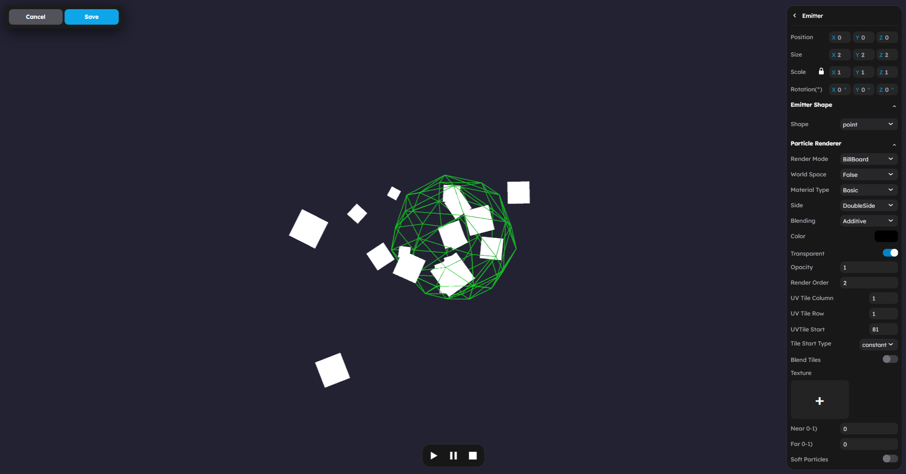
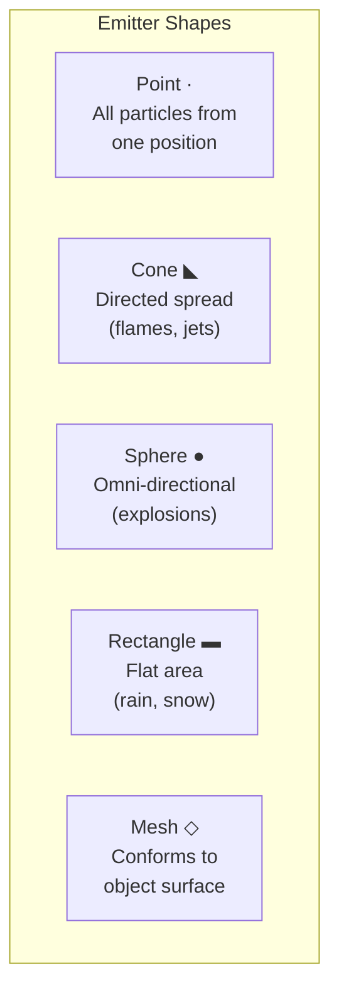

# Particles and VFX

StemStudio uses the **three.quarks** particle system for GPU-accelerated visual effects. You create particle emitters in the VFX editor, then use the **Visual Effect** behavior to play them in response to game events.



Create particle effects, configure emitters, and trigger VFX from game events.

## The Quarks Particle System

StemStudio's particle system is built on the **three.quarks** library, which renders particles using GPU-accelerated batch rendering. Effects are created in the VFX editor and stored as particle emitter objects in your scene.

Particle effects use the [quarks.art](https://quarks.art) JSON format. You can create and preview effects at quarks.art, then upload the exported JSON file to StemStudio.

Each particle emitter defines:

- **Emitter shape** -- Where particles spawn
- **Particle behaviors** -- How particles move, change color, change size, and fade over time
- **Duration and looping** -- How long the effect plays and whether it repeats
- **Render settings** -- Texture, blend mode, and billboard style


## Emitter Shapes

The emitter shape controls the spatial distribution of newly spawned particles. StemStudio supports the following shapes:

| Shape | Description | Example Use |
|-------|-------------|-------------|
| **Point** | All particles emit from a single point | Sparks, small bursts |
| **Circle** / **Ring** | Particles emit along a circle or ring | Shockwaves, portal edges |
| **Cone** | Particles emit within a cone volume | Flame jets, spotlights, fountains |
| **Sphere** | Particles emit from the surface or volume of a sphere | Explosions, ambient dust |
| **Hemisphere** | Particles emit from half a sphere | Ground-level bursts, dome effects |
| **Grid** / **Rectangle** | Particles emit from a flat rectangular area | Rain, snow, area effects |
| **Donut** | Particles emit from a torus shape | Ring explosions, magical auras |
| **Mesh Surface** | Particles emit from the surface of a mesh | Object dissolve, surface glow |



### Choosing A Shape

- **Point** is the simplest and works for most small effects.
- **Cone** is the most commonly used shape for directed effects.
- **Sphere** works well for omnidirectional effects like explosions.
- **Mesh Surface** creates effects that conform to an object's shape.

## VisualEffectBehavior

The **Visual Effect** behavior is the bridge between your particle emitters and the game event system. Attach it to a particle emitter object to control when the effect plays.

### Trigger Modes

| Attribute | Description |
|-----------|-------------|
| **Start On Trigger** | Effect only plays when activated by a Trigger behavior (activate/deactivate events) |
| **Trigger on Added** | Effect plays immediately when the object enters the game |
| **Trigger by Parent Event** | Effect only plays when triggered by an event on the parent object |
| **Restart on Trigger** | Restarts the effect from the beginning each time a trigger is received, instead of being ignored while already playing |

### Event-Driven Triggering

The Visual Effect behavior subscribes to game events through two event lists: **Trigger Events** (start the effect) and **Stop Events** (stop the effect). This is the primary way to connect VFX to gameplay.


### Available Event Types

Events are organized into categories:

#### Game Events

| Event | Description |
|-------|-------------|
| `game.lives.inc` / `game.lives.dec` | Player gained or lost a life |
| `game.health.inc` / `game.health.dec` | Player gained or lost health |
| `game.score.inc` / `game.score.dec` | Score increased or decreased |
| `game.time.inc` / `game.time.dec` | Timer increased or decreased |

#### Enemy Events

| Event | Description |
|-------|-------------|
| `enemy.spawned` | An enemy appeared |
| `enemy.died` | An enemy was defeated |
| `enemy.got.hit` | An enemy took damage |
| `enemy.state.changed` | An enemy changed behavior state |
| `enemy.player.detected` / `enemy.player.lost` | Enemy detected or lost sight of the player |
| `enemy.attack.started` / `enemy.attack` / `enemy.attack.ended` | Enemy attack lifecycle |

#### Character Events

| Event | Description |
|-------|-------------|
| `character.motion.none` | Character stopped moving |
| `character.motion_start` / `character.motion` / `character.motion_end` | General movement |
| `character.motion.walk_start` / `character.motion.walk` / `character.motion.walk_end` | Walking |
| `character.motion.run_start` / `character.motion.run` / `character.motion.run_end` | Running |
| `character.action.jump_start` / `character.action.jump` / `character.action.land` | Jumping |
| `character.action.climb_start` / `character.action.climb` / `character.action.climb_end` | Climbing |
| `character.action.crouch_start` / `character.action.crouch` / `character.action.crouch_end` | Crouching |
| `character.action.fall_start` / `character.action.fall` / `character.action.fall_end` | Falling |
| `character.action.fall_back` | Knocked back |
| `character.action.dead` | Character died |
| `character.action.interact` | Character interacted with an object |

#### Consumable Events

| Event | Description |
|-------|-------------|
| `consumable.in.range` / `consumable.not.in.range` | Player entered or left pickup range |
| `consumable.collected` | Item was collected |
| `consumable.collided` | Player collided with the consumable |

#### Object Events

| Event | Description |
|-------|-------------|
| `jumppad.activated` | Jump pad launched the player |
| `platform.activated` / `platform.moving` / `platform.deactivated` | Moving platform lifecycle |
| `volume.activated` | Player entered a volume trigger |
| `spawner.activated` / `randomized.spawner.activated` | Spawner triggered |
| `teleport.activated` | Teleporter used |

### Custom Events

When the built-in event list does not cover your needs, enable **Use Custom Events** to define your own event names.

| Attribute | Description |
|-----------|-------------|
| **Custom Trigger Events** | Array of custom event names that start the effect |
| **Custom Stop Events** | Array of custom event names that stop the effect |

Custom events are sent from behavior code to trigger VFX effects. Use `findBehaviors()` to locate VFX behaviors and call `onEvent()`:

```ts
// From a behavior script, trigger a custom VFX event
const vfx = this.findBehaviors("visualEffect");
for (const fx of vfx) {
    fx.onEvent("my.custom.explosion", {});
}
```

## Duration and Looping

Each particle emitter has its own **duration** and **looping** settings configured in the VFX editor.

- **Duration** -- How long the emitter runs before stopping (in seconds)
- **Looping** -- Whether the emitter restarts after finishing

When the Visual Effect behavior plays a non-looping emitter with a finite duration, it automatically stops the effect after the duration elapses.

For continuous ambient effects, set the emitter to looping and trigger it once at scene start with **Trigger on Added**.

## Parent-Relative Positioning

When a Visual Effect is a child of another object (for example, a flame effect attached to a torch), the behavior automatically tracks the parent object's world position each frame. This means the effect moves with the parent even though it operates as a scene-level object internally.

The behavior moves the VFX object to the scene root for correct rendering while maintaining the relative offset from the original parent position.

## Multiplayer Synchronization

Visual Effect behavior supports multiplayer. When a VFX plays or stops on the host, the state is synchronized to all connected clients. Position updates for parent-tracking effects are also synced.

Non-host clients receive the VFX state changes and play effects locally.

## Common VFX Patterns

### Explosion on Enemy Death

1. Create an explosion particle emitter (Sphere shape, short duration, no loop).
2. Attach **Visual Effect** behavior.
3. Set **Trigger Events** to `enemy.died`.
4. When an enemy is defeated, the explosion plays at the VFX object's position.

### Footstep Dust

1. Create a small dust puff emitter (Point shape, very short duration, no loop).
2. Parent it to the player character's feet.
3. Attach **Visual Effect** behavior.
4. Set **Trigger Events** to `character.motion.walk`.
5. Enable **Restart on Trigger** so each step creates a new puff.

### Ambient Particles

1. Create a floating dust or sparkle emitter (Sphere or Rectangle shape, looping).
2. Place it in the scene where you want ambient particles.
3. Attach **Visual Effect** behavior.
4. Enable **Trigger on Added**.
5. The effect plays continuously from scene start.

### Pickup Sparkle

1. Create a sparkle emitter (Point shape, looping).
2. Parent it to a collectible object.
3. Attach **Visual Effect** behavior.
4. Enable **Trigger on Added** for the ambient sparkle.
5. Add `consumable.collected` as a **Stop Event** to stop the sparkle when collected.

### Trail Effect

1. Create a particle emitter with a low emission rate and long particle lifetime.
2. Set the emitter shape to **Point**.
3. Parent it to a moving object (projectile, character).
4. Enable **Trigger on Added**.
5. As the parent moves, particles are left behind, creating a trail.

## Next Steps

- Read [Audio](04-audio.md) to pair sound effects with your VFX.
- Read [Physics](01-physics.md) to trigger VFX from collision events.
- Read [Animation](02-animation.md) to synchronize VFX with character animations.
