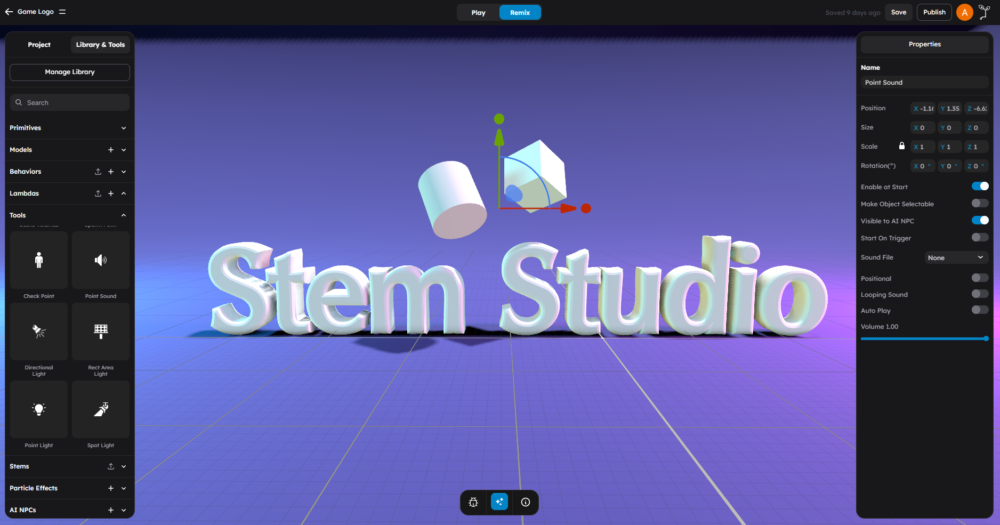

# Audio

StemStudio has two creator-facing audio workflows:

1. **Generic Sound** behavior for world audio attached to scene objects
2. **GameManager sound helpers** for playing sounds already configured in the scene or HUD

The current behavior API does **not** expose a public `this.erth.audio` namespace. Low-level audio loading is handled internally by the engine and by built-in behaviors such as Generic Sound.



## What This Page Is For

Use this page when you need to:

- Add ambient sounds or one-shot effects to objects in the scene
- Play looping background music
- Trigger audio from another behavior
- Use 3D positional sound with distance falloff
- Play short scene-configured sounds from script

## Generic Sound Behavior

The **Generic Sound** behavior is the main creator workflow for object-based audio. It loads an audio asset, attaches it to the object, and optionally spatializes it in 3D.


### Attributes

| Attribute | Type | Default | Description |
|-----------|------|---------|-------------|
| **Start On Trigger** | boolean | false | Wait for an `activate` trigger event before playing |
| **Sound File** | enum | none | Audio asset from the project library |
| **Positional** | boolean | false | Enable 3D spatial audio |
| **Rolloff Factor** | number | 1 | How quickly the sound fades with distance |
| **Looping** | boolean | false | Repeat playback continuously |
| **Auto Play** | boolean | false | Start automatically when the scene starts |
| **Volume** | slider | 1.0 | Playback volume from `0` to `1` |

### How It Works

1. The behavior resolves the selected sound asset.
2. The engine loads the clip and attaches it to the object.
3. Position, looping, rolloff, and volume settings are applied.
4. If **Auto Play** is enabled, playback starts immediately.
5. If **Start On Trigger** is enabled, the behavior waits for a trigger or behavior event.

## 2D vs 3D Audio

### Non-Positional Audio

When **Positional** is disabled, the sound behaves like global audio:

- Background music
- UI sounds
- Ambient layers that should be heard everywhere

### Positional Audio

When **Positional** is enabled, the sound is spatialized relative to the camera listener:

- Machinery, waterfalls, fires, and environmental loops
- Localized interaction sounds
- Vehicle engines or NPC voice sources

### Rolloff Factor

| Rolloff | Result |
|---------|--------|
| `0` | No distance attenuation |
| `1` | Default falloff |
| `2+` | Stronger localization and faster fadeout |

## Triggering Generic Sound From Script

Generic Sound listens for behavior events sent to its object. The current supported pattern is:

```ts
this.game?.behaviorManager?.sendEventToObjectBehaviors(
    soundObject,
    "sound:play"
);

this.game?.behaviorManager?.sendEventToObjectBehaviors(
    soundObject,
    "sound:setVolume",
    { volume: 0.3 }
);

this.game?.behaviorManager?.sendEventToObjectBehaviors(
    soundObject,
    "sound:stop"
);
```

Supported messages:

| Message | Data | Description |
|---------|------|-------------|
| `sound:play` | none | Start playback |
| `sound:stop` | none | Stop playback |
| `sound:pause` | none | Pause playback |
| `sound:resume` | none | Resume playback |
| `sound:setVolume` | `{ volume: number }` | Change volume at runtime |

## Trigger Integration

Generic Sound also responds to Trigger behavior messages:

- `activate` starts playback
- `deactivate` stops playback

That makes it easy to wire sounds to buttons, zones, and scripted interactions without custom audio code.

## Scene Sounds Via GameManager

GameManager exposes a small sound API for scene-configured sounds:

```ts
this.game.playSound("pickup");
this.game.stopSound("pickup");
```

Use this pattern for short sound IDs that have already been configured by the scene or HUD layer. This is not a replacement for Generic Sound:

- Use **Generic Sound** when the sound belongs to an object in the world
- Use **`game.playSound()`** when you want to trigger a known sound ID directly from script

## Audio Assets and `erth.asset.audio`

`this.erth.asset.audio` is for asset lookup and URL resolution, not direct playback control.

```ts
const ref = await this.erth.asset.audio.findByName("AlarmLoop");
if (ref) {
    const url = await this.erth.asset.audio.getUrl(ref);
    console.log("Resolved audio URL:", url);
}
```

Use that when you need to inspect or pass around audio asset references. For actual playback, use Generic Sound or `this.game.playSound()`.

## Common Patterns

### Background Music

1. Add an empty object to the scene.
2. Attach **Generic Sound**.
3. Select your music asset.
4. Enable **Looping**.
5. Enable **Auto Play**.
6. Leave **Positional** disabled.
7. Set a lower **Volume** such as `0.2` to `0.5`.

### Local Ambient Source

1. Place an object at the source location.
2. Attach **Generic Sound**.
3. Select the ambient loop.
4. Enable **Positional**.
5. Tune **Rolloff Factor** until the audible range feels right.

### Triggered One-Shot Effect

1. Attach **Generic Sound** to the object that owns the effect.
2. Disable **Auto Play**.
3. Optionally enable **Start On Trigger**.
4. Emit `sound:play` from another behavior when the event happens.

### Dynamic Music Ducking

Use behavior events to lower volume during combat or dialogue:

```ts
this.game?.behaviorManager?.sendEventToObjectBehaviors(
    musicObject,
    "sound:setVolume",
    { volume: 0.1 }
);

this.game?.behaviorManager?.sendEventToObjectBehaviors(
    musicObject,
    "sound:setVolume",
    { volume: 0.5 }
);
```

## Next Steps

- [Communication Patterns](../scripting/04-communication-patterns.md) for event routing between behaviors
- [GameManager Reference](../apis/04-game-manager.md) for advanced runtime helpers
- [Scene Tools](../assets/09-scene-tools.md) for point sound authoring in the editor
