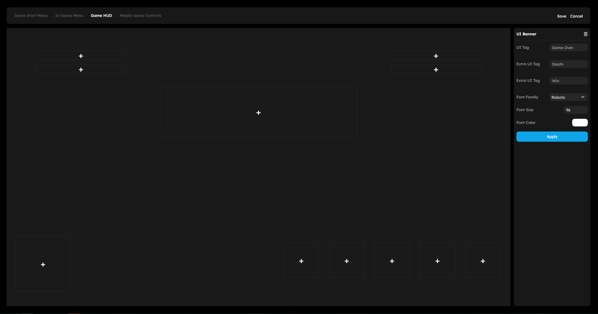
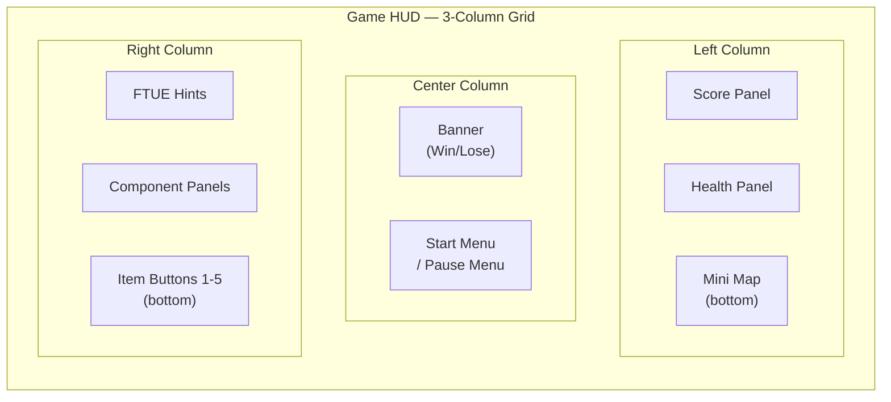

# HUD and UI

The HUD (Heads-Up Display) is the 2D overlay that appears on top of the 3D viewport during gameplay. It shows game information like score, health, lives, timers, and provides controls for menus, inventory, and interaction.



## What This Page Is For

Use this page when you need to:

- Understand the HUD layout and how elements are positioned
- Configure which game data panels appear during play
- Customize the in-game UI using the built-in editor
- Handle mobile safe areas for notches and rounded corners
- Integrate sounds into the HUD system

## HUDManager

The HUDManager is the runtime system that creates and manages the game HUD. It renders React components into a container that overlays the 3D viewport.

The HUDManager handles:

- Creating the HUD container with proper positioning and z-index
- Rendering the HUDView React component tree
- Managing the SoundManager for HUD-related audio
- Cleanup when the game stops or the page navigates away

The HUD container is added to the application's DOM container and positioned absolutely to fill the viewport.

## HUD Layout

The game HUD uses a **3-column grid layout** that organizes UI elements into left, center, and right columns.

```
+------------------+------------------+------------------+
|   LEFT COLUMN    |  CENTER COLUMN   |   RIGHT COLUMN   |
|                  |                  |                  |
|  Component 1     |    Banner        |  FTUE / Help     |
|  Component 2     |   (Game Over)    |  Component 1     |
|                  |                  |  Component 2     |
|                  |                  |                  |
|  Mini Map        |                  |  Item Buttons    |
|  (bottom-left)   |                  |  (bottom-right)  |
+------------------+------------------+------------------+
```



### Left Column

The left column displays:

- Up to 2 **component panels** (score, health, lives, timer, or custom)
- An optional **mini map** at the bottom

### Center Column

The center column is reserved for:

- **Banner messages** (win/lose notifications)
- **Game start menu** (before the game begins)
- **In-game pause menu** (when the player presses Escape)

### Right Column

The right column displays:

- **FTUE (First-Time User Experience)** hints
- **Help component** for contextual guidance
- Up to 2 **component panels**
- Up to 5 **item buttons** at the bottom (weapons, tools, inventory items)

## Safe Area Insets

The HUD respects device safe areas for mobile devices with notches, rounded corners, or navigation bars. This ensures UI elements are not hidden behind hardware features.

The HUD container uses CSS environment variables:

| Inset | CSS Variable | Purpose |
|-------|-------------|---------|
| Top | `env(safe-area-inset-top)` | Avoids camera notches and status bars |
| Bottom | `env(safe-area-inset-bottom)` | Avoids home indicators and gesture bars |
| Left | `env(safe-area-inset-left)` | Avoids rounded corners on landscape orientation |
| Right | `env(safe-area-inset-right)` | Avoids rounded corners on landscape orientation |

On desktop browsers, these insets default to zero and have no effect.

The HUDView wrapper component applies additional padding using these same values, ensuring all interactive and informational elements remain accessible regardless of device.

## Game Data

The HUD tracks and displays the following game data:

| Data | Description |
|------|-------------|
| **Score** | Current and maximum score |
| **Health** | Current and initial health values |
| **Lives** | Current and total lives |
| **Timer** | Remaining time in `HH:MM:SS` format |
| **Weapons** | List of available weapons |
| **Picked Item** | Currently selected weapon or item |

Game data is updated through the application event system. When the GameManager updates any value, the HUD re-renders to reflect the change.

## Standard OSD Panels

OSD (On-Screen Display) panels are the configurable UI elements that display game information during play. You configure them in **Project Settings** under the game UI section.


Each panel can display:

- **Score** counter with current and max values
- **Health** bar with visual indicator
- **Lives** counter
- **Timer** countdown
- Custom text and styling

Panels can be placed in the left or right column and styled with custom colors, fonts, and backgrounds.

### Item Buttons

The HUD supports up to 5 item button slots in the bottom-right area. Each button can be configured as:

| Type | Description |
|------|-------------|
| **Weapon** | Bound to a weapon slot (keyboard 1-5) |
| **Item** | Displays a collectible or consumable |

Item buttons show the item icon, remaining count, and highlight when selected. Weapon buttons respond to number key presses (1-5) for quick switching.

### Banner

The center banner displays win/lose messages when the game ends. It shows "You Won!" or "You Lose" based on the game state and can be styled with custom fonts, colors, and background images.

## Sound Integration

The HUDManager includes a **SoundManager** that handles audio for HUD-related events. You can configure sounds for:

- Score changes
- Health changes
- Item pickups
- Win/lose events
- Menu interactions

Sounds are loaded at game start and played in response to game events. The SoundManager handles loading, playback, and cleanup.

```ts
// HUDManager sound methods
hudManager.loadSounds(soundSettings);
hudManager.playSound("pickup");
hudManager.stopSound("background");
hudManager.clearSounds();
```

## Custom UI

For creators who need more control over the in-game interface, StemStudio provides a **Customize UI** option in the HUD editor.


The HUD editor lets you:

- Toggle visibility of individual OSD components
- Rearrange component positions within the grid
- Customize colors, backgrounds, and text styles for each element
- Add custom banners and mini maps
- Configure item button types and appearances

### Accessing the HUD Editor

1. Open **Project Settings** in the right panel.
2. Navigate to the **Game HUD** section.
3. Click **Customize UI** to open the visual HUD editor.
4. Drag, resize, and configure UI elements.
5. Changes are saved with the scene.

## HUD Views

The HUD transitions between several views during the game lifecycle:

| View | When It Shows | Content |
|------|---------------|---------|
| **Game Start Menu** | Before play begins | Start button, game description, background image |
| **In-Game HUD** | During gameplay | Score, health, items, mini map |
| **In-Game Menu** | When player presses Escape | Resume, restart, settings, quit |
| **Game Over** | When the game ends | Win/lose banner, final score |

### Game Start Menu

The start menu appears before the game begins. It provides a start button and can show a custom background image. The player clicks start to begin gameplay.

### In-Game Menu (Pause)

Pressing Escape during gameplay pauses the game and shows the in-game menu. The menu provides options to resume, restart, or quit.

> **Note:** In sandbox mode, the pause menu is disabled. The game starts automatically without showing a start menu.

## Disabling the HUD

If your game does not need a HUD, you can disable it in Project Settings by toggling **Show HUD** off. This removes all OSD panels and menus, giving you a clean viewport for experiences that do not need traditional game UI.

## Common Patterns

### Score Display

1. Open the HUD editor.
2. Enable a component panel in the left or right column.
3. Set the component type to **Score**.
4. The panel updates automatically when the score changes through gameplay events.

### Health Bar

1. Enable a component panel.
2. Set the component type to **Health**.
3. The bar fills or depletes based on the character's current health relative to initial health.

### Weapon Switching

1. Configure item buttons in the bottom-right section.
2. Set each button type to **Weapon**.
3. During play, players press number keys 1-5 to switch weapons.
4. The active weapon is highlighted in the UI.

## Next Steps

- Read [Camera](06-camera.md) to understand how the camera system works alongside the HUD.
- Read [Audio](04-audio.md) to add sound feedback to HUD events.
- Read [Particles and VFX](03-particles-vfx.md) to add visual effects that complement UI feedback.
