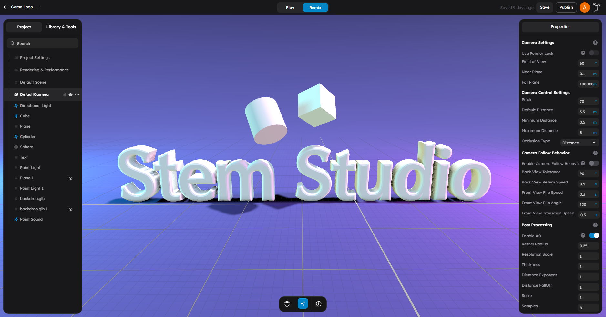
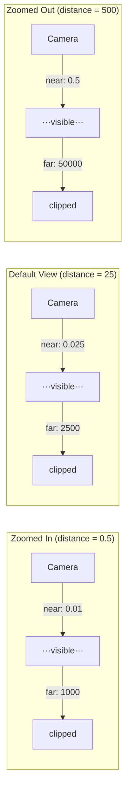

# Camera

StemStudio uses a single camera instance shared between editor mode and play mode. Each mode applies its own configuration to balance depth precision with visibility range.



## What This Page Is For

Use this page when you need to:

- Understand the difference between perspective and orthographic cameras
- Know why objects disappear at certain distances
- Configure camera behavior for gameplay
- Control the camera from behavior scripts
- Set up camera follow for a character

## Camera Types

StemStudio supports two camera types.

### Perspective Camera

The perspective camera renders the scene with realistic depth -- objects farther from the camera appear smaller. This is the default and the most common choice for 3D games.

The perspective camera is defined by:

| Property | Description |
|----------|-------------|
| **fov** | Field of view in degrees (vertical). Controls how wide the camera sees. |
| **near** | Near clipping plane. Objects closer than this distance are not rendered. |
| **far** | Far clipping plane. Objects farther than this distance are not rendered. |
| **aspect** | Width-to-height ratio. Usually set automatically from the viewport size. |
| **position** | Camera position in world space (x, y, z) |
| **quaternion** | Camera rotation as a quaternion |

### Orthographic Camera

The orthographic camera renders without perspective -- objects appear the same size regardless of distance. This is used for 2D-style views, top-down games, or isometric perspectives.

When using orthographic mode, the clipping planes default to:

- **near**: 0.1
- **far**: 512

## Clipping Planes

Clipping planes define the visible depth range. Only objects between the **near** and **far** planes are rendered. Everything outside this range is clipped (invisible).

```
Camera  Near              Far
  |     |                  |
  X-----|--- visible ------|----- clipped
  |     |                  |
```

The ratio between far and near affects depth buffer precision. A large ratio (like 100000:1) causes **z-fighting** -- flickering surfaces where two objects are at nearly the same depth. A small ratio provides clean rendering but limits the visible range.

StemStudio uses different clipping strategies for editor and play mode.

## Camera View Presets

The editor toolbar includes a **Camera View** button that snaps the camera to preset orientations: **Default (Perspective)**, **Top Down**, and **Side View**. These presets help you quickly reposition the camera for common editing tasks like laying out floor plans (top down) or aligning object heights (side view).

See [Toolbar and Viewport](../editor/03-toolbar-and-viewport.md) for the full toolbar reference.

## Editor Mode: Dynamic Clipping

In the editor, clipping planes are dynamically calculated based on the camera's distance to its orbit center. This lets you inspect both tiny details and large scenes without manual adjustment.

```
near = max(0.01, distance * 0.001)
far  = max(1000, distance * 100)
```

| Camera Distance | Near | Far | Use Case |
|-----------------|------|-----|----------|
| 0.5 | 0.01 | 1000 | Zoomed in close to a small object |
| 25 | 0.025 | 2500 | Default editor position |
| 500 | 0.5 | 50000 | Viewing a medium scene |
| 3000 | 3.0 | 300000 | Viewing a large model or terrain |

Dynamic clipping is recalculated when you:

- **Zoom** (scroll wheel or middle-mouse drag)
- **Focus** (double-click or press F to frame an object)
- Initialize the editor controls

It is **not** recalculated during pan or rotate, since those operations do not change the camera-to-target distance.



Formula: `near = max(0.01, distance × 0.001)`, `far = max(1000, distance × 100)`

## Play Mode: Fixed Clipping

During gameplay, the camera switches to fixed clipping planes optimized for consistent rendering:

| Property | Value |
|----------|-------|
| **near** | 0.1 |
| **far** | 1000 |

This gives a 10000:1 ratio, which provides good depth buffer precision for typical game scenes. Objects beyond 1000 units from the camera will not be visible during play.

When you exit play mode, the camera's clipping planes are restored to their pre-play values, and dynamic clipping resumes.

### Camera Lifecycle

```
Camera Created
  near: 0.01, far: 100000 (safe defaults)
         |
         v
Editor Controls Initialized
  near/far dynamically calculated from distance
         |
         v
Enter Play Mode
  near: 0.1, far: 1000 (fixed)
         |
         v
Exit Play Mode
  near/far restored to saved values
         |
         v
Editor Controls Re-initialized
  dynamic clipping resumes
```

## Camera Properties

The camera exposes standard Three.js PerspectiveCamera properties:

| Property | Type | Description |
|----------|------|-------------|
| `fov` | number | Field of view in degrees (vertical angle) |
| `near` | number | Near clipping distance |
| `far` | number | Far clipping distance |
| `position` | Vector3 | Camera position in world space |
| `quaternion` | Quaternion | Camera rotation |
| `aspect` | number | Aspect ratio (auto-set from viewport) |

After changing `fov`, `near`, or `far`, you must call `camera.updateProjectionMatrix()` to apply the changes.

## Camera Settings Panel

The camera settings panel lets you configure camera behavior during gameplay without writing code.

### How To Access

1. Open the **Project** tab in the left panel.
2. Select the **Camera** section.

### Camera Types

| Type | Description |
|------|-------------|
| **Third Person** | Camera orbits behind the player character. Best for action and adventure games |
| **First Person** | Camera is positioned at the character's head. Best for shooters and exploration games |
| **Top Down** | Camera looks straight down from above. Best for strategy and management games |
| **Side Scroller** | Camera follows the character from the side. Best for platformers |

### Common Camera Properties

| Property | Description |
|----------|-------------|
| **FOV** | Field of view in degrees |
| **Near** | Near clipping plane distance |
| **Far** | Far clipping plane distance |

### Third Person Properties

| Property | Description |
|----------|-------------|
| **Pitch** | Vertical angle of the camera relative to the character |
| **Min Distance** | Minimum zoom-in distance from the character |
| **Max Distance** | Maximum zoom-out distance from the character |

### First Person Properties

| Property | Description |
|----------|-------------|
| **Head Height** | The camera's vertical offset from the character's origin |

### Top Down Properties

| Property | Description |
|----------|-------------|
| **Distance** | Height of the camera above the character |
| **Pitch** | Angle of the downward view |

### Side Scroller Properties

| Property | Description |
|----------|-------------|
| **Distance** | How far to the side the camera is positioned |
| **Axis** | Which axis the camera follows along (X or Z) |

### Occlusion Type

| Type | Description |
|------|-------------|
| **Distance** | Camera moves closer to the character when an object is between them |
| **Transparency** | Occluding objects become transparent instead of moving the camera |

### Camera Follow Behavior (Third Person)

When using the Third Person camera type, additional follow behavior settings are available:

| Property | Description |
|----------|-------------|
| **Tolerance** | How much the character can move before the camera starts following |
| **Return Speed** | How quickly the camera returns to its default position behind the character |
| **Flip Angle** | The angle at which the camera flips to the other side of the character |
| **Flip Speed** | How quickly the camera flip animation plays |

## Programmatic Camera Control

From behavior scripts, you can access and modify the camera:

### Reading Camera State

```ts
// Access the camera
const camera = this.game.camera;

// Read position
const pos = camera.position;
console.log(`Camera at: ${pos.x}, ${pos.y}, ${pos.z}`);

// Read field of view
console.log(`FOV: ${camera.fov}`);
```

### Setting Camera Position

```ts
// Move the camera
camera.position.set(10, 5, 20);

// Look at a target point
camera.lookAt(0, 0, 0);
```

### Adjusting Field of View

```ts
// Zoom in by reducing FOV
camera.fov = 30;
camera.updateProjectionMatrix();

// Reset to default
camera.fov = 60;
camera.updateProjectionMatrix();
```

### Custom Clipping

```ts
// Extend the far plane for a very large scene
camera.far = 5000;
camera.updateProjectionMatrix();
```

> **Note:** Changing clipping planes during play mode overrides the default fixed values. Be careful with very large far values, as they can cause z-fighting.

## Camera Control in Play Mode

During gameplay, camera control is managed by the **CameraControl** system. This system:

1. Sets fixed clipping planes (near: 0.1, far: 1000).
2. Responds to player input for looking around.
3. Can follow the player character when a character behavior is active.

The camera control system respects the game's input mode and provides smooth interpolation for camera movement.

### Blocks Camera

Each object in the scene has a **Blocks Camera** property (found in Properties > In-Game Settings). This controls whether the third-person camera collides with the object during play mode.

| Setting | Behavior |
|---------|----------|
| **Enabled** (default) | The camera cannot pass through the object. It stops or adjusts when it hits the surface. |
| **Disabled** | The camera moves freely through the object. |

**When to disable Blocks Camera:**

- Skybox meshes and background decorations
- Particle effects and visual overlays
- Invisible trigger volumes
- Thin props like fences or foliage that would obstruct the camera

> **Tip:** If the third-person camera keeps getting stuck behind objects during play testing, select those objects and disable Blocks Camera in the right panel.

## Character Behavior Camera Follow

When a Character behavior is attached to an object, the camera automatically follows that character during play mode. The follow behavior provides:

- **Third-person orbit** -- The camera orbits around the character
- **Look speed** -- Configurable mouse sensitivity for camera rotation
- **Smooth tracking** -- The camera interpolates its position for fluid movement

The character behavior exposes a **Look Speed** attribute that controls how fast the camera rotates when the player moves the mouse. You can find this in the Character behavior attributes in the right panel.

The camera maintains a fixed offset from the character and rotates around it based on mouse input. The character's forward direction is determined by the camera's facing direction, creating intuitive third-person controls.

<video controls width="100%" autoPlay loop muted playsInline>
  <source src={require('./images/camera_3.mp4').default} type="video/mp4" />
</video>

## Model Preview Clipping

When previewing 3D models (for example, in the asset browser or model import dialog), the camera uses a variant of the dynamic clipping formula:

```
near = max(0.01, distance * 0.001)
far  = max(1000, distance * 10)
```

The far plane multiplier is lower (10x instead of 100x) because model previews typically view a single object at moderate distance, not a full scene.

## Troubleshooting

### Objects Disappear When Zooming Out

The far clipping plane may be too close. In the editor, dynamic clipping should handle this automatically. If objects still disappear, check that the editor controls are active and the camera distance is updating correctly.

In play mode, the far plane is fixed at 1000 units. Objects beyond that distance are not rendered. If you need to see further, adjust the far plane in your behavior code.

### Z-Fighting (Flickering Surfaces)

Z-fighting occurs when two surfaces are very close together and the depth buffer does not have enough precision to distinguish them. The near-to-far ratio is too large.

Solutions:

- In the editor: zoom closer to the affected area. Dynamic clipping increases the near plane, improving precision.
- In play mode: the fixed 0.1/1000 ratio provides good precision for most scenes. If z-fighting persists, increase the near plane or decrease the far plane.
- Move overlapping surfaces slightly apart.

### Objects Clip When Zooming In Very Close

The near clipping plane is too far from the camera. In the editor, the near plane scales down to `distance * 0.001` with a minimum of 0.01, allowing very close inspection.

In play mode, the near plane is 0.1. Objects closer than 0.1 units to the camera will be clipped. This is normal for gameplay but can be noticeable if the camera clips into objects.

### Camera Does Not Follow the Player

Make sure:

1. A Character behavior is attached to the player object.
2. The character is set as the default character (if multiple characters exist).
3. The game is in play mode (camera follow only activates during gameplay).

## Next Steps

- Read [Physics](01-physics.md) to understand how the camera interacts with physics-based character movement.
- Read [HUD and UI](05-hud-and-ui.md) to configure the overlay that appears on top of the camera view.
- Read [Animation](02-animation.md) to animate objects the camera is viewing.
