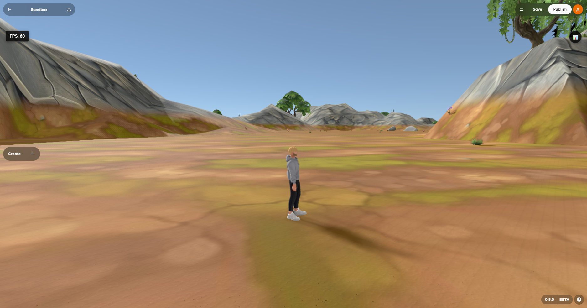

# World Building and Environment

This page covers the part of game creation that turns a blank scene into a place: ground, sky, light, atmosphere, navigation, and in-world media.

## What This Page Is For

Use this page when you need to:

- Build an outdoor level or explorable environment
- Decide whether to use primitives or procedural terrain
- Add a skybox or atmospheric background
- Set up sunlight and a day-night cycle
- Place spawn points, scene volumes, and navigation helpers
- Add in-world screens, signs, or video displays

## The World-Building Mental Model

Most playable scenes come together in this order:

1. **Ground** -- What the player walks on
2. **Lighting** -- How the world reads and feels
3. **Background** -- Sky, horizon, or enclosure
4. **Navigation anchors** -- Spawn points, paths, blockers, checkpoints
5. **Atmosphere** -- Audio, VFX, signs, screens, decorative props

If you get stuck, come back to that order. It keeps you from over-detailing the world before the basic play space works.

---

## Step 1: Choose Your Ground System

StemStudio gives you two good starting points for world geometry.

| Option | Best For | Strengths | Tradeoff |
|--------|----------|-----------|----------|
| **Primitives and models** | Small arenas, rooms, platformers, puzzles | Fast to block out, precise control, simple physics | More manual work for large outdoor spaces |
| **Terrain** | Outdoor worlds, hills, natural landscapes, exploration scenes | Large playable spaces, procedural variation, layered texturing | Less precise for tight indoor spaces |

### Start With Primitives When

- You are still testing the basic gameplay loop
- The level is mostly hard-surface geometry
- You need exact platform placement and collision shapes
- The environment is small enough to place by hand

### Use Terrain When

- The world is primarily natural landscape
- You want hills, elevation, and broad outdoor traversal
- You need one large ground system instead of many separate meshes

> **Rule of thumb:** If the player should feel like they are exploring a landscape, start with terrain. If the player should feel like they are navigating a constructed space, start with primitives.

---

## Step 2: Add Terrain

StemStudio includes a terrain creation flow for large outdoor ground.

### Basic Workflow

1. Open the terrain creation option in the left panel tools.
2. Add the terrain to the scene.
3. Select the terrain object.
4. In the right panel, tune the terrain behavior attributes.
5. Enter play mode and test movement, slopes, and readability.

### Important Terrain Rules

- **Only one terrain should exist per scene.**
- Terrain is best treated as the base ground layer, not as a replacement for every platform or structure.
- You will usually add rocks, props, buildings, roads, or platforms on top of terrain rather than trying to make terrain do everything.

### High-Value Terrain Settings

| Setting | What It Changes |
|--------|------------------|
| **Terrain Height** | Overall elevation range and dramatic verticality |
| **Terrain Seed** | The generated land layout |
| **Grass Max Height** | Where lower grassy regions stop |
| **Rock Max Height** | Where rocky regions stop and snowy peaks begin |
| **Texture / Normal / Roughness maps** | Surface detail and material variation |
| **UV mode / repeat / scale** | How stretched or tiled each terrain layer looks |
| **Use GPU Optimization** | Optional performance optimization on supported hardware |

### Practical Advice

- Keep the first pass gentle. Extreme height values make traversal harder to read.
- Tune the seed before you tune every texture.
- Use terrain for broad shape, then add authored objects for landmarks and gameplay moments.
- Test with your actual player controller early. A landscape that looks good from above may feel bad to move through.

---

## Step 3: Set The Sky And Background

Your background establishes the mood faster than almost anything else.

StemStudio has two common approaches:

| Approach | Best For |
|---------|----------|
| **Image-based sky or skybox** | Fast mood-setting, stylized skies, simple outdoor scenes |
| **Skybox mesh with Skybox behavior** | Background geometry, enclosed horizons, custom environmental shells |

### Option A: Use A Generated Or Imported Sky Image

This is the fastest route for most scenes.

1. Generate or import an image asset.
2. Use it as your scene background or sky image.
3. Adjust your lighting so the foreground matches the sky mood.

This works especially well when you use the AI image workflow to create skies, horizon art, or stylized panoramas.

See [AI Image Generation](../ai/04-ai-image-generation.md) if you want to create sky assets directly in the editor.

### Option B: Use A Skybox Mesh

Use a dedicated skybox mesh when you want a more authored enclosure or distant horizon object.

Typical workflow:

1. Add a very large sphere or cube around the playable area.
2. Apply your sky or horizon material.
3. Attach the **Skybox** behavior.

The Skybox behavior is useful because it turns that object into a non-interactive background element:

- Physics is disabled
- Shadow casting and receiving are disabled
- The mesh is treated as background content rather than gameplay geometry

### When To Prefer A Skybox Mesh

- You want a custom horizon ring, city skyline, mountains, or space dome
- You need more than a flat background image
- You want background geometry that wraps the player

---

## Step 4: Add Lighting And Time Of Day

Good world lighting answers two questions:

- What time of day is it?
- What should the player look at first?

### Start With One Directional Light

For most outdoor scenes, begin with a single **Directional Light**. Treat it as your sun or moon. New directional lights default to a shadow radius of 3, producing softer, more natural shadow edges out of the box.

Then decide whether the light should stay fixed or animate over time.

### Add A Day-Night Cycle

To create changing daylight:

1. Add or select a **Directional Light**.
2. Attach the **Day Night Cycle** behavior.
3. Set the starting time and speed.

Key settings:

| Setting | Typical Use |
|--------|--------------|
| **Enable Sun Rotation** | Turns the cycle on or off |
| **Initial Time (Hours)** | Sets sunrise, noon, sunset, or night starting point |
| **Rotation Speed** | Controls how fast time passes |
| **Pause Rotation** | Locks the world to one chosen lighting state |

Good starting values:

- `6` for sunrise
- `12` for noon
- `18` for sunset

### Add Accent Lights After The Sun Works

Use **Point Lights** and **Spot Lights** for:

- Doorways and interiors
- Campfires, neon signs, and machinery
- Boss arenas or objective markers
- Hero props that need extra visual focus

Do not start with many local lights. First make sure the world reads well under the main light.

---

## Step 5: Add Navigation Anchors

A beautiful environment still feels broken if the player cannot enter it cleanly or understand where to go.

### Spawn Points

Always add at least one **Spawn Point** so the player enters the world at a deliberate location.

Use spawn points to:

- Set the first camera framing
- Control onboarding flow
- Keep respawns out of dangerous zones

### Scene Volumes

Use **Volume** behaviors to define important invisible space in the level.

Common uses:

- Death planes below the map
- Win or lose zones
- Dialogue or story trigger areas
- Invisible blockers and containment areas

### Navigation For NPCs

If enemies or NPCs need to move intelligently across the environment, use:

- **NavMesh** for walkable surfaces -- works with both primitives and imported 3D models, so custom buildings and complex terrain are included automatically
- **NavMesh Connection** for jumps, ladders, or links between disconnected areas

Auto-generation is disabled by default for performance. Enable it in the NavMesh behavior settings if you want the mesh to rebuild when geometry changes, or trigger regeneration manually.

This is especially important once terrain, elevation, or large structures make manual movement unreliable.

See [Built-in Behaviors Reference](../scripting/05-built-in-behaviors.md) for the relevant behavior list and key attributes.

---

## Step 6: Add In-World Media And Signage

Not every world element needs to be physical architecture. Screens, signs, and in-world media help explain the world and guide the player.

StemStudio supports several billboard-style media behaviors.

| Behavior | Use It For |
|---------|-------------|
| **Billboard** | General media surfaces that can face the camera; supports images, web pages, and YouTube video |
| **Image Billboard** | Posters, signs, portraits, decals, or gallery-style images on meshes |
| **Video Billboard** | In-world monitors, displays, ads, or looping environmental video on meshes |

### Good Uses For Billboards

- Tutorial signage
- Objective markers
- In-world menus or kiosks
- TV screens and ad panels
- Decorative posters and ambient storytelling

### Helpful Settings

| Setting | Why It Matters |
|--------|-----------------|
| **Face Camera** | Makes signs easier to read from many angles |
| **Transparent** | Useful for PNG assets with alpha |
| **Fit** | Controls whether media fills or preserves the full frame |
| **Loop** | Keeps video or YouTube content repeating |
| **Start On Trigger** | Delays playback until an interaction or event |
| **Muted / Volume / Proximity** | Makes video screens feel spatial instead of UI-like |

> **Note:** Image and video billboard behaviors are mesh-based workflows. They work best when you intentionally create a display surface, such as a plane, sign, monitor, or panel.

---

## Step 7: Add Atmosphere

Once the ground, light, sky, and spawn flow are working, add the pieces that make the world feel alive:

- **Ambient audio** for wind, machinery, wildlife, or crowd noise
- **Particle effects** for dust, smoke, fire, rain, sparks, or magic
- **Props and stems** for repeated environmental storytelling pieces
- **Trigger-driven events** that make the world react to the player

Good atmosphere supports gameplay. It should make the world clearer, not noisier.

See:

- [Audio](04-audio.md)
- [Particles and VFX](03-particles-vfx.md)
- [Stems and Prefabs](../assets/04-stems-prefabs.md)

---

## Example Workflow: Outdoor Arena

If you want a practical order of operations, use this:

1. Add one spawn point and a rough playable boundary.
2. Create terrain with moderate height values.
3. Add a directional light and set the world to late afternoon or sunset.
4. Add a sky image or skybox mesh.
5. Place a few landmarks using models or stems.
6. Add volumes for out-of-bounds and objective zones.
7. Add one or two billboards or signs to guide the player.
8. Add ambient sound and one small VFX pass.
9. Play-test movement, readability, and traversal time.

This gets you to a believable world faster than starting with decorations.

---

## Performance Checklist

Before you call the environment done, check these:

- Use one clear main light before layering many accent lights.
- Keep billboard and video usage intentional, not everywhere.
- Test terrain scale in play mode, not only from the editor camera.
- Add atmosphere after the space is readable.
- Prefer reusable stems for repeated props or environmental kits.
- Re-test after adding fog-like effects, screens, or heavy VFX.

---

## Common Mistakes

### Building The World Before Testing The Spawn

If the player spawn, first camera angle, or first movement path feels wrong, the whole scene will feel wrong. Fix the entry point early.

### Using Terrain For Everything

Terrain is a base layer, not a substitute for every gameplay surface. Use additional authored objects where precision matters.

### Making The Lighting Dramatic Before It Is Readable

Mood lighting is good. Unreadable combat spaces are not. Make sure players can still understand distance, silhouette, and direction.

### Treating Background And Play Space As The Same Thing

Skyboxes and background meshes should support the world visually without interfering with movement, collision, or core interaction.

---

## Next Steps

- Read [Physics](01-physics.md) if your world needs climbable, collideable, or joint-based objects.
- Read [Camera](06-camera.md) if you need better framing or long-distance scene readability.
- Read [Materials and Textures](../assets/05-materials-and-textures.md) to improve terrain and prop materials.
- Read [Built-in Behaviors Reference](../scripting/05-built-in-behaviors.md) for the full environment-related behavior catalog.
