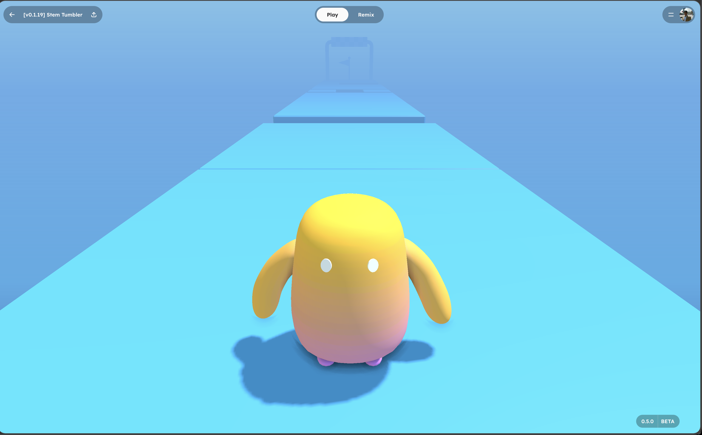

# Tutorial: Build a Multi-Level 3D Platformer

This tutorial walks through every piece of a complete, playable 3D platformer from scratch. By the end you will have a game with four progressively harder levels, a character that runs and jumps across platforms, moving platforms that carry the player, fall-off respawn, level progression, and a victory screen.

Every behavior script is provided in full -- you can paste them directly into the StemStudio behavior editor and have a running game.



> This tutorial is based on **Stem Tumbler**, a game built entirely inside StemStudio. The source scene and all behavior exports are available as reference.
>
> **Current guidance:** this tutorial still uses the older `EventBus` pattern for cross-object signaling because it mirrors the original Stem Tumbler implementation. For new projects, prefer behavior-local `onEvent(msg, data)` handlers, `game.behaviorManager.sendEventToObjectBehaviors()`, and `this.erth.store` for shared state.

## What You Will Learn

- How to plan and organize a scene hierarchy for a multi-level game
- Why physics body types (dynamic, static, kinematic) matter and when to use each one
- How an older EventBus-based architecture maps to current behavior-event patterns
- How to build a level progression system that shows/hides levels at runtime
- How moving platforms work (kinematic physics, interpolation, player snapping)
- How to detect fall-offs and respawn the player
- How to build UI overlays from behavior scripts
- The full behavior lifecycle: `init`, `onStart`, `update`, `dispose`

## Architecture Overview

Before writing any code, it helps to understand how the pieces fit together. This version of the tutorial uses six custom behaviors that communicate through legacy EventBus events:

```
┌─────────────────────────────────────────────────────────────────┐
│                       EVENT FLOW                                │
│                                                                 │
│  Player falls off                                               │
│       │                                                         │
│       ▼                                                         │
│  Out of Bounds ──"onOutOfBounds"──▶ SpawnBehavior               │
│                                     (teleports player back)     │
│                                                                 │
│  Player reaches end of level                                    │
│       │                                                         │
│       ▼                                                         │
│  FinishLine ──"onLevelDone"──▶ Level Manager                    │
│                                  │                              │
│                          ┌───────┴────────┐                     │
│                          │  More levels?  │                     │
│                          └───┬────────┬───┘                     │
│                           Yes│        │No                       │
│                              ▼        ▼                         │
│                     Hide current   "onGameFinish"──▶ End Screen │
│                     Show next                                   │
│                     "onRespawn"──▶ SpawnBehavior                 │
│                     "startPlatformN"──▶ Moving Platforms         │
│                                                                 │
└─────────────────────────────────────────────────────────────────┘
```

Every behavior is self-contained. The Out of Bounds behavior does not know the SpawnBehavior exists -- it just fires an event. This decoupled architecture means you can swap, remove, or add behaviors without breaking the rest of the game.

---

## Part 1: Scene Hierarchy

A well-organized scene hierarchy is the foundation of any multi-level game. Here is the structure we are building:

```
Scene
├── Directional Light
├── Player                    ← Character Controller + SpawnBehavior
├── Systems                   ← Group for global behaviors
│   ├── Out of Bounds         ← Fall detection
│   ├── Level Manager         ← Level progression
│   └── HUD                   ← End screen + UI
├── Level 1                   ← Group: geometry + finish line
├── Level 2                   ← Group: geometry + finish line
├── Level 3                   ← Group: geometry + finish line + moving platforms
└── Level 4                   ← Group: geometry + finish line + moving platforms
```

### Why group levels this way?

Each level is a **separate group node** in the scene tree. This lets the Level Manager show/hide entire levels in one operation by traversing the group's children. It also keeps the hierarchy clean in the editor -- you can collapse levels you are not working on.

The **Systems** group holds behaviors that run for the entire game session, not tied to any specific level. This is a common pattern: separate "infrastructure" logic from "content" logic.

### Setting it up

1. Open StemStudio and create a new project.
2. In the left panel hierarchy, create the following empty groups: `Systems`, `Level 1`, `Level 2`, `Level 3`, `Level 4`.
3. Inside `Systems`, create three child objects: `Out of Bounds`, `Level Manager`, `HUD`.

---

## Part 2: The Player

The player is the most important object in the scene. It needs physics (so it collides with platforms), a character controller (so WASD/touch controls work), and a spawn behavior (so it can be teleported on respawn).

### Adding the player object

1. From the Asset Library, add the character model you want to use (or use a primitive Capsule as a placeholder).
2. Name it `Player`.
3. In **Project Settings**, set this object as the **Player** object.

### Physics configuration

In the right panel, enable **Physics** on the Player with these settings:

| Property | Value | Why |
|----------|-------|-----|
| **Body Type** | Dynamic | The player needs to fall under gravity and collide with the world |
| **Shape** | Capsule | A capsule slides smoothly over edges and stairs -- it has no sharp corners to get caught on geometry |
| **Mass** | 75 | A higher mass gives the character a solid, grounded feel. Too light and the character floats; too heavy and it feels sluggish |
| **Friction** | 0.9 | High friction prevents the player from sliding on surfaces like ice |

> **Why Capsule?** A capsule shape is the standard choice for character controllers in game engines. Its rounded bottom glides over small steps and uneven terrain, and its vertical orientation matches a standing character. A box shape would catch on edges; a sphere would roll.

### Attaching the Character Controller

1. In the right panel, click **Add Behavior** and select the built-in **Character** behavior.
2. Configure the movement attributes (speed, jump height, etc.) to your liking.
3. This built-in behavior handles WASD movement, jumping, and camera follow. It reads keyboard and touch input automatically.

### Attaching the Spawn Behavior

The Spawn Behavior teleports the player to a fixed position whenever a respawn event fires. Create a new behavior on the Player:

1. Click **Add Behavior** → **New Behavior**.
2. Name it `SpawnBehavior`.
3. Add these attributes in the behavior config panel:

| Attribute | Type | Default | Description |
|-----------|------|---------|-------------|
| `position` | group (x, y, z) | 0, 0, 0 | World-space spawn coordinates |
| `rotation` | group (x, y, z) | 0, 0, 0 | Spawn rotation in degrees |
| `event.listenToEvents` | boolean | false | Enable event-driven respawning |
| `event.respawnEventName` | string | "onRespawn" | EventBus name for respawn |
| `event.oobEventName` | string | "onOutOfBounds" | EventBus name for fall-off |

4. Paste this script:

```js
let game;
let scene;
let physics;

let object;
const startingPosition = { x: 0, y: 0, z: 0 };
const startingRotation = { x: 0, y: 0, z: 0 };
const eventAttributes = {
    listenToEvents: false,
    respawnEventName: "onRespawn",
    oobEventName: "onOutOfBounds",
};

this.init = function (_game) {
    game = _game;
    scene = _game.scene;
    physics = _game.physics;

    const attributes = this.attributes;

    startingPosition.x = attributes.position.x;
    startingPosition.y = attributes.position.y;
    startingPosition.z = attributes.position.z;

    startingRotation.x = attributes.rotation.x;
    startingRotation.y = attributes.rotation.y;
    startingRotation.z = attributes.rotation.z;

    eventAttributes.listenToEvents = attributes.event.listenToEvents;
    eventAttributes.respawnEventName = attributes.event.respawnEventName;
    eventAttributes.oobEventName = attributes.event.oobEventName;
};

this.onStart = function () {
    object = this.target;
    goToStartingPosition();
    setStartingRotation();
    setEventListeners();
};

function goToStartingPosition() {
    const pos = new THREE.Vector3().copy(startingPosition);
    if (object.userData?.physics?.enabled) {
        physics.setOrigin(object.uuid, pos);
        return;
    }
    object.position.copy(pos);
}

function setStartingRotation() {
    const rx = THREE.MathUtils.degToRad(startingRotation.x);
    const ry = THREE.MathUtils.degToRad(startingRotation.y);
    const rz = THREE.MathUtils.degToRad(startingRotation.z);

    if (object.userData?.physics?.enabled) {
        const euler = new THREE.Euler(rx, ry, rz, "XYZ");
        const quaternion = new THREE.Quaternion().setFromEuler(euler);
        physics.setRotation(object.uuid, quaternion);
    }
    object.rotation.set(rx, ry, rz);
}

function onRespawnEvent(event, data) {
    goToStartingPosition();
    setStartingRotation();
}

function setEventListeners() {
    if (eventAttributes.listenToEvents) {
        EventBus.instance.subscribe(
            eventAttributes.respawnEventName,
            onRespawnEvent
        );
        EventBus.instance.subscribe(
            eventAttributes.oobEventName,
            onRespawnEvent
        );
    }
}

function removeEventListeners() {
    EventBus.instance.unsubscribe(
        eventAttributes.respawnEventName,
        onRespawnEvent
    );
    EventBus.instance.unsubscribe(
        eventAttributes.oobEventName,
        onRespawnEvent
    );
}

this.update = function (deltaTime) {};
this.onStop = function () {};
this.dispose = function () { removeEventListeners(); };
```

5. Set the `position` attribute to where you want the player to start in Level 1.
6. Enable **Listen To Events** so the behavior responds to respawn and out-of-bounds events.

### How the Spawn Behavior works

**`init`** caches the attribute values into local variables. This is a performance pattern -- reading `this.attributes` repeatedly in `update()` is slower than reading a local variable.

**`onStart`** immediately teleports the object to the configured position. It uses `physics.setOrigin()` instead of directly setting `object.position` because the object has a physics body. If you only move the Three.js position, the physics body stays at the old location and snaps back next frame. `setOrigin` moves both.

**`setEventListeners`** subscribes to two EventBus events. When either fires, the behavior teleports the player back to the spawn point. The Out of Bounds behavior fires `"onOutOfBounds"`, and the Level Manager fires `"onRespawn"` when switching levels.

> **Why use `physics.setOrigin` instead of `body.setLinearVelocity`?** `setOrigin` is a clean teleport -- it moves the physics body without any velocity or force. `setLinearVelocity` changes speed but doesn't change position. For respawning, you want an instant repositioning.

---

## Part 3: Building Level 1

Level 1 is the simplest level -- just static platform geometry and a finish line. It teaches the player the controls without any moving obstacles.

### Creating the level geometry

1. Inside the `Level 1` group, add your platform geometry. You can either:
   - Import a `.glb` model designed in Blender or another 3D tool
   - Build platforms from StemStudio primitive boxes

2. Enable **Physics** on the level geometry:

| Property | Value | Why |
|----------|-------|-----|
| **Body Type** | Static | Level geometry never moves -- static bodies have zero CPU cost for the physics engine |
| **Shape** | ConcaveHull | For complex imported geometry, ConcaveHull matches the mesh exactly. For simple boxes, use Box shape instead |
| **Mass** | 0 | Static bodies always have zero mass |
| **Friction** | 0.9 | Matches the player's friction for good traction |

> **Why ConcaveHull for level geometry?** Unlike ConvexHull (which wraps the mesh like shrink-wrap), ConcaveHull follows every concavity -- ramps, tunnels, overhangs. It is more expensive to compute, but that cost is paid once at load time. Since level geometry is static, this is the right tradeoff.
>
> **When to use Box instead:** If your level is built from primitive boxes, use Box shape on each one. It is much cheaper and perfectly accurate for rectangular platforms.

### Adding the Finish Line

The Finish Line is an invisible object placed at the end of the level. When the player gets close enough, it fires an event.

1. Add a new object inside `Level 1` and name it `Finish Line`.
2. Position it at the end of your platforms.
3. Create a new behavior on it called `FinishLine`.
4. Add these attributes:

| Attribute | Type | Default | Description |
|-----------|------|---------|-------------|
| `disableIfInvisible` | boolean | true | Skip the check when the parent level is hidden |
| `radius` | number | 5 | Detection sphere radius |
| `finishEventName` | string | "onLevelDone" | Event to fire when the player arrives |

5. Paste this script:

```js
let game;
let player;
let object;
let parentObj;

const finishLineInfo = {
    disableIfInvisible: true,
    radius: 5,
    finishEventName: "onLevelDone",
};

let detectionSphere;

this.init = function (_game) {
    game = _game;
    player = _game.player;

    const attributes = this.attributes;
    finishLineInfo.disableIfInvisible = attributes.disableIfInvisible;
    finishLineInfo.radius = attributes.radius;
    finishLineInfo.finishEventName = attributes.finishEventName;
};

this.onStart = function () {
    object = this.target;
    detectionSphere = new THREE.Sphere(
        this.target.position,
        finishLineInfo.radius
    );

    if (finishLineInfo.disableIfInvisible) {
        parentObj = getTopLevelObject(this.target);
    }
};

this.update = function (deltaTime) {
    if (!player) return;
    if (finishLineInfo.disableIfInvisible) {
        if (!parentObj.visible || !object.visible) return;
    }

    if (!detectionSphere.containsPoint(player.position)) return;

    EventBus.instance.send(finishLineInfo.finishEventName);
};

this.onStop = function () {};
this.dispose = function () {};

function getTopLevelObject(obj) {
    let current = obj;
    while (current.parent && !current.parent.isScene) {
        current = current.parent;
    }
    return current;
}
```

### How the Finish Line works

**`THREE.Sphere`** is used for proximity detection. Every frame, the script checks if the player's position is inside the sphere. This is extremely cheap -- just a distance comparison, no physics raycasts needed.

**`disableIfInvisible`** is critical for a multi-level game. When the Level Manager hides Level 1, this finish line stops checking. Without this flag, the player could accidentally trigger a hidden level's finish line.

**`getTopLevelObject`** walks up the parent chain to find the root-level group (e.g. `Level 1`). This is how the behavior knows whether its parent level is currently visible.

> **Why not use physics collision for the finish line?** A `THREE.Sphere` check is simpler and faster. Physics collision events require a physics body, collision shape, and contact processing. For a simple "is the player near this point?" check, a sphere contains-point test is the right tool.

---

## Part 4: Fall Detection

When the player falls off a platform, they should respawn -- not fall forever. The Out of Bounds behavior handles this.

1. Select the `Out of Bounds` object inside the `Systems` group.
2. Create a new behavior called `Out of Bounds`.
3. Add these attributes:

| Attribute | Type | Default | Description |
|-----------|------|---------|-------------|
| `oobPositionY` | number | -15 | Y threshold below which the player is considered out of bounds |
| `oobEventName` | string | "onOutOfBounds" | Event to fire |

4. Paste this script:

```js
let game;
let player;

const outOfBoundsInfo = {
    oobPositionY: -15,
    oobEventName: "onOutOfBounds",
};

this.init = function (_game) {
    game = _game;
    player = _game.player;

    const attributes = this.attributes;
    outOfBoundsInfo.oobPositionY = attributes.oobPositionY;
    outOfBoundsInfo.oobEventName = attributes.oobEventName;
};

this.onStart = function () {};

this.update = function (deltaTime) {
    if (!player) return;
    if (player.position.y > outOfBoundsInfo.oobPositionY) return;

    EventBus.instance.send(outOfBoundsInfo.oobEventName);
};

this.onStop = function () {};
this.dispose = function () {};
```

### How it works

This is the simplest behavior in the game -- just a Y-position check each frame. When the player drops below `-15` (or whatever you configure), it fires `"onOutOfBounds"`. The SpawnBehavior on the Player is subscribed to this event and teleports the player back.

> **Why -15 and not 0?** The threshold should be well below the lowest platform in your game. If your platforms start at Y=0, a threshold of -15 gives the player a few seconds of falling animation before the respawn kicks in. This feels more natural than an instant snap.

---

## Part 5: Level Progression

The Level Manager is the brain of the game. It knows about all levels, listens for completion events, and orchestrates transitions.

1. Select the `Level Manager` object inside `Systems`.
2. Create a new behavior called `Level Manager`.
3. Add these attributes:

| Attribute | Type | Default | Description |
|-----------|------|---------|-------------|
| `onLevelDoneEventName` | string | "onLevelDone" | Event to listen for |
| `onFinishSendEventName` | string | "onGameFinish" | Event to fire when all levels are done |
| `levelInfo` | group array | | Array of level entries |
| `levelInfo[].level` | object | | Reference to the level group object |
| `levelInfo[].onLevelSwitchSendEventNames` | string array | "onLevelSwitch" | Events to fire when switching to this level |

4. In the attributes panel, add one entry in the `levelInfo` array for each level. Set the `level` object picker to point to `Level 1`, `Level 2`, etc.

5. For levels that have moving platforms, set `onLevelSwitchSendEventNames` to a custom event like `"startPlatform3"` or `"startPlatform4"`. The Moving Platform behaviors will listen for these.

6. Paste this script:

```js
let game;
let scene;

const levels = [];
let currentLevel = 0;

const eventInfo = {
    onLevelDoneEventName: "onLevelDone",
    onLevelSwitchSendEventNames: new Map(),
    onFinishSendEventName: "onGameFinish",
};

let hasFinished = false;

this.init = function (_game) {
    game = _game;
    scene = _game.scene;

    currentLevel = 0;
    hasFinished = false;

    const attributes = this.attributes;
    eventInfo.onLevelDoneEventName = attributes.onLevelDoneEventName;

    const levelInfo = attributes.levelInfo;
    for (let i = 0; i < levelInfo.length; i++) {
        const info = levelInfo[i];
        const level = game.scene.getObjectByProperty("uuid", info.level);
        levels.push(level);

        const eventNames = [...info.onLevelSwitchSendEventNames];
        eventInfo.onLevelSwitchSendEventNames.set(
            `Level_${i + 1}`,
            eventNames
        );
    }
};

this.onStart = function () {
    initLevels();
    setupEventListeners();
};

function initLevels() {
    for (let i = 1; i < levels.length; i++) {
        toggleLevel(levels[i], false);
    }
}

function toggleLevel(level, show) {
    level.traverse((obj) => {
        const pos = obj.position.clone();
        if (show) {
            pos.set(pos.x, pos.y + 1000, pos.z);
        } else {
            pos.set(pos.x, pos.y - 1000, pos.z);
        }

        obj.visible = show;
        obj.position.copy(pos);
        game.physics.setOrigin(obj.uuid, pos);
        obj.updateMatrixWorld(true, false);
    });
}

async function onLevelDone(event, data) {
    if (currentLevel + 1 < levels.length) {
        toggleLevel(levels[currentLevel], false);
        currentLevel++;
        EventBus.instance.send("onRespawn");
        toggleLevel(levels[currentLevel], true);
        sendLevelSwitchEvents(currentLevel);
        return;
    }

    EventBus.instance.send(eventInfo.onFinishSendEventName);
}

function sendLevelSwitchEvents(levelIndex) {
    const names = eventInfo.onLevelSwitchSendEventNames.get(
        `Level_${levelIndex + 1}`
    );
    if (!names || names.length === 0) return;

    for (const eventName of names) {
        if (!eventName || eventName === "") continue;
        EventBus.instance.send(eventName);
    }
}

function setupEventListeners() {
    EventBus.instance.subscribe(eventInfo.onLevelDoneEventName, onLevelDone);
}

function removeEventListeners() {
    EventBus.instance.unsubscribe(eventInfo.onLevelDoneEventName, onLevelDone);
}

this.update = function (deltaTime) {};
this.onStop = function () { removeEventListeners(); };
this.dispose = function () { removeEventListeners(); };
```

### How level toggling works

The `toggleLevel` function does two things to each object in a level group:

1. **Sets `visible`** to show/hide the Three.js rendering.
2. **Moves the position 1000 units on Y** and calls `physics.setOrigin()` to relocate the physics body.

> **Why move the physics bodies instead of disabling them?** StemStudio's physics API does not currently expose a per-object "disable" toggle at runtime. Moving bodies far away (Y ± 1000) is a reliable workaround -- they are too far from the player to interact with, and the visibility flag prevents rendering. This is a common technique in game engines when dynamic physics disable is not available.

### The level switch sequence

When a FinishLine fires `"onLevelDone"`:

1. The current level is hidden (moved down by 1000 units).
2. `currentLevel` increments.
3. `"onRespawn"` fires so the SpawnBehavior teleports the player to the new level's start.
4. The next level is shown (moved up by 1000 units).
5. Level-specific events fire (e.g. `"startPlatform3"`) to activate moving platforms.

When the last level is completed, `"onGameFinish"` fires instead, triggering the End Screen.

---

## Part 6: Building Levels 2, 3, and 4

### Level 2: Harder Static Geometry

Level 2 follows the same pattern as Level 1 -- a static geometry model and a Finish Line. Make the platforms narrower, add gaps, and introduce height changes to increase difficulty.

1. Add your geometry to the `Level 2` group.
2. Configure physics: Static, ConcaveHull, mass 0, friction 0.9.
3. Add a Finish Line with the same `FinishLine` behavior.
4. Add a `SpawnBehavior` to the Finish Line with `listenToEvents: true` to reset its position on respawn.

### Level 3: Introducing Moving Platforms

Level 3 adds the first moving platforms. This is where the game teaches timing.

1. Add your static geometry to `Level 3`.
2. Add a Finish Line.
3. Add 3 platform objects (boxes or imported meshes).
4. Configure each platform with physics: **Static** body type, **Box** shape, mass 0, friction 0.9.

> **Why Static and not Kinematic?** The Moving Platform behavior controls position directly via `physics.setOrigin()`, which works on static bodies. Using kinematic would also work but is not necessary here since we are doing the movement ourselves.

5. Attach the **Moving Platform** behavior to each platform object. Here are the attributes:

| Attribute | Type | Default | Description |
|-----------|------|---------|-------------|
| `moveOnStart` | boolean | false | Start moving immediately vs. wait for event |
| `enableEventName` | string | "startPlatform" | EventBus event that starts this platform |
| `useOriginValues` | boolean | true | Use the configured origin instead of current position |
| `speed` | number | 1 | Movement speed |
| `originValues` | group (x, y, z) | 0, 0, 0 | Start position |
| `translate` | group (x, y, z) | 0, 0, 0 | Offset from origin to destination |

6. Set `enableEventName` to `"startPlatform3"` for all Level 3 platforms.
7. In the Level Manager's `levelInfo` for Level 3, set `onLevelSwitchSendEventNames` to `"startPlatform3"`.
8. Set each platform's `originValues` to its starting position and `translate` to the offset (e.g. `x: 10, y: 0, z: 0` for a platform that moves 10 units right).

Here is the Moving Platform script:

```js
let game;
let player;
let object;
let parentObj;

const newPosition = new THREE.Vector3();
let isMoving = false;

const movePlatformInfo = {
    moveOnStart: false,
    enableEventName: "startPlatform",
    useOriginValues: true,
    speed: 1,
};

const originValues = { position: new THREE.Vector3() };
const translate = { position: new THREE.Vector3() };
const target = { position: new THREE.Vector3() };

this.init = function (_game) {
    game = _game;
    player = _game.player;

    const attributes = this.attributes;
    movePlatformInfo.moveOnStart = attributes.moveOnStart;
    movePlatformInfo.enableEventName = attributes.enableEventName;
    movePlatformInfo.useOriginValues = attributes.useOriginValues;
    movePlatformInfo.speed = attributes.speed / 2;

    originValues.position.set(
        attributes.originValues.x,
        attributes.originValues.y,
        attributes.originValues.z
    );
    translate.position.set(
        attributes.translate.x,
        attributes.translate.y,
        attributes.translate.z
    );
};

let detectionBox;
let boxOffset = new THREE.Vector3();
const speedAdjustment = new THREE.Vector3();
const boxCenter = new THREE.Vector3();
const boxSize = new THREE.Vector3();

this.onStart = function () {
    object = this.target;
    parentObj = getTopLevelObject(object);

    if (movePlatformInfo.moveOnStart) {
        isMoving = true;
        createDetectionBox();
    }

    const characterBehaviors = game.behaviorManager.getTargetBehaviorsById(
        game.player, "character"
    );

    setStartOriginValues();
    assignTargetPosition();
    setupEventListeners();
};

this.update = function (deltaTime) {
    if (!isMoving) return;
    if (!object.visible || !parentObj.visible) {
        isMoving = false;
        return;
    }

    movePlatform(deltaTime);
    snapPlayerToPlatform(deltaTime);
};

// ── Detection box for player snapping ─────────────────────────

function createDetectionBox() {
    detectionBox = new THREE.Box3();
    detectionBox.setFromObject(object);
    detectionBox.getSize(boxSize);
    detectionBox.getCenter(boxCenter);

    boxSize.y = player.scale.y * 4;
    boxCenter.y += boxSize.y / 1.75;
    detectionBox.setFromCenterAndSize(boxCenter, boxSize);
    boxOffset.copy(boxCenter).sub(object.position);
}

// ── Event handling ────────────────────────────────────────────

function setupEventListeners() {
    EventBus.instance.subscribe(
        movePlatformInfo.enableEventName, startMovePlatform
    );
}

function removeEventListeners() {
    EventBus.instance.unsubscribe(
        movePlatformInfo.enableEventName, startMovePlatform
    );
}

function startMovePlatform(event, data) {
    if (!object.visible || !parentObj.visible) return;
    setStartOriginValues();
    assignTargetPosition();
    createDetectionBox();
    isMoving = true;
}

function setStartOriginValues() {
    if (movePlatformInfo.useOriginValues) return;
    originValues.position.copy(object.position);
}

function assignTargetPosition() {
    target.position.addVectors(originValues.position, translate.position);
}

// ── Platform movement (ping-pong lerp) ────────────────────────

let time = 0;
let direction = 1;
const displacement = new THREE.Vector3();
const prevPosition = new THREE.Vector3();
let speedFactor = 1.7;

function movePlatform(dt) {
    if (isCooldown) {
        if (displacement.lengthSq() !== 0) displacement.setScalar(0);
        moveCooldown(dt);
        return;
    }

    prevPosition.copy(object.position);
    time += direction * movePlatformInfo.speed * dt;

    // Adjust speed factor near endpoints for smoother feel
    if ((time > 1 - dt * 2 && direction === 1) ||
        (time < dt * 2 && direction === -1)) {
        speedFactor = 1;
    } else if ((time > 1 - dt * 2 && direction === -1) ||
               (time < dt * 2 && direction === 1)) {
        speedFactor = 2.75;
    } else {
        speedFactor = 1.7;
    }

    if (time >= 1) {
        time = 1;
        direction = -1;
        isCooldown = true;
    } else if (time <= 0) {
        time = 0;
        direction = 1;
        isCooldown = true;
    }

    newPosition.lerpVectors(originValues.position, target.position, time);
    game.physics.setOrigin(object.uuid, newPosition);
    object.position.copy(newPosition);

    displacement.copy(object.position).sub(prevPosition);
}

// ── Player-platform snapping ──────────────────────────────────

function snapPlayerToPlatform(dt) {
    if (!detectionBox) return;

    boxCenter.copy(boxOffset).add(object.position);
    detectionBox.setFromCenterAndSize(boxCenter, boxSize);

    if (!detectionBox.containsPoint(player.position)) {
        resetSpeedAdjustment();
        return;
    }

    const isColliding = game.collisionDetector.isColliding(
        player, object, true
    );
    if (!isColliding) {
        resetSpeedAdjustment();
        return;
    }

    if (displacement.lengthSq() === 0) {
        resetSpeedAdjustment();
        return;
    }

    displacement.y = 0;
    wasOnPlatform = true;
    speedAdjustment.copy(displacement)
        .divideScalar(dt * 100)
        .multiplyScalar(speedFactor);
    game.physics.setPlayerSpeedAdjustment(player.uuid, speedAdjustment);
}

let cooldown = 0;
let isCooldown = false;
function moveCooldown(dt) {
    cooldown += dt;
    if (cooldown > 0.5) {
        cooldown = 0;
        prevPosition.copy(object.position);
        isCooldown = false;
    }
}

let wasOnPlatform = false;
const vector3Zero = new THREE.Vector3();
function resetSpeedAdjustment() {
    if (!wasOnPlatform) return;
    game.physics.setPlayerSpeedAdjustment(game.player.uuid, vector3Zero);
    wasOnPlatform = false;
}

this.onStop = function () { removeEventListeners(); };
this.dispose = function () { removeEventListeners(); };

function getTopLevelObject(obj) {
    let current = obj;
    while (current.parent && !current.parent.isScene) {
        current = current.parent;
    }
    return current;
}
```

### How the Moving Platform works

This is the most complex behavior in the game. Let's break it down:

**Ping-pong interpolation.** A `time` variable goes from 0 to 1, then reverses back to 0, and repeats. `lerpVectors` smoothly interpolates between the origin and target positions based on `time`. The `direction` variable flips between `1` and `-1` at the endpoints.

**Cooldown pause.** When the platform reaches an endpoint, it pauses for 0.5 seconds before reversing. This gives the player a moment to jump on or off.

**Player snapping.** This is the hardest part. When a platform moves under a standing player, the physics engine does not automatically carry the player along (unlike Unity or Unreal). We have to do it ourselves:

1. **Detection box** -- A `THREE.Box3` extends upward from the platform surface to detect if the player is standing on it.
2. **Collision confirmation** -- `game.collisionDetector.isColliding()` confirms actual physics contact (not just bounding box overlap).
3. **Speed adjustment** -- `game.physics.setPlayerSpeedAdjustment()` adds the platform's displacement to the character controller's movement. This makes the player "ride" the platform.

> **Why is player snapping needed?** In physics-based platformers, the character controller processes movement independently. If a platform moves 1 unit to the right and the player is standing on it, the player's physics body stays in place and slides off. The speed adjustment compensates by adding the platform's per-frame displacement to the player's movement.

### Level 4: The Final Challenge

Level 4 follows the same pattern as Level 3 but with more moving platforms (up to 9) and different speeds. Use `"startPlatform4"` as the enable event and configure the Level Manager accordingly.

The key to good level design:

- **Level 1**: No obstacles. Teaches controls.
- **Level 2**: Narrower platforms, gaps. Tests precision.
- **Level 3**: 3 moving platforms. Introduces timing.
- **Level 4**: 9 moving platforms in a gauntlet. Tests everything.

---

## Part 7: Victory Screen

When the player finishes the last level, the Level Manager fires `"onGameFinish"`. The End Screen behavior listens for this and shows a full-screen overlay.

1. Select the `HUD` object inside `Systems`.
2. Create a new behavior called `End Screen`.
3. Add one attribute:

| Attribute | Type | Default | Description |
|-----------|------|---------|-------------|
| `onEndScreenEventName` | string | "onGameFinish" | Event to listen for |

4. Paste this script:

```js
const endHTML = `
  <div class="content">
    <h1 class="title">You Finished! 🎉</h1>
    <button class="restart-btn">Restart</button>
  </div>
`;

const endStyle = `
.end-screen {
  display: none;
  position: absolute;
  width: 100%;
  height: 100%;
  background: #2b2d38;
  color: #ffffff;
  z-index: 10000;
  pointer-events: all;
}
.end-screen .content {
  position: absolute;
  top: 50%;
  left: 50%;
  transform: translate(-50%, -50%);
  text-align: center;
}
.end-screen .title {
  font-size: 2.2rem;
  font-weight: 700;
  margin-bottom: 24px;
}
.end-screen .restart-btn {
  background: transparent;
  border: 2px solid #ffffff;
  color: #ffffff;
  padding: 12px 32px;
  font-size: 1.1rem;
  border-radius: 12px;
  cursor: pointer;
  transition: background 0.2s, color 0.2s;
}
.end-screen .restart-btn:hover {
  background: #ffffff;
  color: #2b2d38;
}
`;

let restartBtn;
let endScreenMain;
let onEndScreenEventName = "onEndScreen";

this.init = function (_game) {
    onEndScreenEventName =
        this.attributes.onEndScreenEventName ?? "onEndScreen";
};

this.onStart = function () {
    drawUI();
    setupEventListeners();
};

function drawUI() {
    const element = document.createElement("div");
    element.id = "end-screen-overlay";
    element.classList.add("end-screen");
    element.innerHTML = endHTML;

    endScreenMain = element;
    restartBtn = element.querySelector(".restart-btn");
    restartBtn.addEventListener("click", function () {
        endScreenMain.style.display = "none";
        window.location.reload();
    });

    globalThis.appendToWrapperOnly(element);

    if (!document.getElementById("end-screen-style")) {
        const style = document.createElement("style");
        style.id = "end-screen-style";
        style.textContent = endStyle;
        document.head.appendChild(style);
    }
}

function setupEventListeners() {
    EventBus.instance.subscribe(onEndScreenEventName, onEndScreen);
}

function onEndScreen() {
    endScreenMain.style.display = "flex";
}
```

### How the End Screen works

**HTML injection.** Behaviors can create DOM elements and inject them into the HUD layer. The `globalThis.appendToWrapperOnly()` function is provided by the `UIVariableConstants` behavior (a UI infrastructure behavior that sets up the HUD container and handles scaling).

**CSS styling.** Styles are injected as a `<style>` element. The `#end-screen-style` ID check prevents duplicate injection if the behavior is re-initialized.

**Restart.** The restart button calls `window.location.reload()` -- the simplest way to restart the game. For more complex restart logic, you could fire an EventBus event and have behaviors reset their state.

> **Why use raw DOM instead of UIKit?** For full-screen overlays like victory/defeat screens, raw DOM gives you complete control over layout and styling. UIKit is better for in-world 3D UI elements (health bars over NPCs, floating labels, etc.).

---

## Part 8: Polish

### Scene settings

| Setting | Value | Why |
|---------|-------|-----|
| **Fog** | Exponential, density 0.025 | Hides distant geometry for a cleaner look |
| **Background** | Gradient (light blue) | Matches the pastel platformer aesthetic |
| **Shadow Map** | High quality | Crisp shadows under the character and platforms |

### Mobile support

The built-in **Touch Controls** behavior (available in the Global Behaviors Host) adds a virtual joystick and jump button for mobile players. Enable it in the GlobalBehaviorsHost if you want your game to work on phones and tablets.

---

## Complete Event Reference

| Event Name | Fired By | Listened By | Purpose |
|------------|----------|-------------|---------|
| `onOutOfBounds` | Out of Bounds | SpawnBehavior | Respawn player after falling |
| `onRespawn` | Level Manager | SpawnBehavior | Respawn player at new level's start |
| `onLevelDone` | FinishLine | Level Manager | Signal that a level is complete |
| `onGameFinish` | Level Manager | End Screen | Show victory screen |
| `startPlatform3` | Level Manager | Moving Platform (Level 3) | Activate Level 3 platforms |
| `startPlatform4` | Level Manager | Moving Platform (Level 4) | Activate Level 4 platforms |

---

## Behavior Summary

| Behavior | Attached To | Lines of Code | Key Engine APIs |
|----------|-------------|---------------|-----------------|
| SpawnBehavior | Player, Finish Lines | ~60 | `physics.setOrigin`, `physics.setRotation`, `EventBus` |
| Out of Bounds | Systems/Out of Bounds | ~20 | `player.position.y`, `EventBus` |
| FinishLine | Each level's finish point | ~35 | `THREE.Sphere`, `EventBus` |
| Level Manager | Systems/Level Manager | ~60 | `scene.getObjectByProperty`, `physics.setOrigin`, `EventBus` |
| Moving Platform | Each moving platform | ~120 | `physics.setOrigin`, `collisionDetector`, `physics.setPlayerSpeedAdjustment` |
| End Screen | Systems/HUD | ~40 | DOM manipulation, `EventBus` |

---

## Try It

- **Add a timer** -- Create a behavior that starts counting in `onStart` and stops when `"onGameFinish"` fires. Display it with a UIKit text element.
- **Add collectibles** -- Use the [Collision Pickup](10-tutorial-collision-pickup.md) tutorial pattern to scatter coins across levels.
- **Add a death counter** -- Listen for `"onOutOfBounds"` in a HUD behavior and increment a counter.
- **Add more levels** -- Duplicate a level group, redesign the geometry, and add an entry to the Level Manager's `levelInfo` array.
- **Add sound effects** -- Use the [Audio](04-audio.md) docs to play sounds on jump, respawn, and level complete.

## Next Steps

- [Physics](01-physics.md) -- Deep dive into body types, shapes, materials, and joints
- [Writing Behaviors](../scripting/02-writing-behaviors.md) -- Full behavior lifecycle and attribute system reference
- [Communication Patterns](../scripting/04-communication-patterns.md) -- More EventBus patterns and global store
- [HUD and UI](05-hud-and-ui.md) -- Building game UI with the HUD manager
- [Camera](06-camera.md) -- Camera configuration for platformer perspectives
