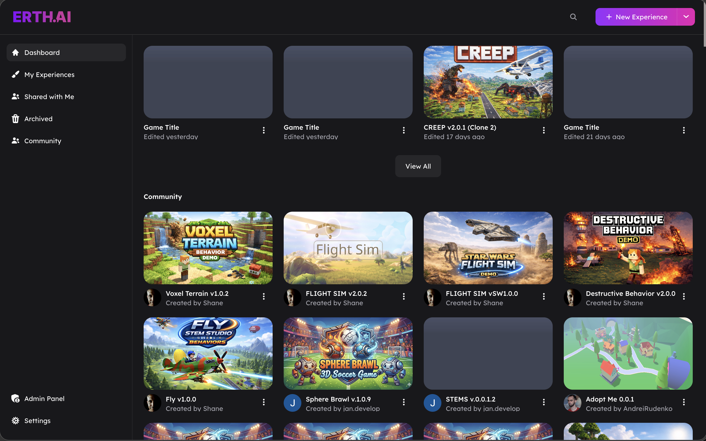

# What Is StemStudio?

StemStudio is a browser-based 3D game editor that lets you build, test, and publish interactive 3D experiences — all from your web browser.



## What You Can Build

StemStudio is designed for a wide range of 3D projects:

- **Action games** — Platformers, shooters, obstacle courses
- **Puzzle games** — Physics-based puzzles, escape rooms, logic challenges
- **Social experiences** — Multiplayer hangouts, virtual spaces, showcase rooms
- **Simulations** — Physics sandboxes, educational demos, interactive visualizations
- **Story-driven games** — Adventures with AI NPCs, dialogue, and branching paths

You do not need to install anything. The editor runs in Chrome, Firefox, or Edge.

## Key Features

### Visual 3D Editor

Build scenes by dragging in objects, adjusting properties, and testing with one click. No command line required for basic creation.


### Behavior System

Attach gameplay logic to objects using **behaviors** — pre-built or custom scripts that control how objects act. Dozens of built-in behaviors handle common patterns like character movement, collectibles, triggers, spawning, AI NPCs, and more.

### Lambda System

For advanced creators, **lambdas** provide ECS-style batch processing across many objects. Use them when you need high-performance systems that update hundreds of objects per frame.

### Built-in Physics

Full physics simulation with two interchangeable engines: **Ammo.js** (Bullet Physics) and **Rapier3D**. Objects can collide, bounce, stack, and respond to forces out of the box. Pick the engine per project from Project Settings.

### Multiplayer

Enable real-time multiplayer with a toggle. StemStudio handles room management, player synchronization, and host authority for you — you just write the gameplay logic.

### AI-Powered Creation

- **AI Copilot** — Describe what you want to build in natural language
- **AI NPCs** — Create characters that talk, listen, and respond with AI-generated dialogue and voice
- **3D Model Generation** — Generate 3D models from text descriptions
- **Image Generation** — Create textures, skyboxes, and images with AI

### Cross-Platform Publishing

Publish your game with one click. Players can access it via web link, or you can build for mobile (iOS/Android) and integrate with platforms like Steam, Discord, and CrazyGames.

## The Creation Workflow

Here is the typical flow for building a game in StemStudio:

```
1. SET UP THE SCENE
   Add objects from primitives, models, or the asset library

2. CONFIGURE OBJECTS
   Set physics, rendering, and visual properties

3. ADD GAMEPLAY LOGIC
   Attach behaviors for interactions, triggers, scoring

4. TEST
   Press Play to test your game in the editor

5. ITERATE
   Adjust, add more objects, refine behaviors

6. PUBLISH
   Share your game with a link or publish to platforms
```

You will spend most of your time in steps 2–5, cycling between configuring objects and testing gameplay.

## Who Is This For?

| If you are... | Start here |
|---------------|------------|
| **Brand new** to StemStudio | [Editor Tour](02-editor-tour.md) → [Your First Game](getting-started-tutorial.md) |
| **A creator** who wants to build without code | [Editor Tour](02-editor-tour.md) → [Built-in Behaviors](../scripting/05-built-in-behaviors.md) |
| **A technical creator** who wants to write scripts | [Behaviors vs Lambdas](../scripting/01-behaviors-vs-lambdas.md) → [Writing Behaviors](../scripting/02-writing-behaviors.md) |
| **Experienced** and want API reference | [Erth Interface](../apis/01-erth-interface.md) → [Built-in Events](../apis/02-eventbus.md) |

## What You Need

- **Browser:** Chrome 90+, Firefox 90+, or Edge 90+ (Chrome recommended)
- **RAM:** 4 GB minimum, 8 GB recommended
- **Graphics:** WebGL 2.0 support required
- A StemStudio account (sign up at [next.erth.ai](https://next.erth.ai))
- No installation required

## Next Steps

- Take the [Editor Tour](02-editor-tour.md) to learn where everything lives.
- Build your first playable game in 10 minutes with [Your First Game](getting-started-tutorial.md).
