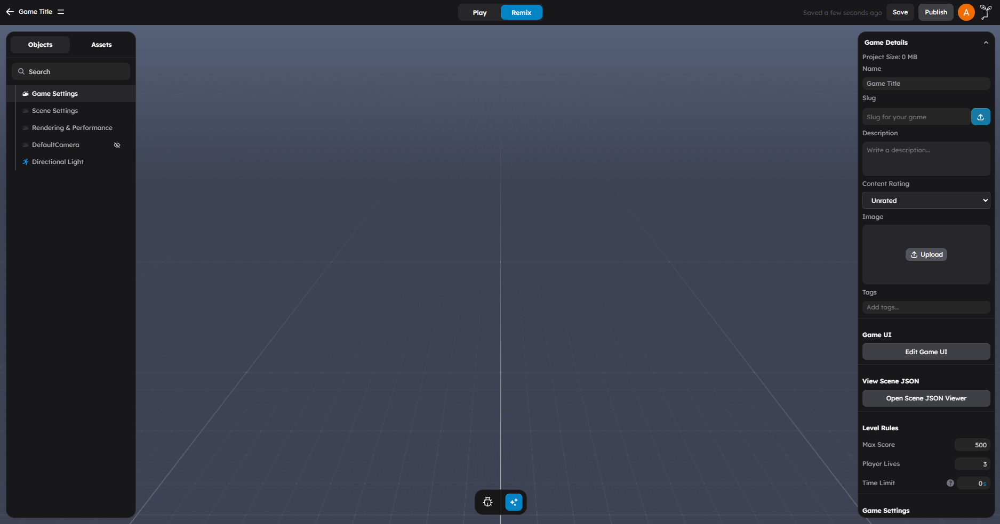

# Editor Tour

If you are new to the editor, this is the workflow to remember:

1. Add or find assets in the **left panel**.
2. Select and manipulate objects in the **viewport**.
3. Configure the selected object in the **right panel**.
4. Use the **top controls** for save, play, code editing, AI, and quick tools.

## The Main Areas

| Area | Purpose |
|------|---------|
| **Left Panel** | Scene hierarchy plus asset/library tools |
| **Viewport** | 3D scene editing and selection |
| **Right Panel** | Object properties, behaviors, lambdas, and scene settings |
| **Top Menu** | Save, publish, account, and project actions |
| **Action Bar** | Camera presets, grid snap quick access, debug, AI copilot, code editor, shortcuts, and help |

## Left Panel

The left side is split between:

- **Project** for scene hierarchy and object structure
- **Library & Tools** for assets and creation flows

The current asset-side categories include primitives, models, AI models, behaviors, lambdas, scripts, stems, scenes, particle effects, AI NPCs, sounds, images, textures, videos, files, and tools.

Read [Left Panel](../editor/01-left-panel.md) for the full breakdown.

## Viewport

The center viewport is where your scene lives.

Use it to:

- select objects
- move, rotate, and scale them
- orbit and frame the camera
- test layout, composition, and gameplay spaces

Press **F** to frame the current selection.

## Right Panel

The right panel changes with your selection.

For most objects, the important areas are:

- **Properties**
- **Behaviors**
- **Lambdas**

When the scene itself is selected, the right side exposes project and scene-level settings such as gameplay configuration, rendering/performance options, and multiplayer settings.

## Top Controls

StemStudio’s top controls are split across two areas.

### Top Menu

Use this area for:

- saving the scene
- publish and visibility actions
- account and profile actions

### Action Bar

Use this area for quick runtime/editor tools:

- camera view presets
- grid snap quick access when snapping is enabled
- debug console
- AI copilot
- unified code editor
- keyboard shortcuts
- help/docs
- collaboration status indicator

## Unified Code Editor

The editor now uses one shared code workspace for:

- behaviors
- lambdas
- import modules
- text-based file assets

You can open it from the action bar or from script assets in the left and right panels.

Read [Code Editor Workflow](../scripting/06-code-editor-workflow.md) for the current scripting flow.

## The Typical Build Loop

Most creator sessions follow this loop:

1. Add or select an object.
2. Configure its properties.
3. Attach or edit behaviors and lambdas.
4. Test in play mode.
5. Iterate.

## Next Steps

- Read [Left Panel](../editor/01-left-panel.md) to learn the asset model.
- Read [Toolbar and Viewport](../editor/03-toolbar-and-viewport.md) for transform, play, and navigation controls.
- Read [Code Editor Workflow](../scripting/06-code-editor-workflow.md) for the current scripting editor.
