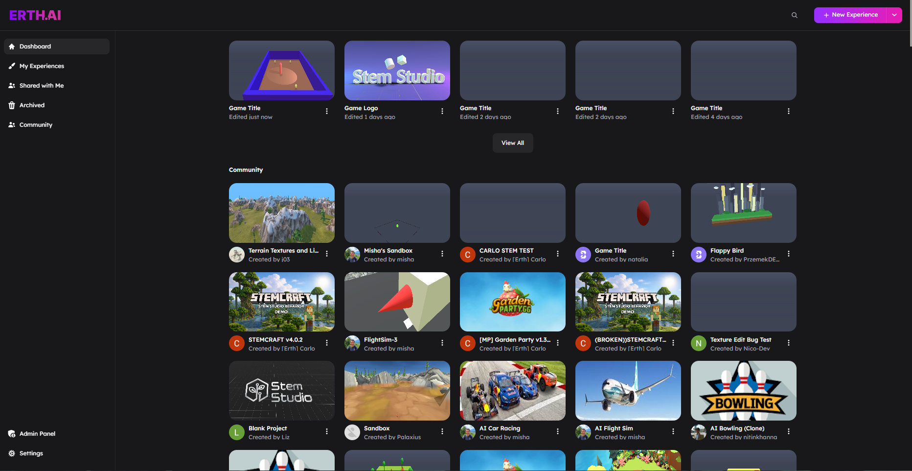

# Dashboard and Project Flow

This page explains how projects move through StemStudio, from the dashboard to the editor and back again.

Create, open, organize, share, and import projects from the StemStudio dashboard.

## The Dashboard At A Glance

The dashboard is your project home base. The main sections are:

- **Dashboard** for your main landing view
- **My Experiences** for projects you own
- **Shared with Me** for projects other people added you to
- **Archived** for projects removed from your active list
- **Community** for public community projects
- **Settings** for account-level settings
- **Admin Panel** for admin-only tools

If you are looking for a project you already created, start with **My Experiences**. If another creator invited you, check **Shared with Me**.

## Creating A New Project

Use the **New Experience** button in the dashboard header to start a project.

### Template Selection

When templates are enabled, StemStudio opens a **Select Project Template** dialog before the editor loads.

Common built-in starting points include:

- **Blank Project** for a clean default scene
- **Open World Sandbox** for a starter scene with terrain and sandbox-oriented setup

Your workspace can also expose additional project templates. Double-clicking a template creates it immediately.

If templates are not configured for your environment, StemStudio skips the dialog and creates a blank project directly.

### Import Instead Of Starting Empty

The **New Experience** dropdown also supports:

- **Import Game** to bring in a scene package
- **Import Asset Pack** to import and publish an asset pack if you have admin access

**Import Game** accepts `.json` scene files. **Import Asset Pack** accepts `.zip` asset pack archives.

After a successful import, the dashboard refreshes so the new content appears in your project list.

## Opening And Launching Projects

From the dashboard, you can:

- Open a project in the editor
- Use **Open in New Tab** from the project menu
- Use **Play Game** for projects that are both published and public

Use the editor when you want to change content. Use **Play Game** when you want the player-facing runtime.

## Project Menu Actions

Each project card includes a menu with management actions. The exact options depend on whether you own the project, whether it is published, and whether you are viewing community content.

### Actions On Your Projects

- **Duplicate** creates another copy of the project inside your own workspace flow.
- **Clone Project** is used in remix-style flows where a project is explicitly cloneable.
- **Make public** / **Make private** control whether other users can discover and launch the published project. They do not replace the publishing step itself.
- **Archive** removes a project from your active list without deleting it permanently.

If you are unsure whether to use Duplicate or Clone, choose the action that appears in the project menu for that item. StemStudio only shows the relevant option for that project state.

#### Visibility

For published experiences, you may see **Make public** or **Make private**. These control discoverability only. They do not replace the publishing step itself. If a project has never been published, publish it first.

> **Note:** Public/private only affects visibility for already-published projects. If a project has never been published, publish it first.

#### Archiving

Use **Archive** to remove a project from your active list without deleting it permanently. Archived projects move to the **Archived** section, where you can use **Unarchive** to restore them.

Archiving is useful for old prototypes, experiments, and internal test scenes you do not want cluttering **My Experiences**.

### Actions On Shared And Community Projects

- **Clone/Remix** creates your own copy of a shared or community project that you can modify independently.
- **Open** launches the project in the editor (for shared projects where you have collaborator access).

## Collaboration And Shared Projects

StemStudio supports creator collaboration at the project level.

### Where Shared Projects Appear

Projects another user adds you to appear in **Shared with Me** on the dashboard.

> **Tip:** If you cannot find a shared project, check **Shared with Me** — collaborator projects do not appear in **My Experiences**.

### Managing Collaborators

To manage collaborators, open the project and go to [Project Settings > Collaborator Management](../editor/04-project-settings.md#collaborator-management).

### What Collaboration Changes In The Editor

In collaborative editing sessions, some objects may be temporarily locked by another user while they are selected. If you cannot select an object someone else is actively editing, that is expected behavior.

Read [Project Settings](../editor/04-project-settings.md) for collaboration-related project settings such as room limits and multiplayer options.

## Common Tasks

| I want to... | Do this |
|--------------|---------|
| Start from scratch | Click **New Experience** and choose **Blank Project** |
| Start from a starter world | Choose **Open World Sandbox** or another template |
| Open a project in another browser tab | Use **Open in New Tab** from the project menu |
| Make a published project visible to others | Use **Make public** |
| Hide a published project again | Use **Make private** |
| Clean up my active project list | Use **Archive** |
| Restore an archived project | Go to **Archived** and use **Unarchive** |
| Work with another creator | Add them in **Collaborators** and check **Shared with Me** |

## Next Steps

- Read [Project Settings](../editor/04-project-settings.md) to configure the current project.
- Read [World Building and Environment](../gameplay/07-world-building.md) if you are starting from a sandbox or outdoor scene.
- Read [Publishing Games](../publishing/01-publishing-games.md) when you are ready to release.
