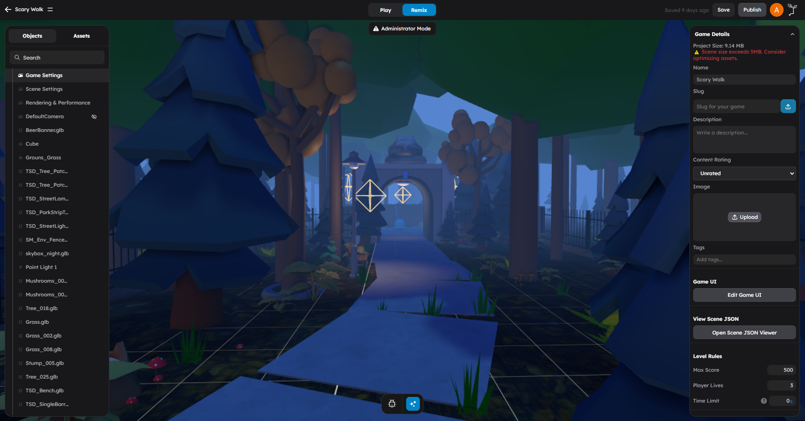
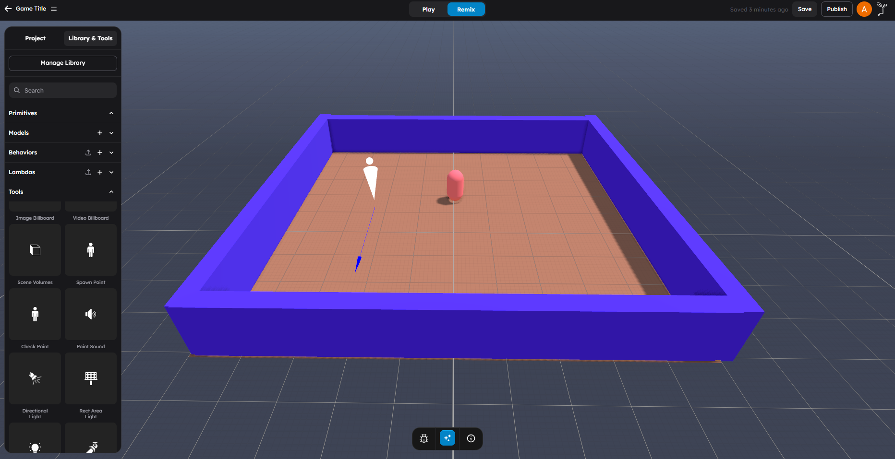
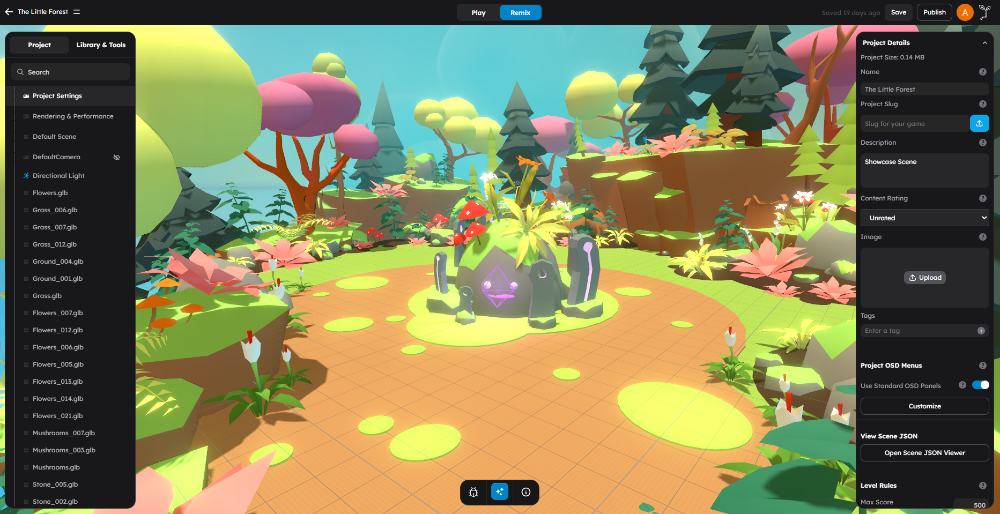

# Your First Game

In this tutorial, you will build a simple collectible game from scratch. By the end, you will have:

- A floor and walls
- A player character that moves
- Collectible items that increase score
- A spawn point for the player
- A working game you can test with Play

**Time:** About 10 minutes.

## Step 1: Create A New Scene

1. Open StemStudio at [next.erth.ai](https://next.erth.ai).
2. Click **Create New** to start a fresh scene.
3. Give your scene a name like "My First Game".

## Step 2: Add The Floor

1. In the left panel, open **Primitives**.
2. Click **Box** to add a box to the scene.
3. Select the box in the viewport.
4. In the right panel **Properties** tab:
   - Set **Scale** to `(20, 0.5, 20)` to make it a wide, flat floor.
   - Set **Position** to `(0, -0.25, 0)` so the top surface is at ground level.
5. In the **Physics** section:
   - Set **Body Type** to `Static`.
   - This makes the floor a solid, immovable surface.

> **Tip:** Static physics objects never move, making them perfect for floors, walls, and platforms.

> **Tip:** If the player falls through the floor during testing, make sure the floor has Body Type set to `Static`. If it is set to `None`, physics objects will pass through it.

## Step 3: Add Walls

1. Add four more **Box** primitives from the left panel.
2. Scale and position them to form walls around the floor:

| Wall | Position | Scale |
|------|----------|-------|
| North | `(0, 1, -10)` | `(20, 2, 0.5)` |
| South | `(0, 1, 10)` | `(20, 2, 0.5)` |
| East | `(10, 1, 0)` | `(0.5, 2, 20)` |
| West | `(-10, 1, 0)` | `(0.5, 2, 20)` |

3. Set each wall's **Body Type** to `Static`.

## Step 4: Add A Player Character

1. In the left panel, open **Primitives**.
2. Add a **Capsule** to the scene — this will be the player.
3. Position it at `(0, 1, 0)` so it sits on the floor.
4. In the right panel, switch to the **Behaviors** tab.
5. Click **Add Behavior** and search for **character**.
6. Attach the **Character** behavior.

The Character behavior gives your player:

- WASD / arrow key movement
- Jump with spacebar
- Camera follow
- Collision response

> **Note:** The character controller behavior has attributes you can tune, like speed and jump height. The defaults work fine for now.

> **Tip:** If the character does not move, make sure the Character behavior is attached and the game is in Play mode. Movement only works during play.

## Step 5: Add A Spawn Point

1. In the left panel, open **Primitives**.
2. Add a **Sphere** and position it at `(0, 1, 0)`.
3. In the right panel **Properties** tab, uncheck **Visible In Game** so players do not see it.
4. Switch to the **Behaviors** tab.
5. Attach the **Spawn Point** behavior.
6. In the spawn point attributes, set the spawn type to `Player`.

This tells the game where to place the player when the game starts.

## Step 6: Add Collectibles

1. Add 5 **Sphere** primitives scattered around the floor.
2. Scale them down to `(0.5, 0.5, 0.5)` to make them small.
3. Position them at various locations inside the arena.
4. For each collectible sphere, switch to the **Behaviors** tab.
5. Attach the **Consumable** behavior.

The Consumable behavior makes objects:

- Disappear when the player touches them
- Emit a pickup event
- Optionally update the game score

### Configure Scoring

In the Consumable behavior attributes, set:

- **Score Value** to `10` (each collectible gives 10 points)

> **Tip:** If collectibles do not disappear, make sure each one has the Consumable behavior attached and the player has the Character behavior.

## Step 7: Test Your Game

1. Click **Play** in the toolbar (or press the play button).
2. Use **WASD** to move your character around the arena.
3. Walk into collectible spheres — they should disappear and add to your score.
4. Click **Stop** (or press the play button again) to return to the editor.

## Step 8: Polish And Improve

Now that the core loop works, you can improve the game:

### Add Color

1. Select each object and open **Properties**.
2. Change the **Material Color** to make the floor, walls, and collectibles visually distinct.

### Adjust The Light

1. Select the default directional light in the scene hierarchy.
2. Adjust its rotation to light the arena from above.

### Add Project Settings

1. Click the scene background to deselect all objects.
2. Open the **Settings** tab.
3. Set a **Project Name** and **Description**.

## What You Built

Your game now has:

- A physics-enabled arena with floor and walls
- A player character with keyboard movement
- Collectible items that disappear and update score
- A spawn point that positions the player

All of this was done with zero code — just behaviors and properties.
