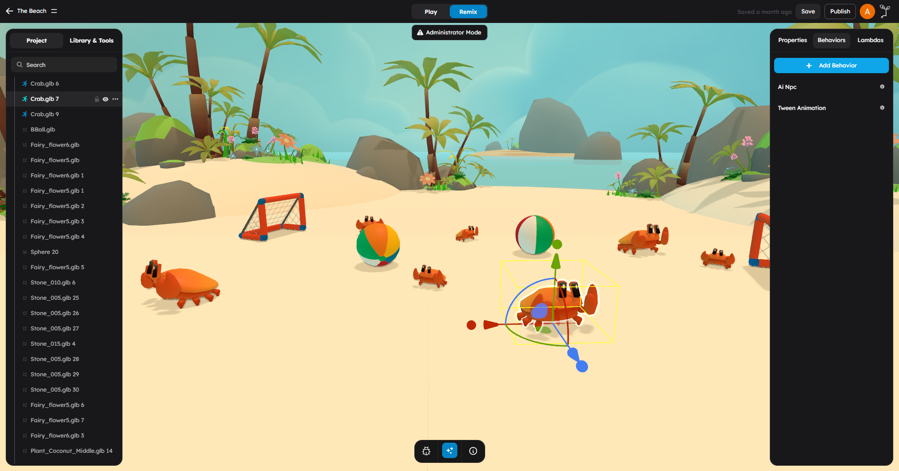
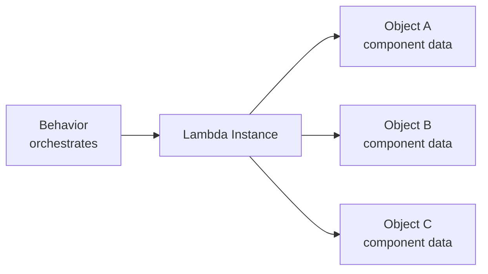

# Behaviors vs Lambdas

If you only remember one rule, use this one:

- Use a **behavior** for logic that belongs to one object.
- Use a **lambda** for a shared system that processes many objects through component data.

## What This Page Is For

Use this page when you need to decide:

- should this feature live on one object or many
- do I need lifecycle hooks and events
- do I want a shared data-driven processor
- how should behaviors and lambdas cooperate

## The Current Mental Model

### Behaviors

Behaviors are **per-object runtime components**.

Each attached behavior instance gets:

- `this.target` for the owning Three.js object
- `this.gameObject` for the wrapped game object API
- `this.erth` for runtime helpers
- lifecycle hooks like `init`, `onStart`, `update`, `fixedUpdate`, `onEvent`, and `onStop`

That makes behaviors the default place for:

- triggers
- object interaction
- gameplay flow
- orchestration
- one-off object state

### Lambdas

Lambdas are **shared ECS-style processors**.

Instead of one script instance per object, a lambda has:

- one lambda instance
- shared lambda-level attributes
- per-object component data stored on the objects that participate in it

At runtime, the lambda processes its registered objects together through `apply()` and `update()`.

That makes lambdas a good fit for:

- repeated movement rules
- shared simulation passes
- batch-friendly data processing
- systems where many objects follow the same rule with different component values

## The Core Difference

| Question | Behavior | Lambda |
|----------|----------|--------|
| What owns the logic? | One object | One shared system |
| How many instances run? | Usually one per attached object | One instance can manage many objects |
| How does it update? | Automatically through lifecycle hooks | Through lambda runtime processing |
| What data does it use? | Behavior attributes + local state | Lambda attributes + per-object component data |
| Best for | Gameplay logic and orchestration | Batch-style shared rules |

## When To Choose A Behavior

Choose a behavior when most of these are true:

- the logic clearly belongs to one object
- you need `onStart`, `update`, `onEvent`, or `onStop`
- the feature is mostly triggers, interactions, or control flow
- you want the object to “own” the feature

Examples:

- a door that opens when something enters a trigger
- a pickup that increments score and disappears
- a checkpoint that updates respawn state
- a manager object that coordinates waves, timers, or UI

## When To Choose A Lambda

Choose a lambda when most of these are true:

- many objects use the same processing rule
- each object needs its own data for that rule
- the feature becomes cleaner as a shared system
- you want to avoid copying the same per-frame logic across many behaviors

Examples:

- moving many objects with per-object velocity data
- rotating many decorations with different speeds
- processing a shared physics-style or data-style pass
- applying the same gameplay rule to a large set of tagged objects

## How They Work Together

In practice, behaviors and lambdas usually cooperate.

The most common pattern is:

1. A behavior decides **when** something should happen.
2. The behavior discovers or configures the right lambda instance.
3. Objects contribute lambda component data.
4. The lambda processes all registered objects together.

This is why a good rule of thumb is:

- behaviors decide
- lambdas process

## Current Creator Workflow

Inside the editor, lambdas are not just “another behavior.”

The current flow is:

1. Create a **lambda asset**.
2. Add it to the project or scene where needed.
3. Attach lambda component data to objects.
4. Let the runtime process those objects through the lambda.

That differs from behaviors, which you usually attach directly to the target object.

## Recommended Starting Point

Start with a behavior unless you have a clear reason not to.

That is the safer default because:

- behaviors are easier to reason about early on
- they map directly to visible objects
- they are better for fast gameplay iteration

Move shared repeated work into a lambda later if the system becomes repetitive or batch-heavy.

## Common Mistakes

- **Using a lambda for one object.** A behavior is usually simpler.
- **Using many identical behaviors for tiny repeated per-frame work.** That is where a lambda often helps.
- **Treating lambdas like behavior subclasses.** They are a different runtime model with shared processing and component data.
- **Starting with optimization too early.** Build the gameplay behavior first, then extract shared lambda work when the pattern is obvious.

## Decision Checklist

Use a **behavior** if:

- this logic belongs to one object
- I need lifecycle hooks or events
- I am coordinating gameplay systems
- the feature is primarily orchestration

Use a **lambda** if:

- many objects share the same update rule
- I want per-object data with one shared processor
- the system is cleaner as ECS-style data plus processing
- I expect batch-style scaling to matter

## Next Steps

- Read [Writing Behaviors](02-writing-behaviors.md) to build a custom behavior.
- Read [Writing Lambdas](03-writing-lambdas.md) to build a shared runtime system.
- Read [Code Editor Workflow](06-code-editor-workflow.md) to see how both asset types are edited today.
