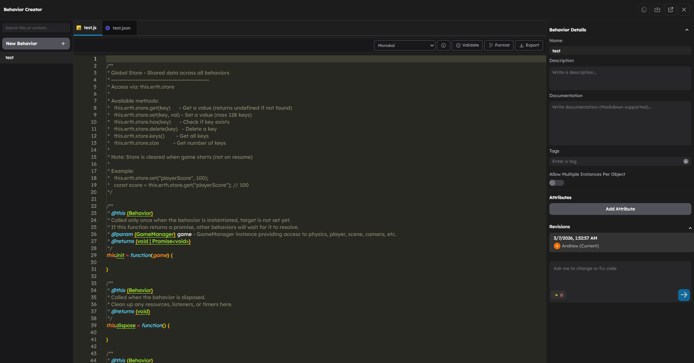

# Writing Behaviors

A behavior is a TypeScript class that attaches to one 3D object and gives it gameplay logic. This page walks through everything you need to write your own.



## What This Page Is For

Use this page when you need to:

- Understand the full behavior lifecycle
- Define attributes that appear in the editor
- Access runtime helpers like `this.erth`, `this.target`, and `this.gameObject`
- Read and write attribute values at runtime
- Find other behaviors in the scene
- Configure throttling for performance
- Build a complete behavior from scratch

## Behavior Pack Structure

Every behavior lives in a pack folder with two required files:

```
behaviors/packs/myBehavior/
├── MyBehavior.ts          # TypeScript class (default export)
├── behavior.json          # Configuration, attributes, metadata
└── assets/                # Optional: models, textures, sounds
```

The `behavior.json` tells the editor what attributes to show and how the behavior should run. The TypeScript class contains the runtime logic.

## The Behavior Lifecycle

Every behavior follows a defined lifecycle from creation to cleanup:

```
┌──────────────────────────────────────────────────────────────────┐
│                                                                  │
│   init(game)                                                     │
│     │  GameManager is available. Target object is set.           │
│     ▼                                                            │
│   onStart()                                                      │
│     │  Game play begins. All behaviors are loaded.               │
│     ▼                                                            │
│   ┌─────── Game Loop ────────────────────────────────────┐       │
│   │                                                      │       │
│   │  update(deltaTime)         ← every frame             │       │
│   │  fixedUpdate(fixedDelta)   ← fixed timestep (opt.)   │       │
│   │  onEvent(msg, data)        ← when events arrive      │       │
│   │  onAttributesUpdated()     ← when attrs change       │       │
│   │  onPaused() / onResumed()  ← pause state changes     │       │
│   │  onReset()                 ← game restart            │       │
│   │                                                      │       │
│   └──────────────────────────────────────────────────────┘       │
│     │                                                            │
│     ▼                                                            │
│   onStop()                                                       │
│     │  Game play ends.                                           │
│     ▼                                                            │
│   dispose()                                                      │
│     Clean up resources, listeners, references.                   │
│                                                                  │
└──────────────────────────────────────────────────────────────────┘
```

### Lifecycle Methods Reference

| Method | When It Runs | Use It For |
|--------|-------------|------------|
| `init(game)` | Behavior is created, target is set | One-time setup, caching references |
| `onStart()` | Game play begins (can be async) | Finding other behaviors, subscribing to events |
| `update(deltaTime)` | Every frame during play | Movement, animation, visual updates |
| `fixedUpdate(fixedDeltaTime)` | Fixed timestep (e.g. 60Hz). **Requires scheduler behaviorUpdateMode = "fixed".** | Physics-dependent logic, deterministic simulation |
| `onEvent(msg, data)` | An event is received | Reacting to gameplay events from other behaviors or engine systems |
| `onAttributesUpdated()` | Any attribute changes in editor | Refreshing internal state from new attribute values |
| `onPaused()` | Behavior is paused | Stopping sounds, freezing timers |
| `onResumed()` | Behavior is unpaused | Restarting sounds, resuming timers |
| `onReset()` | Game is restarted | Resetting state to initial values |
| `onStateUpdated(key, value)` | Multiplayer state changes in GameManager storage | Syncing local state with multiplayer state |
| `onStop()` | Game play ends | Cleanup before dispose |
| `dispose()` | Behavior is destroyed | Releasing resources, removing listeners |

### fixedUpdate vs update

`update(deltaTime)` runs once per rendered frame. The `deltaTime` value varies depending on frame rate.

`fixedUpdate(fixedDeltaTime)` runs at a fixed rate determined by quality settings (typically 60Hz on desktop). Use it for physics-dependent logic where you need deterministic behavior regardless of frame rate. Visual smoothing should still happen in `update()`.

To use `fixedUpdate`, you must implement it in your behavior class **and** enable the frame-based scheduler with fixed updates in Scene Settings (Scheduler > Behavior Update Mode = "fixed"). Without this setting, `fixedUpdate` will never be called.

## Runtime Helpers

Inside any behavior method, you have access to these properties:

### this.erth

The main API surface for interacting with the engine. Provides access to:

| Property | Type | What It Does |
|----------|------|-------------|
| `this.erth.ai` | `ErthAI` | AI generation (models, images) |
| `this.erth.asset` | `ErthAsset` | Load and manage assets (audio/video support name-based lookup via `findByName`) |
| `this.erth.camera` | `ErthCamera` | Control the camera |
| `this.erth.object` | `ErthObject` | Create and manage 3D objects |
| `this.erth.scene` | `ErthScene` | Access scene properties |
| `this.erth.store` | `ErthStore` | Global key-value store (128 key limit) |
| `this.erth.combat` | `ErthCombat` | Damage calculation and combat utilities |
| `this.erth.team` | `ErthTeam` | Team affiliation and enemy/friendly checks |
| `this.erth.pool` | `ErthPool` | Generic object pooling for reusable instances |
| `this.erth.lambdas` | `ErthLambdas` | Query and drive lambda instances |
| `this.erth.behaviors` | `ErthBehaviors` | Find behaviors on objects |
| `this.erth.tween` | `ErthTween` | Engine-ticked tween animations (time in seconds) |
| `this.erth.fsm` | `ErthFsm` | Finite state machines (XState v5) |
| `this.erth.behaviorTree` | `ErthBehaviorTree` | Behavior trees for NPC AI (mistreevous) |
| `this.erth.spatial` | `ErthSpatial` | Spatial queries (octree against scene geometry) |

### this.target

The `THREE.Object3D` this behavior is attached to. Use it to read or change position, rotation, scale, visibility, and other Three.js properties.

```ts
// Move the object up
this.target.position.y += 1;

// Hide the object
this.target.visible = false;

// Read the object's world position
const worldPos = new THREE.Vector3();
this.target.getWorldPosition(worldPos);
```

### this.gameObject

The `GameObject` wrapper around the Three.js object. This is the game-level representation that provides additional metadata and integration with the behavior system.

## The Attribute System

Attributes are the primary way creators configure behaviors in the editor. You define them in `behavior.json`, and the editor renders appropriate controls automatically.

### Attribute Types

| Type | Editor Control | Example |
|------|---------------|---------|
| `number` | Numeric input | `{ "type": "number", "default": 5, "min": 0, "max": 100 }` |
| `string` | Text input | `{ "type": "string", "default": "hello" }` |
| `boolean` | Checkbox | `{ "type": "boolean", "default": true }` |
| `enum` | Dropdown select | `{ "type": "enum", "options": [...], "default": "walk" }` |
| `color` | Color picker | `{ "type": "color", "default": "#ff0000" }` |
| `vector3` | XYZ inputs | `{ "type": "vector3", "default": { "x": 0, "y": 1, "z": 0 } }` |
| `slider` | Slider control | `{ "type": "slider", "min": 0, "max": 1, "step": 0.05 }` |
| `object` | Object picker | `{ "type": "object" }` (selects a scene object by UUID) |
| `image` | Image upload | `{ "type": "image" }` |
| `label` | Section header | `{ "type": "label" }` (display only) |
| `separator` | Visual divider | `{ "type": "separator" }` (display only) |
| `group` | Nested group | `{ "type": "group", "attributes": { ... } }` |

### Attribute Properties

Each attribute supports these properties:

```json
{
    "speed": {
        "name": "Movement Speed",
        "type": "number",
        "default": 5,
        "min": 0,
        "max": 100,
        "description": "How fast the object moves in units per second."
    }
}
```

| Property | Required | Description |
|----------|----------|-------------|
| `name` | Yes | Label shown in the editor |
| `type` | Yes | One of the types above |
| `default` | Recommended | Default value when the behavior is first added |
| `description` | Recommended | Tooltip text in the editor |
| `min` / `max` | Optional | Numeric constraints |
| `step` | Optional | Increment for sliders |
| `options` | For enum | Array of `{ "label": "...", "value": "..." }` |
| `autoFill` | Optional | Auto-populate options (e.g. `"object.animations"`) |
| `array` | Optional | When `true`, allows multiple entries |
| `invisible` | Optional | Hide from editor but keep at runtime |

### Conditional Visibility with visibleIf

Attributes can be shown or hidden based on the value of other attributes:

```json
{
    "mode": {
        "name": "Mode",
        "type": "enum",
        "options": [
            { "label": "Fixed", "value": "fixed" },
            { "label": "Random", "value": "random" }
        ],
        "default": "fixed"
    },
    "maxValue": {
        "name": "Max Value",
        "type": "number",
        "default": 10,
        "visibleIf": {
            "mode": "random"
        }
    }
}
```

In this example, `maxValue` only appears in the editor when `mode` is set to `"random"`. You can also combine multiple conditions:

```json
"visibleIf": {
    "mode": "custom",
    "advancedSettings": true
}
```

Both conditions must be true for the attribute to appear.

### Enum with autoFill

The `autoFill` property automatically populates an enum dropdown from object or scene data:

```json
{
    "animation": {
        "name": "Animation",
        "type": "enum",
        "autoFill": "object.animations",
        "searchFor": ["idle"],
        "default": "none"
    }
}
```

This populates the dropdown with animation names from the attached 3D model, and pre-selects any animation whose name contains "idle".

### Group Attributes

Groups create nested attribute sections, optionally as arrays:

```json
{
    "conditions": {
        "name": "Conditions",
        "type": "group",
        "array": true,
        "itemLabel": "Condition",
        "default": [],
        "attributes": {
            "type": {
                "name": "Type",
                "type": "enum",
                "options": [...]
            },
            "value": {
                "name": "Value",
                "type": "number"
            }
        }
    }
}
```

When `array` is true, the editor shows add/remove buttons so creators can add multiple entries.

## Reading and Writing Attributes at Runtime

### getAttribute(key)

Read a single attribute value:

```ts
const speed = this.getAttribute("speed"); // returns the current value
```

This is the way to read attributes at runtime.

### requestAttributeChange(key, value, options?)

Request a change to an attribute value. This goes through the behavior system's change pipeline, which supports validation and notifications:

```ts
const result = await this.requestAttributeChange("speed", 10);

if (result.accepted) {
    console.log("Speed changed to", result.value);
} else {
    console.log("Change was rejected");
}
```

The optional `options` parameter supports:

| Option | Default | Description |
|--------|---------|-------------|
| `sync` | `false` | When `true`, the change is applied synchronously |

### Attribute Change Hooks

You can implement optional hooks to intercept and respond to attribute changes:

```ts
// Called BEFORE the change is applied. Return false to reject.
onAttributeChangeRequested(key: string, newValue: any, oldValue: any, requester: Behavior | null): boolean {
    if (key === "health" && newValue < 0) {
        return false; // reject negative health
    }
    return true;
}

// Called AFTER the change is applied. Respond to the change.
onAttributeChanged(key: string, newValue: any, oldValue: any): void {
    if (key === "speed") {
        this.recalculateMovement();
    }
}
```

## Finding Other Behaviors

### findBehavior(id, target?)

Find a single behavior by its type ID. Defaults to searching the same object:

```ts
// Find the animation behavior on this object
const anim = this.findBehavior("animation");

// Find the character behavior on a specific object
const char = this.findBehavior("character", playerObject);
```

Returns the first match or `null`.

### findBehaviors(id)

Find all behaviors of a type across the entire scene:

```ts
// Find every enemy behavior in the scene
const enemies = this.findBehaviors("enemy");

for (const enemy of enemies) {
    const health = enemy.getAttribute("health");
    console.log(`Enemy health: ${health}`);
}
```

## The behavior.json Config File

Here is a complete annotated `behavior.json`:

```json
{
    "id": "doorTrigger",
    "name": "Door Trigger",
    "description": "Opens a door when the player enters a trigger zone.",
    "author": "Your Name",
    "version": "1.0.0",
    "tags": ["interaction", "trigger"],
    "main": "DoorTriggerBehavior.ts",

    "throttleConfig": {
        "throttlePriority": "HIGH",
        "enableFrustumCulling": false,
        "enableDistanceThrottling": true,
        "requiresConsistentUpdates": false
    },

    "visibilityConditions": [
        {
            "key": "_obj.type",
            "condition": "equals",
            "value": "Mesh"
        }
    ],

    "objectSettings": {
        "physics": {
            "enabled": true,
            "type": "kinematic",
            "shape": "box",
            "mass": 0
        }
    },

    "attributes": {
        "triggerDistance": {
            "name": "Trigger Distance",
            "type": "number",
            "min": 0,
            "max": 50,
            "default": 3,
            "description": "How close the player must be to activate the door."
        },
        "openSpeed": {
            "name": "Open Speed",
            "type": "number",
            "min": 0.1,
            "max": 10,
            "default": 2,
            "description": "How fast the door opens, in units per second."
        },
        "openDirection": {
            "name": "Open Direction",
            "type": "enum",
            "options": [
                { "label": "Up", "value": "up" },
                { "label": "Left", "value": "left" },
                { "label": "Right", "value": "right" }
            ],
            "default": "up"
        },
        "openDistance": {
            "name": "Open Distance",
            "type": "number",
            "min": 0,
            "default": 3,
            "description": "How far the door moves when fully open."
        },
        "autoClose": {
            "name": "Auto Close",
            "type": "boolean",
            "default": true,
            "description": "Close the door automatically when the player leaves."
        },
        "closeDelay": {
            "name": "Close Delay",
            "type": "number",
            "min": 0,
            "default": 2,
            "description": "Seconds before the door starts closing.",
            "visibleIf": {
                "autoClose": true
            }
        }
    }
}
```

### Top-Level Fields

| Field | Required | Description |
|-------|----------|-------------|
| `id` | Yes | Unique identifier. Do not change after publishing. |
| `name` | Yes | Display name in the editor |
| `description` | Recommended | One sentence explaining what the behavior does |
| `author` | Recommended | Creator name |
| `version` | Yes | Semantic version string |
| `tags` | Recommended | Search and filter tags |
| `main` | Yes | TypeScript file name (must use `export default`) |
| `throttleConfig` | Recommended | Performance throttling settings |
| `visibilityConditions` | Optional | When this behavior appears in the editor list |
| `objectSettings` | Optional | Auto-configure physics when attached |
| `attributes` | Yes | Attribute definitions for the editor |
| `isSingleton` | Optional | Only one instance allowed per scene |
| `priority` | Optional | Initialization order (lower = earlier) |
| `isThrottlingLocked` | Optional | Prevent creators from changing throttle settings |

## Full Example: Door Trigger Behavior

```ts
import { Object3D, Vector3 } from "three";
import { BehaviorBase } from "../../Behavior";
import type GameManager from "../../game/GameManager";

export default class DoorTriggerBehavior extends BehaviorBase {

    // Internal state
    private closedPosition = new Vector3();
    private openPosition = new Vector3();
    private isOpen = false;
    private closeTimer = 0;
    private playerObject: Object3D | null = null;

    // ── Lifecycle ─────────────────────────────────────────────

    init(game: GameManager): void | Promise<void> {
        super.init(game);

        // Store the closed position as the object's starting position
        this.closedPosition.copy(this.target.position);

        // Calculate the open position based on direction and distance
        const direction = this.getAttribute("openDirection");
        const distance = this.getAttribute("openDistance") ?? 3;

        this.openPosition.copy(this.closedPosition);
        switch (direction) {
            case "up":
                this.openPosition.y += distance;
                break;
            case "left":
                this.openPosition.x -= distance;
                break;
            case "right":
                this.openPosition.x += distance;
                break;
        }
    }

    onStart(): void {
        // Find the player character in the scene
        const characters = this.findBehaviors("character");
        if (characters.length > 0) {
            this.playerObject = characters[0].target;
        }
    }

    update(deltaTime: number): void {
        if (!this.playerObject) return;

        const triggerDistance = this.getAttribute("triggerDistance") ?? 3;
        const speed = this.getAttribute("openSpeed") ?? 2;

        // Check distance to player
        const dist = this.target.position.distanceTo(this.playerObject.position);
        const playerInRange = dist < triggerDistance;

        if (playerInRange && !this.isOpen) {
            this.isOpen = true;
            this.closeTimer = 0;
        }

        if (!playerInRange && this.isOpen && this.getAttribute("autoClose")) {
            this.closeTimer += deltaTime;
            const closeDelay = this.getAttribute("closeDelay") ?? 2;
            if (this.closeTimer >= closeDelay) {
                this.isOpen = false;
            }
        }

        // Smoothly move toward target position
        const targetPos = this.isOpen ? this.openPosition : this.closedPosition;
        this.target.position.lerp(targetPos, speed * deltaTime);
    }

    onEvent(msg: string, data: any): void {
        // Listen for manual door control events
        if (msg === "door.open") {
            this.isOpen = true;
            this.closeTimer = 0;
        }
        if (msg === "door.close") {
            this.isOpen = false;
        }
    }

    onReset(): void {
        // Reset to initial state
        this.isOpen = false;
        this.closeTimer = 0;
        this.target.position.copy(this.closedPosition);
    }

    dispose(): void {
        this.playerObject = null;
    }
}
```

### Why This Works

- **init** stores the initial position and calculates the open position from attributes
- **onStart** finds the player character to measure distance against
- **update** checks proximity every frame and smoothly interpolates position
- **onEvent** allows other behaviors to open or close the door via `findBehavior()` + `onEvent()`
- **onReset** restores the door to its starting state
- **dispose** cleans up the player reference

## Importing and Exporting Behaviors

### Importing Existing Behaviors

To use a built-in behavior in your own code, import it by its class:

```ts
import type { Behavior } from "../../Behavior";

// Find an existing behavior on an object
const animation = this.findBehavior("animation");
if (animation) {
    animation.requestAttributeChange("speed", 2);
}
```

You do not instantiate behaviors directly. Use `findBehavior()` or `findBehaviors()` to locate existing instances at runtime.

### Exporting Your Behavior

Your behavior class must be the default export of its TypeScript file:

```ts
export default class MyBehavior extends BehaviorBase {
    // ...
}
```

The `main` field in `behavior.json` points to this file. The behavior system discovers and loads packs automatically.

## Throttle Configuration

StemStudio includes a built-in throttling system that automatically optimizes behavior updates for performance. You configure it in `behavior.json`:

```json
{
    "throttleConfig": {
        "throttlePriority": "MEDIUM",
        "enableFrustumCulling": true,
        "enableDistanceThrottling": true,
        "requiresConsistentUpdates": false
    }
}
```

### Throttle Priority Levels

| Priority | When To Use | Behavior |
|----------|------------|----------|
| `CRITICAL` | Player controller, triggers, volumes | Always updated every frame, never skipped |
| `HIGH` | Enemies, NPCs, teleporters | Updated frequently, minimal throttling |
| `MEDIUM` | Animations, tweens, platforms, followers | Throttled by distance and frustum visibility |
| `LOW` | Ambient behaviors, consumables, background effects | Aggressively throttled when far away or off-screen |

### Throttle Options

| Option | Default | Description |
|--------|---------|-------------|
| `throttlePriority` | `MEDIUM` | Priority level from the table above |
| `enableFrustumCulling` | `true` | Skip updates when the object is off-screen |
| `enableDistanceThrottling` | `true` | Reduce update frequency based on distance from camera |
| `requiresConsistentUpdates` | `false` | When `true`, never skip updates (overrides culling/distance) |

### Guidelines

- Set `CRITICAL` priority for anything the player directly interacts with (character, triggers, volumes)
- Set `enableFrustumCulling: false` for behaviors that must run even when not visible (audio, physics, game state)
- Set `requiresConsistentUpdates: true` for behaviors where skipping a frame could cause bugs (player controller, collision detection)
- Use `MEDIUM` or `LOW` for decorative and ambient behaviors

When throttling is active, skipped frames accumulate their delta time. The next update receives a larger `deltaTime` that accounts for the skipped frames, so movement and animations stay smooth.

## Common Patterns

### Start On Trigger

Many built-in behaviors support a `startOnTrigger` attribute. When enabled, the behavior stays inactive until a Trigger behavior activates it:

```json
{
    "startOnTrigger": {
        "name": "Start on Trigger",
        "type": "boolean",
        "default": false
    }
}
```

This lets creators wire up activation logic in the editor without writing code.

### Reacting to State Changes

Use `onStateUpdated` for multiplayer state synchronization:

```ts
onStateUpdated(key: string, value: string | undefined): void {
    if (key === "doorOpen") {
        this.isOpen = value === "true";
    }
}
```

### Cleanup Checklist

In `dispose()`, make sure you:

- Null out object references (`this.playerObject = null`)
- Clear any maps or arrays
- Remove any DOM elements you created
- Stop any audio sources
- Call `.dispose()` on any Three.js geometries, materials, or textures you created

## What To Avoid

- Do not modify `this.attributes` directly. Use `requestAttributeChange()`.
- Do not forget to call `super.init(game)` in your `init` method.
- Do not hold references to disposed objects. Null them in `dispose()`.
- Do not run expensive logic every frame without throttling. Use the throttle system.
- Do not assume `this.erth` is always available. It may be undefined in some testing contexts.

## Global Scope

Behavior scripts have access to the following globals injected at runtime. These are the **only** supported globals -- do not rely on any others.

### THREE

The full [Three.js](https://threejs.org/) library. Use it for vectors, colors, math, geometry, materials, and anything else Three.js provides.

```ts
const dir = new THREE.Vector3(0, 1, 0);
const color = new THREE.Color(0xff0000);
const mat = new THREE.MeshStandardMaterial({ color });
```

### Physics (gameObject.physics)

The physics API is accessed through `this.gameObject.physics`. Use it to configure physics settings before adding an object to the scene, and to manipulate the physics body at runtime.

#### Configuring Physics

Call `configure()` **before** adding the object to the scene with `erth.scene.addObject()`:

```ts
this.gameObject.physics.configure({
    enabled: true,
    bodyType: "dynamic",     // "static" | "dynamic" | "kinematic"
    shape: "sphere",         // "box" | "sphere" | "capsule" | "convexHull" | "concaveHull"
    mass: 1,
    friction: 0.5,
    restitution: 0.8,        // bounciness (0-1)
    material: "metal",       // surface material for audio/effects
});
```

Call `getSettings()` to read the current physics configuration:

```ts
const settings = this.gameObject.physics.getSettings();
if (settings?.bodyType === "dynamic") {
    console.log("Mass:", settings.mass);
}
```

#### Runtime Physics (RigidBodyHandle)

After the object is in the scene, call `getBody()` to get a `RigidBodyHandle` for runtime manipulation:

```ts
const body = this.gameObject.physics.getBody();
if (body) {
    // Apply an impulse to launch the object upward
    body.applyImpulse({ x: 0, y: 10, z: 0 });

    // Set linear velocity directly
    body.setVelocity({ x: 5, y: 0, z: 0 });

    // Make the object pass-through but still detect collisions
    body.setCollisionBehavior("ghost");

    // Remove this body from the simulation
    body.remove();
}
```

| Method | Description |
|--------|-------------|
| `applyImpulse(impulse, relativePosition?)` | Apply an instantaneous impulse. Optional relative position for off-center forces. |
| `setVelocity(velocity)` | Set the linear velocity directly. |
| `setCollisionBehavior(behavior)` | `"regular"` (solid) or `"ghost"` (pass-through but detects collisions). |
| `remove()` | Remove this body from the physics simulation. |

### CSS3DObject / CSS3DSprite

Create HTML-based 3D elements that exist in the Three.js scene graph. Useful for labels, HUDs, and overlays that should track 3D positions.

```ts
const div = document.createElement("div");
div.textContent = "Hello";
const label = new CSS3DObject(div);
label.position.set(0, 2, 0);
```

### UIKit

A 3D UI component library for building in-world interfaces.

| Component | Description |
|-----------|-------------|
| `UIKit.Container` | Layout container for grouping UI elements |
| `UIKit.Text` | Text display |
| `UIKit.Image` | Image display |
| `UIKit.Input` | Text input field |
| `UIKit.Fullscreen` | Full-screen overlay container |
| `UIKit.Content` | Scrollable content area |
| `UIKit.Svg` | SVG element display |
| `UIKit.Video` | Video player element |

```ts
const panel = new UIKit.Container({
    width: 2,
    height: 1,
    backgroundColor: "#222222"
});
const label = new UIKit.Text({ content: "Score: 0", fontSize: 0.1 });
panel.add(label);
```

### UIKitPointerEvents

Reference-counted pointer event system for UIKit. Manages enabling/disabling pointer interactions across multiple consumers.

```ts
UIKitPointerEvents.enable();   // increment reference count
UIKitPointerEvents.disable();  // decrement reference count
```

### console

Standard console logging methods, safe to use inside behavior scripts:

```ts
console.log("Behavior started");
console.warn("Unexpected value");
console.error("Something failed");
```

## Next Steps

- Read [Writing Lambdas](03-writing-lambdas.md) for batch processing across many objects.
- Read [Communication Patterns](04-communication-patterns.md) for store and inter-component messaging patterns.
- Browse the [Built-in Behaviors Reference](05-built-in-behaviors.md) to see what is already available.
