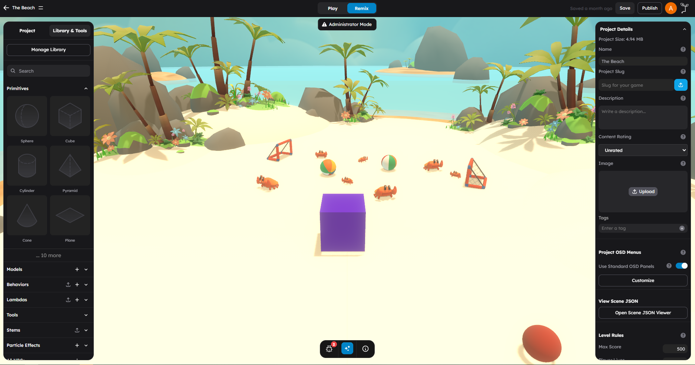

# Built-in Behaviors Reference

StemStudio includes built-in behavior packs that cover the most common gameplay patterns. This page lists the behaviors available to creators, organized by category.

## How To Use This Reference

Each entry in the tables below includes:

- **Name** -- The display name in the editor
- **ID** -- The identifier used in code (e.g. `this.findBehavior("character")`)
- **Purpose** -- What the behavior does
- **Key Attributes** -- The most important configurable properties

To attach a behavior in the editor, select an object and add it from the Behaviors tab in the right panel. To find a behavior in code, use `this.findBehavior(id)` or `this.findBehaviors(id)`.

---

## Player Control

Behaviors that handle player input, movement, and mobile controls.

| Name | ID | Purpose | Key Attributes |
|------|-----|---------|---------------|
| Character | `character` | Core player controller. Handles WASD movement, jumping, climbing, crouching, physics collision, and animation state management. This is the fundamental behavior for creating playable characters. | `health` (100), `walkSpeed` (2.5), `runSpeed` (9), `jumpHeight` (1), `stepHeight` (0.1), `climbSpeed` (1), `maxSlope` (90), `lookSpeed` (0.2), `groundAcceleration` (0.3), `pushObjects`, `kickObjects` |
| Touch Controls | `touchControls` | Mobile virtual joystick and action buttons. Provides on-screen touch controls for mobile devices, including a configurable joystick for movement and customizable action buttons. | `mobileEnabled`, joystick configuration, buttons array |

### Character Details

The Character behavior auto-configures physics as a dynamic capsule collider. Only one character per scene should have `isDefault: true`. The behavior fires character motion and action events (see [Communication Patterns](04-communication-patterns.md)) and manages animation states for idle, walk, run, jump, climb, crouch, fall, and die.

---

## AI and NPCs

Behaviors that create AI-powered, hostile, or ambient non-player characters.

| Name | ID | Purpose | Key Attributes |
|------|-----|---------|---------------|
| AI NPC | `aiNpc` | AI-powered NPC with conversational abilities, spoken responses, autonomous movement, object interaction, and gesture animations. | `npc_profile`, `voice_id` (20+ voices: Aria, Roger, Sarah, Laura, Charlie, George, Callum, River, Liam, Charlotte, Alice, Matilda, Will, Jessica, Eric, Chris, Brian, Daniel, Lily, Bill), `range` (5), `walkSpeed` (2.5), `runSpeed` (9), `active_in_voice_chat`, `show_text_chat`, `roamDistance`, `environment` |
| Enemy | `enemy` | Hostile AI with state-based combat. Supports detection, pursuit, attack, and retreat states with configurable weapon types, damage, and patrol patterns. Includes multiplayer synchronization. | `enemyType` (Aggressive, Defensive, Patrols, Custom), `weapon` (Machine Gun, Sub Machine Gun, Rifle, SciFi Sniper Rifle, Shot Gun, Pistol, Bow, Hands, Sword, Knife, Staff, Grenade), `health` (100), `attackDamage` (1), `attackDistance` (25), `movementSpeed` (5), `roamDistance`, `respawn` |
| NPC | `npc` | Simple ambient non-player character. Supports standing still or roaming within a defined area. Lighter alternative to Enemy for non-combat NPCs. | `movementType` (Stand Still, Roam), `movementSpeed`, `roamDistance`, `health` (100), `engageDistance` |

### NPC Physics

The NPC behavior auto-configures physics as a kinematic capsule collider with mass 1. No manual physics setup is needed -- just attach the behavior and the NPC is ready to move.

### Enemy Types

- **Aggressive** -- Actively pursues the player on detection
- **Defensive** -- Only attacks when provoked or attacked first
- **Patrols** -- Follows a patrol pattern within `roamDistance`, engages on detection
- **Custom** -- Fully configurable AI behavior

---

## Pathfinding

Behaviors that enable AI navigation through the scene.

| Name | ID | Purpose | Key Attributes |
|------|-----|---------|---------------|
| NavMesh | `navmesh` | Navigation mesh generation. Uses Recast/Detour to build walkable surfaces from scene geometry, including imported 3D models and groups. Singleton -- only one per scene. Used by Enemy, NPC, and AI NPC behaviors. | `cellSize` (0.2), `cellHeight`, `agentHeight`, `agentRadius`, `agentMaxClimb`, `agentMaxSlope`, `autoGenerate` (off), `onlyPhysicsMeshes`, `showDebugMesh` |
| NavMesh Connection | `navmesh-connection` | Off-mesh navigation links. Creates connections between disconnected NavMesh regions, such as jump points, ladders, or teleport links. | `targetObject`, `bidirectional`, `radius` |

### NavMesh Tips

- NavMesh supports imported 3D models and groups, not just primitives -- custom architecture and terrain are included in the walkable surface automatically
- Lower `cellSize` values produce more detailed navigation meshes but take longer to generate
- Set `agentHeight` and `agentRadius` to match your character's physical dimensions
- Enable `showDebugMesh` in the editor to visualize walkable areas
- Auto-generation is disabled by default for performance. Enable `autoGenerate` in the behavior attributes if you want the mesh to rebuild when geometry changes, or trigger regeneration manually

---

## Movement and Animation

Behaviors that control object motion, interpolation, and animation playback.

| Name | ID | Purpose | Key Attributes |
|------|-----|---------|---------------|
| Animation | `animation` | Play embedded model animations. Selects and plays animation clips from 3D models with configurable playback speed and looping. Only available on objects with animations. | `animation` (auto-populated from model), `loop`, `speed`, `startOnTrigger` |
| Tween Animation | `tween` | Smooth transform interpolation. Animates position, rotation, and scale using easing functions. Supports 28 easing types and three loop modes. Uses @tweenjs/tween.js. | `move` (vector3), `rotate` (vector3), `scale` (vector3), `speed`, `easeType` (Linear, QuadIn/Out/InOut, CubicIn/Out/InOut, QuartIn/Out/InOut, BounceIn/Out/InOut, ElasticIn/Out/InOut, and more), `loopMode` (None, Repeat, Mirror), `startOnTrigger` |
| Platform | `platform` | Moving platform that carries players. Uses tween-based animation along a defined path. Auto-configures as kinematic physics. Players standing on the platform are carried automatically. | `move` (vector3), `speed` (10), `loopMode` (None, Repeat, Mirror), `startOnTrigger` |
| Teleport | `teleport` | Instant player transport. Moves the player to a target object's position and rotation on collision. Resets camera for smooth transition. | `teleportTargetUuid` (object reference) |
| Jump Pad | `jumppad` | Physics impulse launcher. Applies configurable upward force on collision with strength and angle controls. Supports fixed, random, and movement-based force modes. | `strengthMode` (Fixed, Random, Movement Based), `strength`, `maxStrength`, `enableAngle`, `angleMode`, `angle` |
| Follow | `follow` | Follow a target object. Smoothly moves toward a target while maintaining a minimum distance. Supports rotation toward target and physics-enabled objects. | `followTargetUuid` (object reference), `distance` (1), `speed`, `rotate`, `startOnTrigger` |

### Easing Types (Tween)

The tween behavior supports these easing function families, each with In, Out, and InOut variants:

Linear, Quadratic, Cubic, Quartic, Quintic, Sinusoidal, Exponential, Circular, Elastic, Back, Bounce

---

## Interactive Systems

Behaviors that create triggers, collectibles, zones, spawners, and interactive mechanics.

| Name | ID | Purpose | Key Attributes |
|------|-----|---------|---------------|
| Trigger | `trigger` | Conditional event system with 22 condition types and configurable action steps. The core logic behavior for creating interactive gameplay. Conditions include collision, key press, distance, timer, variable compare, line of sight, random chance, cooldown, and more. | `if_condition` (array of conditions), `if_operator` (AND, OR), `then_steps` (array of actions: Activate, Deactivate, Apply Lambda, Apply Behavior, Set Attribute, Send Event), `delay` |
| Enable/Disable | `enableDisable` | Control object and behavior state. Toggles visibility, physics, and behavior activation on target objects. Used as an action target for Trigger behaviors. | Target object/behavior selection, enable/disable state |
| Consumable | `consumable` | Collectible items with effects. Creates pickup items that grant health, points, speed, jump boosts, money, ammo, or scale changes. Supports instant and press-to-collect modes. | `inventoryType` (Consumable, Throwable, Weapon, Weapon Ammo), `pointAmount`, `healthAmount`, `speedAmount`, `jumpAmount`, `moneyAmount`, `ammoAmount`, `shieldAmount`, `scaleAmount`, `timeAmount`, `consumableType` (Instant, Press E), `collisionType`, `disposable`, `canReappear`, `timeToShowAgain` |
| Volume | `volume` | Collision zones with presets. Creates invisible trigger zones for game events. Presets: Blocking (stops movement), Kill (instant death), Dialogue (triggers text), Loose (deducts score/time), Win (triggers victory), Custom. | `volumeType` (Blocking, Kill, Dialogue, Loose, Win, Custom), `blockEnemies`, `blockThrowables`, `blockCharacters`, `damageAmount`, `loosePoints`, `looseTime`, `startOnTrigger` |
| Spawn | `spawn` | Object spawner. Creates instances of a selected **Stem (prefab)** at the spawner's position. Choose a Stem from your library to spawn. Can be triggered manually or by a Trigger behavior. | Stem selection, spawn count, spawn interval, `startOnTrigger` |
| Spawn Point | `spawnpoint` | Player spawn location. Marks a position where players appear when joining the game or after respawning. Multiple spawn points allow random or sequential spawning. | Position and rotation (inherited from object transform) |
| Object Interactions | `objectInteractions` | Pickup, drop, push, and pull mechanics. Enables physics-based interaction with objects including grabbing, carrying, throwing, and pushing/pulling. | Interaction type, pickup distance, throw force |
| Shop | `shop` | In-game shop UI. Displays a purchasable item list with prices. Players can buy items using in-game currency (money from consumables). | Shop items configuration, UI layout |

### Trigger Condition Types

The Trigger behavior supports 22 condition types:

| Condition | What It Checks |
|-----------|---------------|
| On Enter Trigger Volume | Player enters the trigger's collision zone |
| On Exit Trigger Volume | Player exits the trigger's collision zone |
| While Inside Trigger Volume | Player is currently inside the zone |
| Player Touches | Player collides with this object |
| Object Touches | A specific object collides with this object |
| Press E Key / Press F Key | Player presses interaction key near this object |
| Key/Button Pressed | A configurable key or button is pressed |
| Timer Elapsed | A specified number of seconds has passed |
| Distance Compare | Distance to an object is less/greater than a threshold |
| Has Tag/Team/Faction | An entity has a specific metadata value |
| Variable Compare | A scene/object/player variable meets a comparison |
| Behavior State | A behavior on an object is in a specific state |
| Animation Event Reached | A named animation event fires |
| Line Of Sight | Unobstructed view to a target object |
| Random Chance % | Passes with a percentage probability |
| Cooldown Ready | Enough time has passed since last activation |
| On Interact | Player interacts with a specific object |
| Object State Compare | An object's state property meets a comparison |
| Time Window | Current time is within a specified hour range |
| Multiplayer Role | Local client has a specific role (host, local player, team) |
| Physics Collision Event | A physics collision event occurs with a specific object |
| AI Proximity | An AI entity is within detection range and FOV |

---

## Physics

Behaviors that create physics constraints between objects.

| Name | ID | Purpose | Key Attributes |
|------|-----|---------|---------------|
| Fixed Joint | `jointFixed` | Rigid connection between two objects. Locks two physics bodies together so they move as one. Useful for attaching parts to a main body. | Connected body reference |
| Hinge Joint | `jointHinge` | Rotating constraint with motor and limits. Creates a hinge (like a door or wheel) between two objects with configurable rotation axis, angular limits, and optional motor. | Connected body, hinge axis, low/high angle limits, motor enabled, motor speed, motor force |
| Point-to-Point Joint | `jointPoint2Point` | Ball-and-socket constraint. Creates a flexible connection point between two objects that allows rotation in all directions, like a pendulum or chain link. | Connected body, pivot points |

---

## Visual and Media

Behaviors for displaying images, video, web content, skyboxes, and particle effects.

| Name | ID | Purpose | Key Attributes |
|------|-----|---------|---------------|
| Billboard | `billboard` | Display images, video, or web content on a flat surface. Renders external media onto a plane in the 3D scene. Supports images, video URLs, and iframe embeds. | Media type, URL, dimensions |
| Image Billboard | `image_billboard` | Display an image on a mesh surface. Maps an image texture onto the object's material. Simpler alternative to Billboard for static images. | Image source, UV mapping |
| Video Billboard | `video_billboard` | Display a video on a mesh surface. Streams video onto the object's material with playback controls. | Video URL, autoplay, loop, muted |
| Skybox | `skybox` | Set a mesh as the scene skybox. Wraps the scene in a skybox using the attached object's geometry and material. Typically used with a large inverted sphere or cube. | Skybox configuration |
| Visual Effect | `visualEffect` | Particle effect system with event triggers. Creates configurable particle effects (sparks, fire, smoke, etc.) that can be triggered by gameplay events or played continuously. | Particle configuration, trigger events, duration, loop |

---

## Audio

Behaviors for spatial and ambient sound.

| Name | ID | Purpose | Key Attributes |
|------|-----|---------|---------------|
| Generic Sound | `genericSound` | Spatial audio with positional 3D. Plays audio files with configurable 3D spatialization, volume falloff by distance, looping, and trigger-based playback. | Audio source, volume, loop, spatial distance model, reference distance, max distance, `startOnTrigger` |

---

## Combat and Effects

Behaviors that handle projectiles, destructibility, and post-processing feedback.

| Name | ID | Purpose | Key Attributes |
|------|-----|---------|---------------|
| Projectile | `projectile` | Projectile spawning, physics, and collision. Fires projectiles in response to `"fire"` events with configurable speed, gravity, spread, and damage. Uses object pooling for performance. | `speed`, `gravity`, `spread`, `damage`, `lifetime`, pool size |
| Destructible | `destructible` | Makes an object destructible via Trigger step or EventBus event. On destruction the object is hidden and its physics body removed; it can optionally respawn after a delay. | `respawnAfter`, `respawnDelay`, destruction event |
| Post-FX Flash | `postFx` | Triggers a time-limited post-processing flash (film grain, chromatic aberration, or LUT intensity) in response to EventBus events. Useful for damage flashes, warp/teleport effects, and ability activations. | Effect type, intensity, duration, event trigger |

---

## Camera

Behaviors that control runtime camera behavior beyond the default follow camera.

| Name | ID | Purpose | Key Attributes |
|------|-----|---------|---------------|
| Cinematic Camera | `cinematicCamera` | Smoothly animate the camera through a sequence of positions and look targets for cutscenes. Supports smooth interpolation, wait pauses between steps, and looping. | Camera path, wait times, easing, loop mode |

---

## Lighting

Behaviors that control dynamic scene lighting.

| Name | ID | Purpose | Key Attributes |
|------|-----|---------|---------------|
| Day Night Cycle | `dayNightCycle` | Dynamic time-of-day lighting. Simulates a full day/night cycle with sun movement, sky color changes, and configurable cycle duration. Broadcasts events for time-dependent behaviors. | Cycle duration, sun intensity, ambient colors, time presets |
| CSM | `csm` | Cascaded Shadow Maps. Implements high-quality cascaded shadow mapping for directional lights, providing sharp shadows at all distances with configurable cascade count and range. | Cascade count, shadow resolution, max distance, fade |

---

## Procedural

Behaviors for procedural content generation.

| Name | ID | Purpose | Key Attributes |
|------|-----|---------|---------------|
| Terrain | `terrain` | Infinite procedural terrain. Generates and manages terrain chunks around the player using noise-based height maps. Chunks load and unload as the player moves. | Terrain parameters, chunk size, view distance, height scale, noise configuration |
| Randomized Spawner | `randomizedSpawner` | Weighted random prefab spawning. Spawns objects from a weighted list of prefabs at random positions within a defined area. Useful for procedural item placement, enemy spawning, and environmental decoration. | Prefab list with weights, spawn area, spawn count, spawn interval |

---

## Quick Lookup Table

Built-in behaviors sorted alphabetically by ID for fast reference.

| ID | Name | Category |
|----|------|----------|
| `aiNpc` | AI NPC | AI and NPCs |
| `animation` | Animation | Movement and Animation |
| `billboard` | Billboard | Visual and Media |
| `character` | Character | Player Control |
| `cinematicCamera` | Cinematic Camera | Camera |
| `consumable` | Consumable | Interactive Systems |
| `csm` | CSM | Lighting |
| `destructible` | Destructible | Combat and Effects |
| `dayNightCycle` | Day Night Cycle | Lighting |
| `enableDisable` | Enable/Disable | Interactive Systems |
| `enemy` | Enemy | AI and NPCs |
| `follow` | Follow | Movement and Animation |
| `genericSound` | Generic Sound | Audio |
| `image_billboard` | Image Billboard | Visual and Media |
| `jointFixed` | Fixed Joint | Physics |
| `jointHinge` | Hinge Joint | Physics |
| `jointPoint2Point` | Point-to-Point Joint | Physics |
| `jumppad` | Jump Pad | Movement and Animation |
| `navmesh` | NavMesh | Pathfinding |
| `navmesh-connection` | NavMesh Connection | Pathfinding |
| `npc` | NPC | AI and NPCs |
| `objectInteractions` | Object Interactions | Interactive Systems |
| `platform` | Platform | Movement and Animation |
| `postFx` | Post-FX Flash | Combat and Effects |
| `projectile` | Projectile | Combat and Effects |
| `randomizedSpawner` | Randomized Spawner | Procedural |
| `shop` | Shop | Interactive Systems |
| `skybox` | Skybox | Visual and Media |
| `spawn` | Spawn | Interactive Systems |
| `spawnpoint` | Spawn Point | Interactive Systems |
| `teleport` | Teleport | Movement and Animation |
| `terrain` | Terrain | Procedural |
| `touchControls` | Touch Controls | Player Control |
| `trigger` | Trigger | Interactive Systems |
| `tween` | Tween Animation | Movement and Animation |
| `video_billboard` | Video Billboard | Visual and Media |
| `visualEffect` | Visual Effect | Visual and Media |
| `volume` | Volume | Interactive Systems |

---

## Throttle Priority by Behavior

Understanding which behaviors use which throttle priority helps you predict performance characteristics.

| Priority | Behaviors |
|----------|-----------|
| **CRITICAL** | `character`, `trigger`, `volume` |
| **HIGH** | `aiNpc`, `enemy`, `npc`, `jumppad`, `teleport`, `genericSound` |
| **MEDIUM** | `animation`, `tween`, `platform`, `follow`, `enableDisable`, `csm` |
| **LOW** | `consumable`, `navmesh`, `spawn`, `spawnpoint`, `billboard`, `visualEffect`, `terrain`, `randomizedSpawner` |

---

## Common Combinations

These behavior combinations are used frequently in games:

| Pattern | Behaviors | Description |
|---------|-----------|-------------|
| Player character | Character + Touch Controls | Full player setup with mobile support |
| Interactive door | Trigger + Tween Animation | Player touches zone, door slides open |
| Collectible coin | Consumable + Visual Effect + Generic Sound | Collect with particles and sound feedback |
| Enemy wave | Trigger + Spawn + Enemy + NavMesh | Trigger spawns enemies that pathfind to player |
| Moving platform | Platform + Trigger | Platform activates when player steps on it |
| Teleport portal | Trigger + Teleport + Visual Effect | Player enters zone, teleports with effect |
| AI conversation | AI NPC + NavMesh | NPC that walks around and talks to player |
| Physics puzzle | Hinge Joint + Trigger + Enable/Disable | Hinged objects activated by triggers |

---

## Next Steps

- Read [Writing Behaviors](02-writing-behaviors.md) to create your own custom behaviors.
- Read [Communication Patterns](04-communication-patterns.md) to understand how behaviors communicate.
- Read [Writing Lambdas](03-writing-lambdas.md) for batch processing across many objects.
