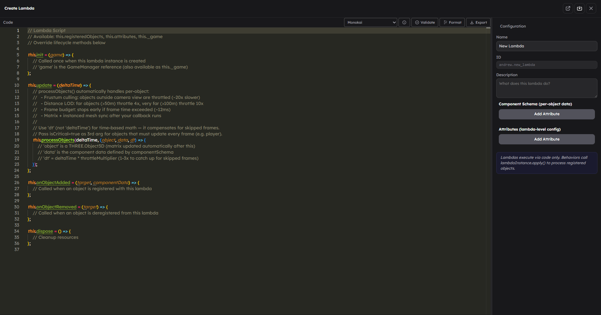

# Code Editor Workflow

StemStudio now uses one **unified code editor** for scripting work. Instead of separate “behavior creator” and “lambda editor” experiences, you open a single editor shell and switch between assets from the asset tree on the left.

## What This Page Is For

Use this page when you need to:

- open the current code editor
- understand what asset types it edits
- save one script or many scripts safely
- work with revisions and diffs
- use pinning or pop-out windows

## What The Unified Editor Can Open

The code editor can work with four creator-facing asset types:

| Asset type | What it is | How it appears |
|------------|------------|----------------|
| **Behaviors** | Per-object gameplay scripts | code tab + generated config tab + metadata panel |
| **Lambdas** | Shared data-processing systems | code tab + lambda schema/attributes panel |
| **Scripts** | Reusable JavaScript modules shared by behaviors and lambdas via `@import` | code tab + script metadata panel |
| **Files** | Text-based file assets such as `.json`, `.md`, `.yaml`, `.js`, `.ts`, `.svg` | code tab + file details panel |

Binary files stay in the asset library, but only text-based file assets show up in the Monaco code workspace.

## How To Open It

You can open the code editor from several places:

- the **Code Editor** button in the editor action bar
- a behavior, lambda, script, or file entry from the left panel
- object behavior and lambda panels in the right panel
- create flows such as **New Behavior**, **New Lambda**, or **New Script**

If you open the editor with no preselected asset, StemStudio selects the first available script asset automatically.

## Editor Layout

The unified editor has three working areas:

| Area | Purpose |
|------|---------|
| **Left asset tree** | Browse behaviors, lambdas, scripts, and text files |
| **Center editor** | Edit code in Monaco |
| **Right details panel** | Edit metadata, schema/attributes, and revisions |

The header also exposes:

- **Save**
- **Save All**
- **Pin to Side**
- **Pop Out** on desktop
- **Close**

## Working With Each Asset Type

### Behaviors

Behavior entries are the richest editor view:

- the center area includes the behavior code and generated config JSON
- the right panel lets you edit name, description, tags, documentation, and behavior attributes
- the revisions panel supports diffing and loading other revisions

This is the right place to evolve a behavior’s code and its editor-facing attribute contract together.

### Lambdas

Lambda entries use the same Monaco surface, but the right panel focuses on lambda structure:

- **object-specific attributes** become component schema fields
- **lambda-level attributes** are shared attributes for the lambda instance
- revisions and diffs are available in the same way as behaviors

### Scripts

Script assets are shared JavaScript modules. Use them when multiple behaviors or lambdas need reusable helper code. (The asset type was previously called "Import" — existing scenes are migrated transparently.)

Inside the code editor:

- the center panel edits the module source
- the right panel manages the asset name and revision history

### Files

Text files can be edited directly in Monaco and saved as file asset revisions. The right panel shows file metadata such as format, content type, and size.

## Saving Model

There is **no auto-save**.

Use:

- **Save** or `Cmd/Ctrl+S` to save the active asset
- **Save All** or `Cmd/Ctrl+Shift+S` to save every dirty asset currently open in the editor state

Save behavior, lambda, import, and file changes explicitly before closing the editor or switching tasks.

## Revisions, Diffs, And Merge Safety

Behaviors, lambdas, and imports are revisioned assets. The right panel exposes revision history so you can:

- inspect older revisions
- compare diffs
- load another revision into the editor

When someone else has saved a newer revision first, StemStudio uses a merge flow instead of silently overwriting their work. If a merge is needed, the editor updates your local draft and asks you to save again.

## Validation And Formatting

The Monaco toolbar includes quality-of-life tools for script editing:

- **Validate** to run structure checks
- **Format** to reformat the current document
- theme and font controls
- keybindings help

These tools are especially useful when editing behavior, lambda, and import code.

## Pinning And Pop-Out Windows

The unified editor supports two advanced layouts:

### Pin To Side

Use **Pin to Side** when you want the code editor visible next to the main editor while you keep working in the scene.

### Pop Out

On desktop, use **Pop Out** to move the code editor into a separate browser window.

Pop-out windows:

- keep the same current selection
- warn before closing with unsaved changes
- can be restored back into the main window

If several pop-outs are open, StemStudio shows a **Restore All** control.

## Practical Workflow

For most creator work:

1. Open the unified code editor.
2. Pick the behavior, lambda, import, or file from the left tree.
3. Edit code in the center panel.
4. Update metadata or schema in the right panel if needed.
5. Save often.
6. Use revision diffs before loading older work.

## Common Mistakes

- **Thinking behavior and lambda editing live in different editors.** They now share the same code editor shell.
- **Forgetting Scripts exist.** Use script modules with `@import` for reusable helper code instead of duplicating utility functions across behaviors.
- **Assuming files always appear in the code tree.** Only text-based file assets are editable there.
- **Closing the editor without saving.** Dirty state is tracked, but it is still an explicit save workflow.
- **Using pop-outs casually with unsaved work.** Treat them like full editors, not previews.

## Next Steps

- Read [Writing Behaviors](02-writing-behaviors.md) to build a custom behavior.
- Read [Writing Lambdas](03-writing-lambdas.md) to build a shared runtime system.
- Read [Communication Patterns](04-communication-patterns.md) when scripts need to coordinate across objects and systems.
