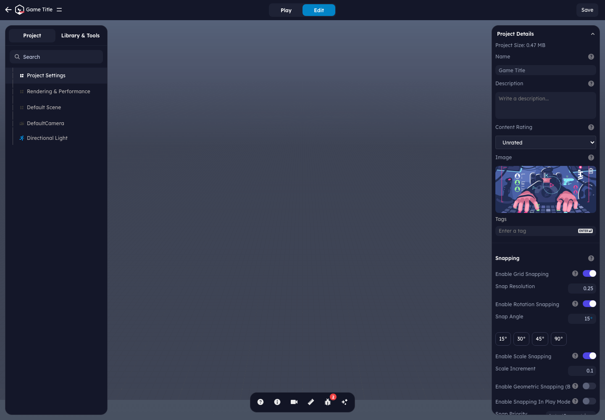
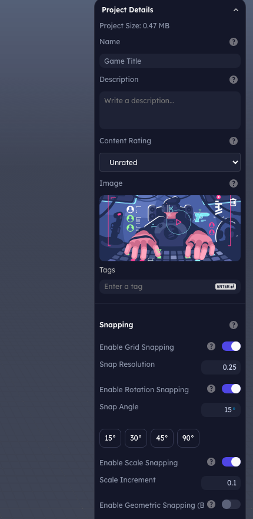
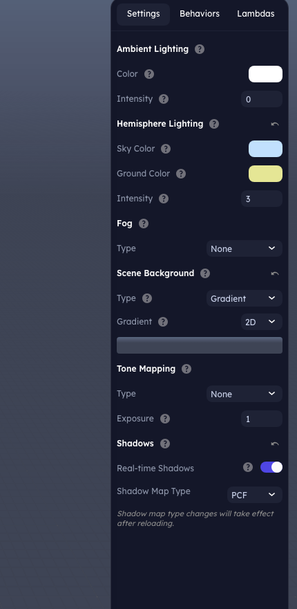
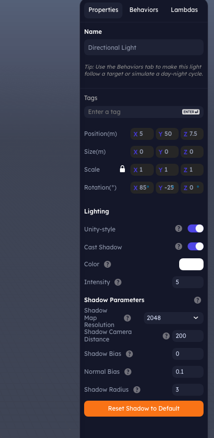

# Scheduler and Editor Performance Settings

Most scene-wide controls live in the **Project** tab. That tab is the map for
project metadata, editor preferences, runtime performance, default scene
lighting, cameras, and scene-level objects such as the default directional
light.



Use these entries as the main navigation points:

| Project tab entry | What it controls |
|---|---|
| Project Settings | Project metadata, editor snapping/units, physics defaults, game rules, HUD/display, player settings, multiplayer, and developer tools. |
| Rendering & Performance | Quality presets, scheduler, rendering switches, physics runtime toggles, behavior throttling, profiling, LOD, and splat settings. |
| Default Scene | Scene-wide ambient light, hemisphere light, fog, background, tone mapping, and shadow defaults. |
| DefaultCamera | Camera object transform and camera-specific settings. |
| Directional Light | The default sun/key light object, including directional-light behavior, shadow casting, and shadow quality. |

---

## Project settings



**Project Settings** is the broad project-authoring panel. It mixes scene
metadata with editor workflow preferences and game runtime defaults:

| Section | Settings |
|---|---|
| Project Details | Name, description, content rating, thumbnail image, tags, and server-backed slug/publishing metadata when available. |
| Snapping | Grid snapping, snap resolution, rotation snapping, snap angle presets, scale snapping, geometric snapping, play-mode snapping, and snap priority. |
| CAD, units, and measurement | CAD tools, unit system, display unit, angle units, bounding-box mode, and color palette. |
| Physics | Default physics engine and gravity stored under `scene.userData.physics`. Runtime physics toggles such as sleeping and workers live in Rendering & Performance. |
| Level Rules | Max score, player lives, and time limit stored with `scene.userData.game`. |
| HUD & Display | Standard HUD panel toggle, HUD renderer, HUD customization entry point, orientation policy, orbit controls, SceneTraverser, and mobile VFX toggle. |
| Player Settings | Avatar/player defaults for play mode. |
| Multiplayer | Multiplayer, collaboration, room/client limits, auto-join, and voice chat options. |
| Developer Tools | Production mode, game project mode, Play-mode Inspector, Compartments, and first-time-experience reset. |

Project Settings answers "what kind of project is this and how should the
editor/play mode behave?" Rendering & Performance answers "how should the
runtime spend frame time?"

---

## Rendering and performance


The **Rendering & Performance** panel is the runtime tuning panel. It contains:

| Section | Settings |
|---|---|
| Quality Presets | Target-device presets for rendering, physics, scheduler budget, view distance, culling, and LOD. |
| Rendering | Dynamic batching, mesh instancing, batching-data reset, post-processing, WebGL fallback, and VFX renderer fallback. |
| Physics | Physics sleeping and multi-threaded physics worker. |
| Scheduler | Modern Game Scheduler and fixed-rate behavior/lambda updates. |
| Behavior Performance | Off-screen optimization, distance optimization, consistent updates, priority, distance thresholds, and throttle factors. |
| Budget Inspector | Runtime budget visibility for avatars, plots, textures, and hot rows. |
| Lambda Explorer | Play-mode profiling for lambda instances, waves, entity counts, and timings. |
| LOD / developer tools | Batch LOD generation, root transform policy, performance overlay, memory overlay, debug mode, and splat/Spark renderer controls. |

These controls affect how the runtime spends each frame, which systems are
allowed to skip work, and which diagnostics are visible while you tune a
project.

---

## Scheduler architecture

The modern scheduler is implemented by `FrameOrchestrator`. It replaces a
single sequential update loop with fixed pipeline stages:

| Stage | What runs there |
|---|---|
| `INPUT` | Input state finalization. Always runs and is not budget gated. |
| `FIXED_UPDATE` | Fixed-timestep behaviors, fixed lambdas, and deterministic physics work. |
| `PRE_UPDATE` | Quality updates, spatial-grid rebuild, and budget setup before normal gameplay work. |
| `UPDATE` | Behaviors, lambdas, animation, audio, AI world, player events, texture residency, and other frame systems. |
| `POST_UPDATE` | Late events and sync points after main update work. |
| `RENDER` | Optional scheduled render stage and deferred render callbacks. |

Systems register through adapters in
`client/packages/editor-oss/src/scheduler/createSchedulerFromConfig.ts`. Within
each stage, `DependencyGraph` orders systems by declared reads/writes and then
priority. The lambda scheduler uses the same idea at the lambda level: lambdas
that write fields another lambda reads are scheduled before their consumers.

The scheduler also owns:

- A shared frame deadline from `FrameBudgetManager`.
- A fixed-step accumulator with `maxFixedStepsPerFrame` to prevent spiral of
  death.
- Render-pressure detection using average render time and frame delta spikes.
- Time slicing for supported update-stage systems.
- Background-tab throttling that skips expensive stages while the tab is hidden.
- A uniform spatial grid used by lambda/behavior throttling for distance checks.
- Command-buffer flushes between fixed/update boundaries so queued scene changes
  land at predictable points.

---

## Quality presets

Quality presets bundle rendering, physics, scene, and scheduler settings by
target device class. Start from the closest device tab, inspect the preset
details, then override individual controls only when needed.


Preset details include scheduler values such as frame budget, fixed timestep,
and maximum fixed steps. Those settings feed `createSchedulerFromConfig()` when
Play mode starts.

| Preset field | Runtime effect |
|---|---|
| Pixel ratio, shadows, antialiasing, post processing | Renderer cost and visual quality. |
| Physics rate and substeps | Physics simulation cost and stability. |
| View distance, LOD distances, culling aggressiveness | Scene traversal and rendering load. |
| Scheduler budget, fixed timestep, max fixed steps | Logic budget and fixed-step behavior under load. |

---

## Scheduler controls


| Setting | Use it for |
|---|---|
| **Modern Game Scheduler (Beta)** | Enables the pipeline scheduler. Prefer it for new scenes; turn it off only when auditing an older scene that depends on legacy ordering. |
| **Use Fixed Rate Updates (Beta)** | Registers fixed behavior and lambda adapters. Use for physics-dependent gameplay, deterministic controller logic, and code that implements `fixedUpdate()`. |

Fixed-rate updates do not mean every behavior should move into `fixedUpdate()`.
Use normal `update(deltaTime)` for visual effects, UI, camera polish, and
non-deterministic gameplay. Reserve `fixedUpdate()` for logic that benefits from
a fixed timestep.

These toggles persist on the scene:

```jsonc
{
  "userData": {
    "scheduler": {
      "enabled": true,
      "behaviorUpdateMode": "fixed" // or "variable"
    }
  }
}
```

The active quality profile supplies the lower-level scheduler fields:
`frameBudgetMs`, `fixedTimestepHz`, `maxFixedStepsPerFrame`,
`enableTimeSlicing`, `spatialGridCellSize`, `renderPressureThreshold`, and
`deltaTimePressureThreshold`.

---

## Frame buffering, yielding, and catch-up

The scheduler has three separate mechanisms that are easy to confuse:

| Mechanism | What it does |
|---|---|
| Fixed-step accumulator | Buffers elapsed time for `FIXED_UPDATE`, runs zero or more fixed steps, then caps work with `maxFixedStepsPerFrame`. Under render pressure it runs at most one fixed step and drops excess fixed debt instead of replaying a long backlog. |
| Throttle catch-up | Behaviors that are skipped by throttling accumulate skipped `deltaTime`; the next update receives an effective delta that includes that skipped time. Lambda `processObjects()` does the same with the callback `dt` by multiplying by the throttle factor. |
| Generator yielding | Advanced source-level systems can return a `Generator` and yield between chunks when registered as time-sliceable update systems. Source-authored lambdas can also override `applySliced()` / `updateSoASliced()`. |

For normal editor-authored behavior and lambda code, do not rely on returning a
generator from `update()` as a resume mechanism. Keep per-frame work bounded,
use `processObjects()` for lambda iteration, split long jobs across frames with
your own state machine, or move pure computation into a background worker.

The fixed-step accumulator also publishes interpolation state in the frame
context (`interpolationAlpha`, `fixedOverstep`) so render-facing systems can
smooth visuals between fixed simulation steps.

---

## Rendering and physics controls

Rendering controls manage draw-call and renderer compatibility choices:

| Setting | Stored at | Notes |
|---|---|---|
| Enable Dynamic Batching | `scene.userData.rendering.batching.enableDynamic` | Rebuilds batching state when toggled. |
| Mesh Instancing Optimization | editor setting | Reduces repeated mesh draw overhead when suitable. |
| Clear Batching Data | runtime action | Clears current batching stats/debug data. |
| Force WebGL | `scene.userData.rendering.forceWebGL` | Compatibility fallback when WebGPU is unstable. |
| Force WebGL for VFX | `scene.userData.rendering.forceWebGLForVFX` | Keeps VFX on WebGL while the main renderer may use WebGPU. |

Physics controls:

| Setting | Stored at | Notes |
|---|---|---|
| Enable Physics Sleeping | `scene.userData.physicsSleepingEnabled` | Lets inactive bodies sleep until woken. |
| Multi-threaded Physics | `scene.userData.physicsUseWorker` | Runs heavier physics work in a worker where supported. |

Post-processing and shadow sections expose renderer-specific quality controls.
Use them after choosing a quality preset so you are tuning from a known baseline.

---

## Behavior performance controls


The **Behavior Performance** section configures throttling for behavior updates:

| Setting | Effect |
|---|---|
| Off Screen Optimization | Allows off-screen behaviors to update less often. |
| Distance-Based Optimization | Allows far behaviors to update less often. |
| Force Consistent Updates | Keeps updates consistent when throttling would cause visible/gameplay issues. |
| Update Priority | Marks behaviors as critical/high/medium/low/minimal for scheduler decisions. |
| Mid/Far Distance Threshold | Distances where throttle tiers begin. |
| Mid/Far Throttle Factor | How aggressively non-critical behaviors are skipped at those tiers. |

These values are stored in `scene.userData.behaviorThrottlingConfig` and also
update the running game config when Play mode is active.

Use critical/high priority for player controllers, combat resolution, and logic
that must stay frame-accurate. Use lower priorities for ambient props, distant
NPC polish, idle effects, and visual-only behaviors.

---

## Budget and lambda profiling


The **Budget Inspector** surfaces runtime budget state for avatars, plots,
textures, and hot rows. Use it when a scene is spending too much memory or when
runtime budget coordination is shedding work.

The **Lambda Explorer** is disabled by default. Enable it in Play mode to see:

- Active lambda instance count.
- Dependency wave count.
- Entity count per lambda instance.
- Average and maximum execution time per lambda.

This is the fastest way to find a lambda that should be converted to
`processObjects()`, split into smaller systems, or moved partially into a worker.

---

## LOD, developer tools, and splats

The same panel includes tools that affect performance but are not scheduler
settings:

| Section | What it configures |
|---|---|
| LOD Generation | Batch model LOD settings and optimized model generation. |
| Scene Root Transform Policy | Whether runtime auto-resets, warns about, or ignores non-identity scene root transforms. Stored in `scene.userData.rendering.rootTransformPolicy`. |
| Performance Statistics Overlay | Runtime frame diagnostics while playing. |
| Memory Statistics Overlay | Runtime memory diagnostics while playing. |
| Debug Mode | Development-only diagnostics through `app.debug` / storage. |
| Gaussian Splats / Spark Renderer Options | Splat culling, sort, LOD, and Spark renderer tuning stored under `scene.userData.rendering.splat` and related Spark options. |

Turn overlays on only while profiling; leave them off for normal authoring and
published play.

---

## Default Scene settings



The **Default Scene** entry edits scene-wide environment settings rather than a
single mesh:

| Section | What it controls |
|---|---|
| Ambient Lighting | Global flat light color and intensity. Use sparingly; high values flatten form and make shadows less useful. |
| Hemisphere Lighting | Sky color, ground color, and intensity for simple outdoor-style fill lighting. |
| Fog | Scene fog mode and related fog parameters when enabled. |
| Scene Background | Color, equirectangular texture, cubemap, or gradient backdrop. Texture/cubemap modes also expose rotation, intensity, and blurriness. |
| Tone Mapping | Tone mapping operator and exposure. Use this after lighting is close; it affects final brightness and contrast. |
| Shadows | Real-time shadow toggle and shadow map type. Shadow map type changes require a reload. |

These settings are serialized through the scene rendering/environment data, so
they travel with saved projects and scene exports.

---

## Directional Light settings and behaviors



The default **Directional Light** is the scene's sun/key light object. Select it
from the Project tab to edit both its transform and light-specific controls:

| Setting | Use it for |
|---|---|
| Transform | Position and rotation determine the light direction and helper placement. Directional lights are effectively infinitely far away; direction matters more than distance. |
| Unity-style | Uses a Unity-like directional light workflow for scenes or imported content that expect that convention. |
| Cast Shadow | Enables real-time shadows from this light. Keep this enabled on the main sun/key light and limit other shadow-casting lights. |
| Color / Intensity | Controls the key-light tint and brightness. |
| Shadow Map Resolution | Shadow texture size. Higher values improve detail but cost GPU memory and render time. |
| Shadow Camera Distance | Coverage area for directional shadows. Smaller coverage gives sharper shadows. |
| Shadow Bias / Normal Bias | Fine tuning for acne, peter-panning, and shimmer. Use tiny values. |
| Shadow Radius / Blur Samples | Softness controls for supported shadow map types. |

Use the **Behaviors** tab on the directional light when the light should follow
a target, react to triggers, or simulate a day-night cycle. The `dayNightCycle`
behavior is the built-in starting point for animated sun direction and time of
day. Keep static lighting in the Properties tab; use behaviors only when light
state changes during play.

---

## Playground vs server-backed revision control

The playground/OSS storage path keeps projects local and latest-only for asset
edits. Behavior, lambda, script import, and setting changes resolve to the
current local version so iteration is simple.

A server-backed install adds full revision history through `ProjectStore`,
`AssetSource`, and the `@stem/network` revision endpoints. In that mode, each
save can create an immutable scene or asset revision, history panels can diff
and roll back, and published players can stay pinned to a release while editors
continue working on head.

See [`server-side-storage.md`](./server-side-storage.md) for the backend
interfaces behind that version-control model.

---

## Recommended workflow

1. Pick the closest quality preset for the target device.
2. Enable the modern scheduler for new scenes.
3. Use fixed updates only for deterministic or physics-linked systems.
4. Tune behavior throttling before hand-optimizing individual scripts.
5. Use Lambda Explorer in Play mode when many objects share the same logic.
6. Use Budget Inspector and overlays to confirm the bottleneck before lowering
   visual quality.
7. Save behavior, lambda, and import assets through the editor or designer so
   revisions and dependencies stay pinned correctly.
