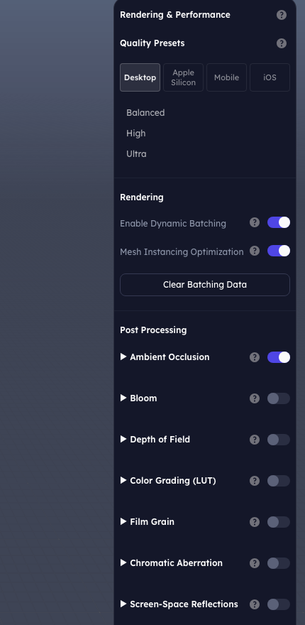
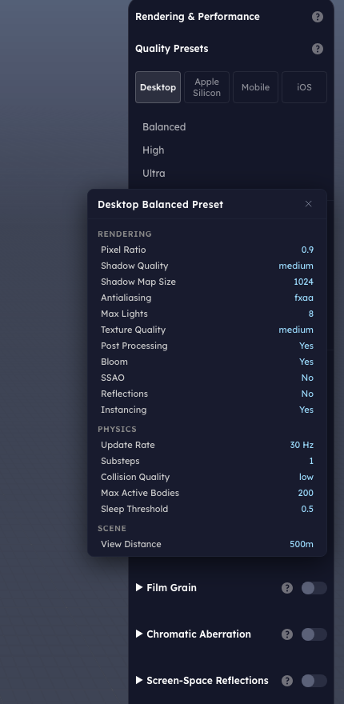
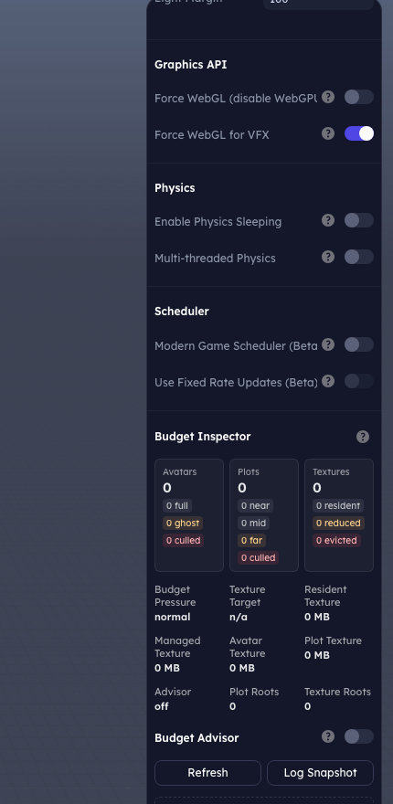
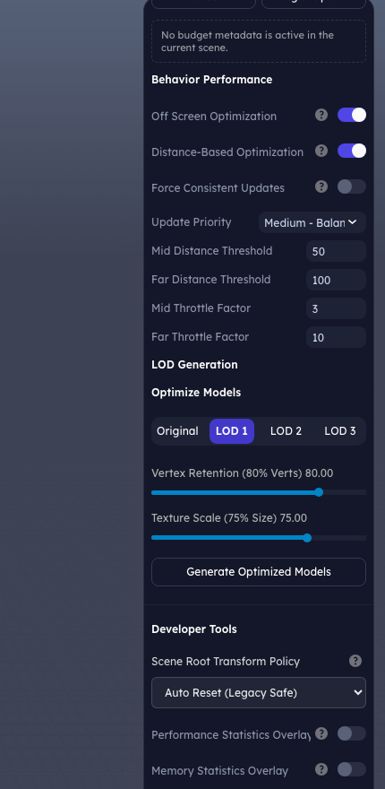
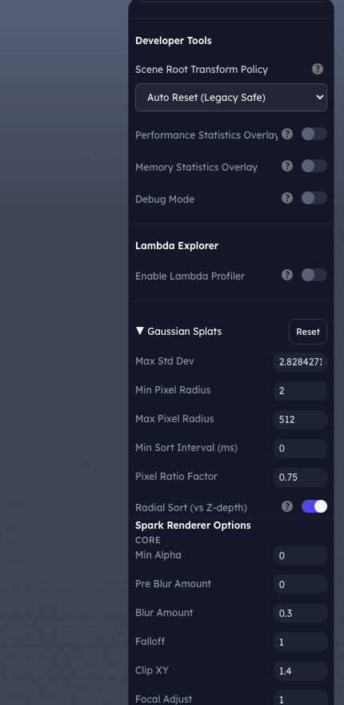

# Scheduler and Editor Performance Settings

The editor has one place for frame scheduling, quality presets, rendering
switches, profiling, and per-system throttling: **Project tab -> Rendering &
Performance**. These controls affect how the runtime spends each frame, which
systems are allowed to skip work, and which diagnostics are visible while you
tune a project.



---

## Scheduler architecture

The modern scheduler is implemented by `FrameOrchestrator`. It replaces a
single sequential update loop with fixed pipeline stages:

| Stage | What runs there |
|---|---|
| `INPUT` | Input state finalization. Always runs and is not budget gated. |
| `FIXED_UPDATE` | Fixed-timestep behaviors, fixed lambdas, and deterministic physics work. |
| `PRE_UPDATE` | Quality updates, spatial-grid rebuild, and budget setup before normal gameplay work. |
| `UPDATE` | Behaviors, lambdas, animation, audio, AI world, player events, texture residency, and other frame systems. |
| `POST_UPDATE` | Late events and sync points after main update work. |
| `RENDER` | Optional scheduled render stage and deferred render callbacks. |

Systems register through adapters in
`client/packages/editor-oss/src/scheduler/createSchedulerFromConfig.ts`. Within
each stage, `DependencyGraph` orders systems by declared reads/writes and then
priority. The lambda scheduler uses the same idea at the lambda level: lambdas
that write fields another lambda reads are scheduled before their consumers.

The scheduler also owns:

- A shared frame deadline from `FrameBudgetManager`.
- A fixed-step accumulator with `maxFixedStepsPerFrame` to prevent spiral of
  death.
- Render-pressure detection using average render time and frame delta spikes.
- Time slicing for supported update-stage systems.
- Background-tab throttling that skips expensive stages while the tab is hidden.
- A uniform spatial grid used by lambda/behavior throttling for distance checks.
- Command-buffer flushes between fixed/update boundaries so queued scene changes
  land at predictable points.

---

## Quality presets

Quality presets bundle rendering, physics, scene, and scheduler settings by
target device class. Start from the closest device tab, inspect the preset
details, then override individual controls only when needed.



Preset details include scheduler values such as frame budget, fixed timestep,
and maximum fixed steps. Those settings feed `createSchedulerFromConfig()` when
Play mode starts.

| Preset field | Runtime effect |
|---|---|
| Pixel ratio, shadows, antialiasing, post processing | Renderer cost and visual quality. |
| Physics rate and substeps | Physics simulation cost and stability. |
| View distance, LOD distances, culling aggressiveness | Scene traversal and rendering load. |
| Scheduler budget, fixed timestep, max fixed steps | Logic budget and fixed-step behavior under load. |

---

## Scheduler controls



| Setting | Use it for |
|---|---|
| **Modern Game Scheduler (Beta)** | Enables the pipeline scheduler. Prefer it for new scenes; turn it off only when auditing an older scene that depends on legacy ordering. |
| **Use Fixed Rate Updates (Beta)** | Registers fixed behavior and lambda adapters. Use for physics-dependent gameplay, deterministic controller logic, and code that implements `fixedUpdate()`. |

Fixed-rate updates do not mean every behavior should move into `fixedUpdate()`.
Use normal `update(deltaTime)` for visual effects, UI, camera polish, and
non-deterministic gameplay. Reserve `fixedUpdate()` for logic that benefits from
a fixed timestep.

These toggles persist on the scene:

```jsonc
{
  "userData": {
    "scheduler": {
      "enabled": true,
      "behaviorUpdateMode": "fixed" // or "variable"
    }
  }
}
```

The active quality profile supplies the lower-level scheduler fields:
`frameBudgetMs`, `fixedTimestepHz`, `maxFixedStepsPerFrame`,
`enableTimeSlicing`, `spatialGridCellSize`, `renderPressureThreshold`, and
`deltaTimePressureThreshold`.

---

## Rendering and physics controls

Rendering controls manage draw-call and renderer compatibility choices:

| Setting | Stored at | Notes |
|---|---|---|
| Enable Dynamic Batching | `scene.userData.rendering.batching.enableDynamic` | Rebuilds batching state when toggled. |
| Mesh Instancing Optimization | editor setting | Reduces repeated mesh draw overhead when suitable. |
| Clear Batching Data | runtime action | Clears current batching stats/debug data. |
| Force WebGL | `scene.userData.rendering.forceWebGL` | Compatibility fallback when WebGPU is unstable. |
| Force WebGL for VFX | `scene.userData.rendering.forceWebGLForVFX` | Keeps VFX on WebGL while the main renderer may use WebGPU. |

Physics controls:

| Setting | Stored at | Notes |
|---|---|---|
| Enable Physics Sleeping | `scene.userData.physicsSleepingEnabled` | Lets inactive bodies sleep until woken. |
| Multi-threaded Physics | `scene.userData.physicsUseWorker` | Runs heavier physics work in a worker where supported. |

Post-processing and shadow sections expose renderer-specific quality controls.
Use them after choosing a quality preset so you are tuning from a known baseline.

---

## Behavior performance controls



The **Behavior Performance** section configures throttling for behavior updates:

| Setting | Effect |
|---|---|
| Off Screen Optimization | Allows off-screen behaviors to update less often. |
| Distance-Based Optimization | Allows far behaviors to update less often. |
| Force Consistent Updates | Keeps updates consistent when throttling would cause visible/gameplay issues. |
| Update Priority | Marks behaviors as critical/high/medium/low/minimal for scheduler decisions. |
| Mid/Far Distance Threshold | Distances where throttle tiers begin. |
| Mid/Far Throttle Factor | How aggressively non-critical behaviors are skipped at those tiers. |

These values are stored in `scene.userData.behaviorThrottlingConfig` and also
update the running game config when Play mode is active.

Use critical/high priority for player controllers, combat resolution, and logic
that must stay frame-accurate. Use lower priorities for ambient props, distant
NPC polish, idle effects, and visual-only behaviors.

---

## Budget and lambda profiling



The **Budget Inspector** surfaces runtime budget state for avatars, plots,
textures, and hot rows. Use it when a scene is spending too much memory or when
runtime budget coordination is shedding work.

The **Lambda Explorer** is disabled by default. Enable it in Play mode to see:

- Active lambda instance count.
- Dependency wave count.
- Entity count per lambda instance.
- Average and maximum execution time per lambda.

This is the fastest way to find a lambda that should be converted to
`processObjects()`, split into smaller systems, or moved partially into a worker.

---

## LOD, developer tools, and splats

The same panel includes tools that affect performance but are not scheduler
settings:

| Section | What it configures |
|---|---|
| LOD Generation | Batch model LOD settings and optimized model generation. |
| Scene Root Transform Policy | Whether runtime auto-resets, warns about, or ignores non-identity scene root transforms. Stored in `scene.userData.rendering.rootTransformPolicy`. |
| Performance Statistics Overlay | Runtime frame diagnostics while playing. |
| Memory Statistics Overlay | Runtime memory diagnostics while playing. |
| Debug Mode | Development-only diagnostics through `app.debug` / storage. |
| Gaussian Splats / Spark Renderer Options | Splat culling, sort, LOD, and Spark renderer tuning stored under `scene.userData.rendering.splat` and related Spark options. |

Turn overlays on only while profiling; leave them off for normal authoring and
published play.

---

## Playground vs server-backed revision control

The playground/OSS storage path keeps projects local and latest-only for asset
edits. Behavior, lambda, script import, and setting changes resolve to the
current local version so iteration is simple.

A server-backed install adds full revision history through `ProjectStore`,
`AssetSource`, and the `@stem/network` revision endpoints. In that mode, each
save can create an immutable scene or asset revision, history panels can diff
and roll back, and published players can stay pinned to a release while editors
continue working on head.

See [`server-side-storage.md`](./server-side-storage.md) for the backend
interfaces behind that version-control model.

---

## Recommended workflow

1. Pick the closest quality preset for the target device.
2. Enable the modern scheduler for new scenes.
3. Use fixed updates only for deterministic or physics-linked systems.
4. Tune behavior throttling before hand-optimizing individual scripts.
5. Use Lambda Explorer in Play mode when many objects share the same logic.
6. Use Budget Inspector and overlays to confirm the bottleneck before lowering
   visual quality.
7. Save behavior, lambda, and import assets through the editor or designer so
   revisions and dependencies stay pinned correctly.

---

## Verification

Scheduler and settings changes should run both unit tests and a live Playwright
pass:

```bash
bun run typecheck
bun run test
node scripts/playwright/oss-smoke.mjs
node scripts/playwright/capture-scheduler-docs.mjs
```

The screenshot capture script expects the editor dev server on
`http://localhost:5173` unless `PLAYWRIGHT_BASE_URL` is set.
